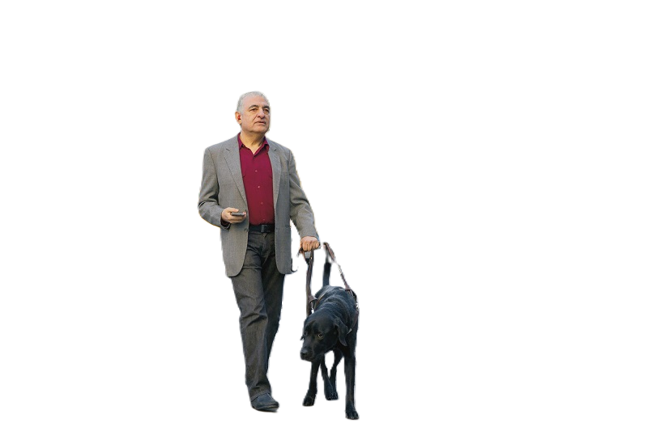

Azure AI Vision is a subset of artificial intelligence (AI) wherein software interprets visual input, typically derived from images or video streams.

Azure AI Vision can be provisioned either as a standalone resource or integrated within a broader Azure AI Services resource, leveraging the Azure AI Vision API for comprehensive functionality.

The Azure AI Vision service is crafted to assist in extracting valuable information from images. It furnishes a suite of functionalities tailored for:
* Description and tag generation - determining an appropriate caption for an image, and identifying relevant "tags" that can be used as keywords to indicate its subject.
* Object detection - detecting the presence and location of specific objects within the image.
* People detection - detecting the presence, location, and features of people in the image.
* Image metadata, color, and type analysis - determining the format and size of an image, its dominant color palette, and whether it contains clip art.
* Category identification - identifying an appropriate categorization for the image, and if it contains any known landmarks.
* Background removal - detecting the background in an image and output the image with the background transparent or a greyscale alpha matte image.
* Moderation rating - determine if the image includes any adult or violent content.
* Optical character recognition - reading text in the image.
* Smart thumbnail generation - identifying the main region of interest in the image to create a smaller "thumbnail" version.

[Computer Vision APIs](https://eastus.dev.cognitive.microsoft.com/docs/services/Cognitive_Services_Unified_Vision_API_2024-02-01/operations/61d65934cd35050c20f73ab6), for analyzing the images. 

[Vision Studio](https://portal.vision.cognitive.azure.com/), UI interface to analyze the images.

* Endpoint: https://aidemo1000001.cognitiveservices.azure.com/computervision/imageanalysis:analyze?api-version=2024-02-01&features=tags,Read,SmartCrops,Objects,people&model-version=latest&language=en&gender-neutral-caption=False
    aidemo1000001 is the name of the computer vision or multi-service account resource in Azure
* Headers : Content-Type: application/json
* Headers : Ocp-Apim-Subscription-Key: Key from the resources aidemo1000001
* Method : POST
* Body : raw 

Install the  Azure AI Vision SDK package for the choice of your development language.
.NET : Azure.AI.Vision.ImageAnalysis
Python : azure-ai-vision-imageanalysis

Request
```json
{
  "url": "https://github.com/MicrosoftLearning/mslearn-ai-vision/blob/main/Labfiles/01-analyze-images/Python/image-analysis/images/street.jpg?raw=true"
}
```
Response
```json
{
  "modelVersion": "2023-10-01",
  "metadata": {
    "width": 800,
    "height": 533
  },
  "tagsResult": {
    "values": [{
      "name": "outdoor",
      "confidence": 0.9987088441848755
    }, {
      "name": "land vehicle",
      "confidence": 0.9902223348617554
    }, {
      "name": "vehicle",
      "confidence": 0.9888724088668823
    }, {
      "name": "building",
      "confidence": 0.9854653477668762
    }, {
      "name": "road",
      "confidence": 0.9597859978675842
    }, {
      "name": "wheel",
      "confidence": 0.9513680934906006
    }, {
      "name": "street",
      "confidence": 0.9470843076705933
    }, {
      "name": "person",
      "confidence": 0.9301488399505615
    }, {
      "name": "clothing",
      "confidence": 0.9119247198104858
    }, {
      "name": "taxi",
      "confidence": 0.9095333814620972
    }, {
      "name": "car",
      "confidence": 0.8400692939758301
    }, {
      "name": "dog",
      "confidence": 0.8268368244171143
    }, {
      "name": "yellow",
      "confidence": 0.7708067893981934
    }, {
      "name": "walking",
      "confidence": 0.7410971522331238
    }, {
      "name": "city",
      "confidence": 0.6479701399803162
    }, {
      "name": "woman",
      "confidence": 0.5752822160720825
    }]
  },
  "objectsResult": {
    "values": [{
      "boundingBox": {
        "x": 0,
        "y": 212,
        "w": 282,
        "h": 149
      },
      "tags": [{
        "name": "car",
        "confidence": 0.724
      }]
    }, {
      "boundingBox": {
        "x": 408,
        "y": 231,
        "w": 242,
        "h": 102
      },
      "tags": [{
        "name": "taxi",
        "confidence": 0.77
      }]
    }, {
      "boundingBox": {
        "x": 245,
        "y": 133,
        "w": 143,
        "h": 355
      },
      "tags": [{
        "name": "person",
        "confidence": 0.781
      }]
    }, {
      "boundingBox": {
        "x": 363,
        "y": 326,
        "w": 90,
        "h": 192
      },
      "tags": [{
        "name": "dog",
        "confidence": 0.544
      }]
    }]
  },
  "readResult": {
    "blocks": [{
      "lines": [{
        "text": "-",
        "boundingPolygon": [{
          "x": 145,
          "y": 271
        }, {
          "x": 165,
          "y": 271
        }, {
          "x": 166,
          "y": 279
        }, {
          "x": 146,
          "y": 279
        }],
        "words": [{
          "text": "-",
          "boundingPolygon": [{
            "x": 145,
            "y": 271
          }, {
            "x": 147,
            "y": 271
          }, {
            "x": 147,
            "y": 279
          }, {
            "x": 145,
            "y": 279
          }],
          "confidence": 0.976
        }]
      }]
    }]
  },
  "smartCropsResult": {
    "values": [{
      "aspectRatio": 1.5,
      "boundingBox": {
        "x": 33,
        "y": 22,
        "w": 734,
        "h": 489
      }
    }]
  },
  "peopleResult": {
    "values": [{
      "boundingBox": {
        "x": 241,
        "y": 109,
        "w": 155,
        "h": 399
      },
      "confidence": 0.9498757123947144
    }, {
      "boundingBox": {
        "x": 396,
        "y": 264,
        "w": 23,
        "h": 58
      },
      "confidence": 0.24925367534160614
    }, {
      "boundingBox": {
        "x": 699,
        "y": 262,
        "w": 20,
        "h": 33
      },
      "confidence": 0.22452928125858307
    }, {
      "boundingBox": {
        "x": 138,
        "y": 230,
        "w": 28,
        "h": 31
      },
      "confidence": 0.06960226595401764
    }, {
      "boundingBox": {
        "x": 129,
        "y": 188,
        "w": 15,
        "h": 26
      },
      "confidence": 0.010913374833762646
    }, {
      "boundingBox": {
        "x": 146,
        "y": 188,
        "w": 16,
        "h": 25
      },
      "confidence": 0.01024781446903944
    }, {
      "boundingBox": {
        "x": 405,
        "y": 263,
        "w": 15,
        "h": 28
      },
      "confidence": 0.009595599956810474
    }, {
      "boundingBox": {
        "x": 164,
        "y": 187,
        "w": 17,
        "h": 25
      },
      "confidence": 0.008438891731202602
    }, {
      "boundingBox": {
        "x": 176,
        "y": 187,
        "w": 13,
        "h": 25
      },
      "confidence": 0.004477222915738821
    }, {
      "boundingBox": {
        "x": 139,
        "y": 186,
        "w": 42,
        "h": 29
      },
      "confidence": 0.0019122643861919641
    }, {
      "boundingBox": {
        "x": 510,
        "y": 262,
        "w": 17,
        "h": 10
      },
      "confidence": 0.0012213165173307061
    }, {
      "boundingBox": {
        "x": 247,
        "y": 247,
        "w": 141,
        "h": 121
      },
      "confidence": 0.001094880630262196
    }]
  }
}
```
Remove Background from the image



