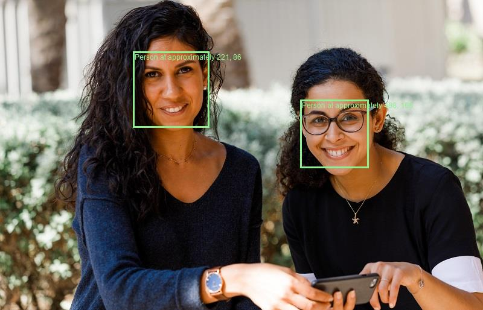
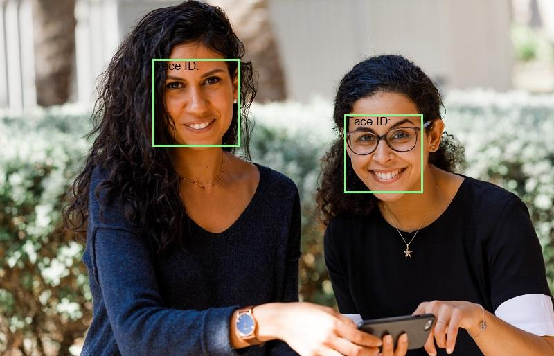

Detecting the presence of a person, pinpointing their facial position, or identifying individuals through their facial characteristics represents a fundamental aspect through which AI systems emulate human-like behavior and foster empathy with users.

There are two Azure AI services that you can use to build solutions that detect faces or people in images.

**Image Analysis** 
Provide location of face with a bounding box in the image. 

**Face service** 
- Face Detection (with bounding box): This involves identifying the presence and location of faces within an image or video frame. A bounding box is drawn around each detected face to indicate its position.

- Comprehensive Facial Feature(Attribute) Analysis: This encompasses a range of analyses performed on detected faces, including:
    * Head Pose: Determining the orientation of the face in terms of yaw, pitch, and roll.
    * Presence of Spectacles: Identifying whether the subject is wearing glasses or not.
    * Blur Detection: Assessing the clarity of the facial image to determine if it's blurred.
    * Facial Landmarks: Locating key points on the face such as eyes, nose, mouth, and chin.
    * Occlusion Detection: Recognizing if parts of the face are obstructed, e.g., by hands or objects.
    * Face Comparison and Verification: This involves comparing faces against each other to determine if they belong to the same person (verification) or if they are different individuals (comparison).
    * Exposure (underExposure, goodExposure, or overExposure)
    * Noise (visual noise in the image)
    * Accessories (glasses, headwear, mask)
    * QualityForRecognition (low, medium, or high)

- Facial Recognition: This is a broader concept involving the identification or verification of individuals based on their facial features. It often entails comparing detected faces against a database of known faces to determine their identity.

- Facial liveness - liveness can be used to determine if the input video is a real stream or a fake to prevent bad intentioned individuals from spoofing the recognition system.

**SDK** 
Install the package 
* Microsoft.Azure.CognitiveServices.Vision.ComputerVision
* Microsoft.Azure.CognitiveServices.Vision.Face

Image analysis to identify the face with the bounding box: 
Response 

 
 
Face Service 

Response 
2 faces detected.

Face number 1
 - Mouth Occluded: False
 - Eye Occluded: False
 - Blur: Low
 - Glasses: NoGlasses

Face number 2
 - Mouth Occluded: False
 - Eye Occluded: False
 - Blur: Low
 - Glasses: ReadingGlasses

