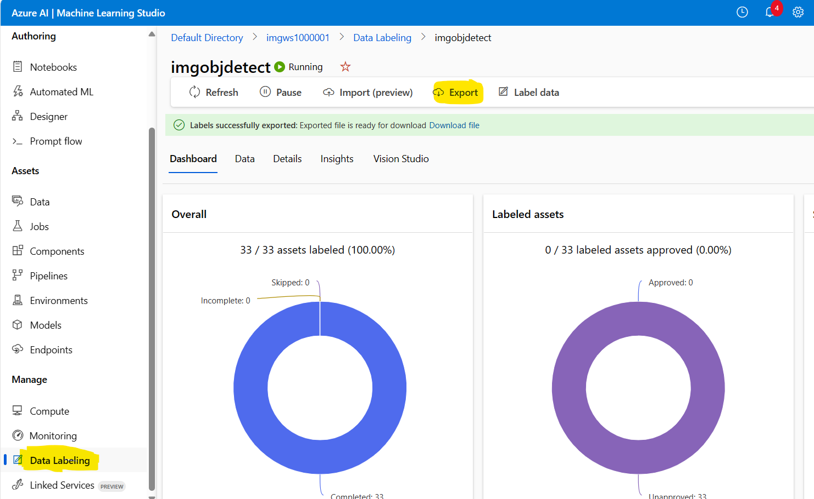

Common Objects in Context(COCO)  files are JSON files with specific required fields: "images", "annotations", and "categories".

A sample COCO file format will look like
```json
{
  "images": [
    {
      "id": 1,
      "width": 1024,
      "height": 768,
      "file_name": "IMG_20200229_164823.jpg",
      "coco_url": "AmlDatastore://fruit/IMG_20200229_164823.jpg",
      "absolute_url": "https://store100001.blob.core.windows.net/fruit/IMG_20200229_164823.jpg",
      "date_captured": "2023-12-07T22:52:56.1086527Z"
    }
  ]
}
```

COCO file can be generated from the Machine Language Studio in the "Data Labeling" section. You can click on export to generate the file and placed in the <Storage Container>/Labeling path. This file will be used in creating the data set for the image classification or Object detection or Product recognition.

In ML Studio, 
  - create the workspace
  - create the dataset pointing to the storage account to load the images for training the model
  - navigate to "Data Labeling" create or select the project 
  - select "Label Data" to tag the objects in the image
  - completing the above step, back to project and click on "Export" option to generate COCO file and place in the path <Storage Container>/Labeling path. 
   