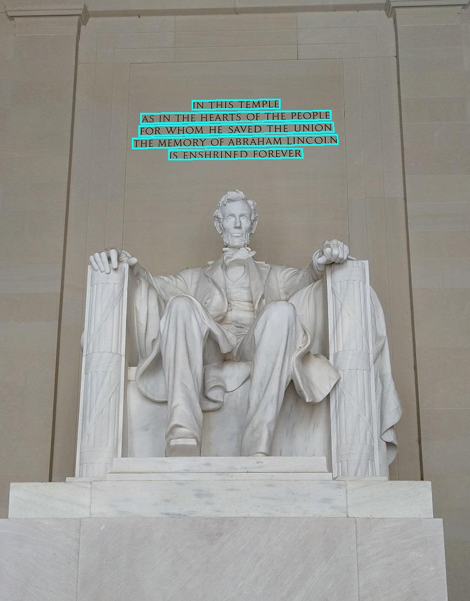

Given a task of transferring text from thousands of images to a computer database, where the text is in various formats and languages, there are efficient ways to accomplish this with high accuracy. Companies globally face similar challenges daily, and without AI services, managing such projects could be daunting, especially considering the scale.

Utilizing AI services, particularly Azure AI Vision, we can approach this task by employing Optical Character Recognition (OCR). OCR enables the extraction of text from images, whether they are street signs, product labels, or documents, including handwritten or unstructured content.

To create an automated AI solution, it's essential to train machine learning models to handle diverse scenarios. Azure AI Vision service provides access to advanced algorithms for image processing, ensuring data is securely stored after extraction.

Azure AI offers two distinct features for reading text from documents and images: the Azure AI Vision Service and Azure AI Document Intelligence. Although there's some overlap in functionality, each service is optimized for specific inputs.

**Image Analysis Optical Character Recognition (OCR):**

* Suitable for unstructured documents with relatively small text amounts or images containing text.
* Provides immediate results through a single API call (synchronous).
* Offers additional image analysis capabilities beyond text extraction, such as object detection, image description, and smart thumbnail generation.
* Examples include street signs, handwritten notes, and store signs.

**Document Intelligence:**

* Designed for reading text from images and PDF documents, catering to small to large volumes of text.
* Utilizes document context and structure to enhance accuracy.
* Initial function call returns an asynchronous operation ID, which is used in a subsequent call to retrieve results.
* Examples include receipts, articles, and invoices.

OCR:

Response of the image input

   'IN THIS TEMPLE' 
   Bounding Polygon: [(328, 171) (477, 169) (477, 184) (328, 186)] 
   Bounding Polygon: [(328, 171) (477, 169) (477, 184) (328, 186)] 
   'AS IN THE HEARTS OF THE PEOPLE' 
   Bounding Polygon: [(240, 193) (564, 188) (564, 203) (240, 210)] 
   Bounding Polygon: [(240, 193) (564, 188) (564, 203) (240, 210)] 
   'FOR WHOM HE SAVED THE UNION' 
   Bounding Polygon: [(237, 214) (568, 208) (569, 224) (237, 231)] 
   Bounding Polygon: [(237, 214) (568, 208) (569, 224) (237, 231)] 
   'THE MEMORY OF ABRAHAM LINCOLN' 
   Bounding Polygon: [(226, 235) (575, 229) (576, 245) (226, 252)] 
   Bounding Polygon: [(226, 235) (575, 229) (576, 245) (226, 252)] 
   'IS ENSHRINED FOREVER' 
   Bounding Polygon: [(288, 255) (515, 253) (516, 268) (288, 271)] 
   Bounding Polygon: [(288, 255) (515, 253) (516, 268) (288, 271)] 

   