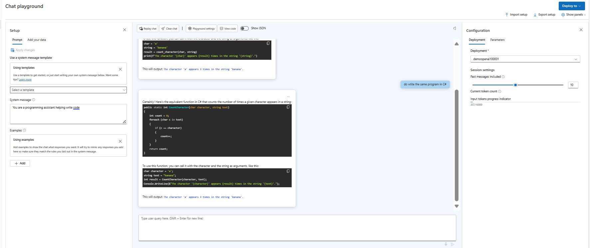

With Azure OpenAI, we can use large language models to create content, like coding. This helps developers make and enhance code in different languages, making work easier and clearer.

# Construct code from natural language
- Write Functions
- Change Coding Language
- Understand UnKnown Code

# Complete code and assist the development process
- Complete the Partial code
- Write Unit Test
- Add comments and generate documentation

# Fix bugs and improve your code
- Fix bugs in your code
- Improve performance
- Refactor inefficient code

-------------------------------------------------------------------------------------------------------

1. Create an Azure OpenAI resource, choose and deploy a model in the OpenAI Studio.
     "AzureOAIEndpoint": "Open AI Endpoint captured from the Key and Endpoint section",
     "AzureOAIKey": "Open AI key captured from the Key and Endpoint section",
     "AzureOAIDeploymentName": "deployed model name created in the Open AI studio"
2. Create a Deployment model in the Azure OpenAI Studio, if not created
3. Explore code generation in the Playground section, select the Chat page. Chat playground consiste of three sections
    - Setup - used to set the context for the model’s responses.
    - Chat session - used to submit chat messages and view responses.
    - Configuration - used to configure settings for the model deployment.
4. In the Setup section, set the system message to "You are a programming assistant helping write code" and apply the changes.
5. In Chat session submit the query " Write a function in python that takes a character and a string as input, and returns how many times the character appears in the string"
    
6. Next, enter the prompt "Do write the same program in C#"
    
7. Next, let’s explore using AI to understand code. Submit the following prompt as the user message
    ```markdown
        What does the following function do?  
        ---  
        def multiply(a, b):  
            result = 0  
            negative = False  
            if a < 0 and b > 0:  
                a = -a  
                negative = True  
            elif a > 0 and b < 0:  
                b = -b  
                negative = True  
            elif a < 0 and b < 0:  
                a = -a  
                b = -b  
            while b > 0:  
                result += a  
                b -= 1      
            if negative:  
                return -result  
            else:  
                return result  
    ```
    
8. Submit the prompt "Can you simplify the function?." to write the simpler version of the function in step 7.
    
9. Submit the prompt: Add some comments to the function.
    
-------------------------------------------------------------------------------------------------------------------------------------
10.  Install the  Azure AI OpenAI SDK package for the choice of your development language.
    - .NET : Azure.AI.OpenAI
    - Python : openai==1.13.3
11. Run the application to select the option 1 and enter the prompt " Add comments to the following function. Return only the commented code.\n---\n"
    
12. Next, select the option 2 and enter the prompt " Write four unit tests for the following function.\n---\n"
    
13. Next, select the option 3 and enter the prompt " Fix the code below for an app to play Go Fish with the user. Return only the corrected code.\n---\n"
    
    


```markdown
1: Add comments to my function
2: Write unit tests for my function
3: Fix my Go Fish game
"quit" to exit the program

Enter a number to select a task:
1

Enter a prompt:
 Add comments to the following function. Return only the commented code.\n---\n

Calling Azure OpenAI to generate code...


Response written to result/app.txt


1: Add comments to my function
2: Write unit tests for my function
3: Fix my Go Fish game
"quit" to exit the program

Enter a number to select a task:
2

Enter a prompt:
 Write four unit tests for the following function.\n---\n

Calling Azure OpenAI to generate code...


Response written to result/app.txt


1: Add comments to my function
2: Write unit tests for my function
3: Fix my Go Fish game
"quit" to exit the program

Enter a number to select a task:
3

Enter a prompt:
 Fix the code below for an app to play Go Fish with the user. Return only the corrected code.\n---\n

Calling Azure OpenAI to generate code...


Response written to result/app.txt


1: Add comments to my function
2: Write unit tests for my function
3: Fix my Go Fish game
"quit" to exit the program

Enter a number to select a task:
```