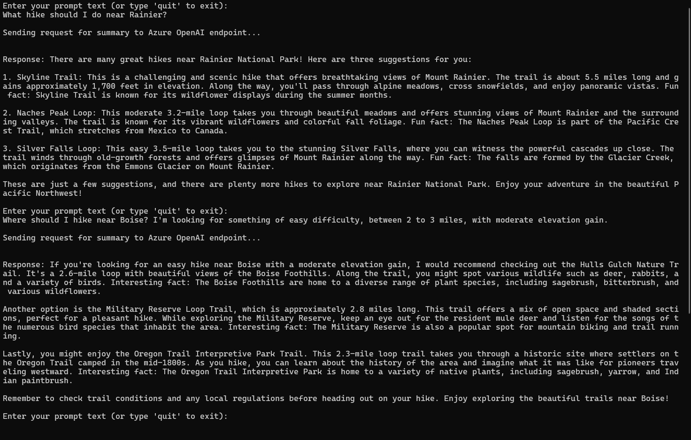
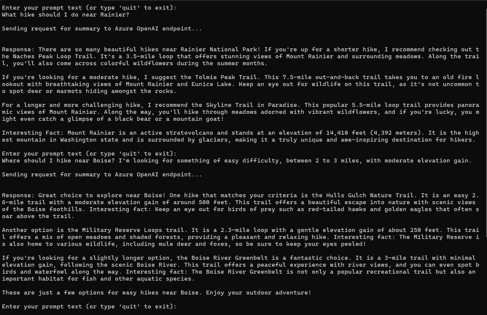
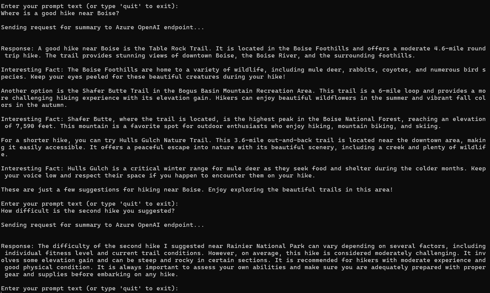

A starting point for developing solutions with generative AI.

Create an Azure OpenAI resource, choose and deploy a model.

**Authentication and specification of deployed model**
When we deploy a model in Azure OpenAI, we give it a name for deployment. To set up our app, we need to provide the resource endpoint, key, and deployment name. This helps us direct requests to the specific model we deployed. It's like giving each model its own address so we can talk to it separately.

**Prompt engineering**
The way we write the input prompt significantly influences how the AI model responds. A basic prompt like "What is Azure OpenAI" might yield a generic answer, akin to a search engine result. Yet, providing additional details in the prompt results in a more precise and specific response from the AI model.

```markdown
Basic prompt: "What is Azure OpenAI?"
Response: The AI model might provide a general overview of Azure OpenAI, similar to what you might find in a search engine result.

Detailed prompt: "Can you explain how Azure OpenAI's generative models are different from traditional search engines?"
Response: In this case, the AI model might delve deeper into the specific capabilities and differences of Azure OpenAI's generative models compared to traditional search engines, providing a more detailed and focused response.

Classify the following news headline into 1 of the following categories: Business, Tech, Politics, Sport, Entertainment

Headline 1: Donna Steffensen Is Cooking Up a New Kind of Perfection. The Internet’s most beloved cooking guru has a buzzy new book and a fresh new perspective
Category: Entertainment

Headline 2: Major Retailer Announces Plans to Close Over 100 Stores
Category:
```

**Available endpoints**
- Completion: The model generates one or more predictions based on an input prompt.
- ChatCompletion: The model generates the next message in a chat conversation, considering the roles of participants.
- Embeddings: The model converts input into a vector representation.

For instance, ChatCompletion requires input in the form of a conversation with specified roles for each message.
```json
{"role": "system", "content": "You are a helpful assistant, teaching people about AI."},
{"role": "user", "content": "Does Azure OpenAI support multiple languages?"},
{"role": "assistant", "content": "Yes, Azure OpenAI supports several languages, and can translate between them."},
{"role": "user", "content": "Do other Azure AI Services support translation too?"}
```
When the AI receives an actual conversation, it responds more accurately with the right tone and context. ChatCompletion makes ChatGPT's conversations more lifelike by including the chat history with the next user message.


ChatCompletion isn't limited to chat; it can also handle tasks like summarization or entity extraction. Just provide a brief conversation, including system info and the request, to get results. For instance, to create a job description, format our input like this:
```json
{"role": "system", "content": "You are an assistant designed to write intriguing job descriptions. "},
{"role": "user", "content": "Write a job description for the following job title: 'Business Intelligence Analyst'. It should include responsibilities, required qualifications, and highlight benefits like time off and flexible hours."}
```

1. Create an Azure OpenAI resource, choose and deploy a model in the OpenAI Studio.
     "AzureOAIEndpoint": "Open AI Endpoint captured from the Key and Endpoint section",
     "AzureOAIKey": "Open AI key captured from the Key and Endpoint section",
     "AzureOAIDeploymentName": "deployed model name created in the Open AI studio"
2. Install the  Azure AI OpenAI SDK package for the choice of your development language.
.NET : Azure.AI.OpenAI
Python : openai==1.13.3
    - System message set in the SDK code

    
    - Temperature set to 1.0
    
    
3. When we increase the temperature, the response tends to become more diverse, even if the input remains the same, because of the heightened randomness. we can experiment by running the model multiple times with different temperature values to observe how the output may differ.
4. **Maintain conversation history**: In practical scenarios, referring back to earlier parts of the conversation enhances the realism of interactions with an AI agent. While the Azure OpenAI API is stateless, including a conversation history in your prompt allows the AI model to access past messages. Modify the SDK code to maintain the message history
 