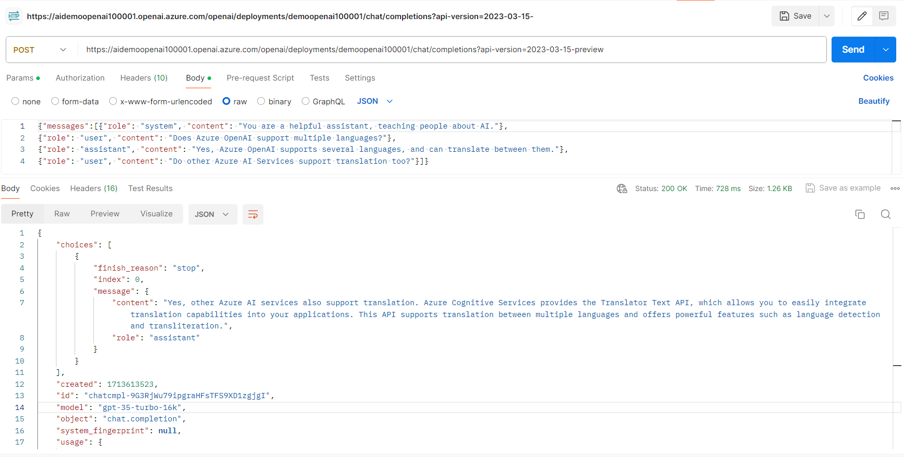

Rest Endpoint for the completions

    https://aidemoopenai100001.openai.azure.com/openai/deployments/demoopenai100001/chat/completions?api-version=2023-03-15-preview

Headers:
- Content-Type : application/json
- api-key :  <Open AI key captured from the Key and Endpoint section>
    
Method: POST

Body:

       ```json
        {"messages":[{"role": "system", "content": "You are a helpful assistant, teaching people about AI."},
        {"role": "user", "content": "Does Azure OpenAI support multiple languages?"},
        {"role": "assistant", "content": "Yes, Azure OpenAI supports several languages, and can translate between them."},
        {"role": "user", "content": "Do other Azure AI Services support translation too?"}]}
       ```
    
Response:

        ```json
        {
            "choices": [
                {
                    "finish_reason": "stop",
                    "index": 0,
                    "message": {
                        "content": "Yes, other Azure AI services also support translation. Azure Cognitive Services provides the Translator Text API, which allows you to easily integrate translation capabilities into your applications. This API supports translation between multiple languages and offers powerful features such as language detection and transliteration.",
                        "role": "assistant"
                    }
                }
            ],
            "created": 1713613523,
            "id": "chatcmpl-9G3RjWu79ipgraHFsTFS9XD1zgjgI",
            "model": "gpt-35-turbo-16k",
            "object": "chat.completion",
            "system_fingerprint": null,
            "usage": {
                "completion_tokens": 50,
                "prompt_tokens": 62,
                "total_tokens": 112
            }
        }
        ```


