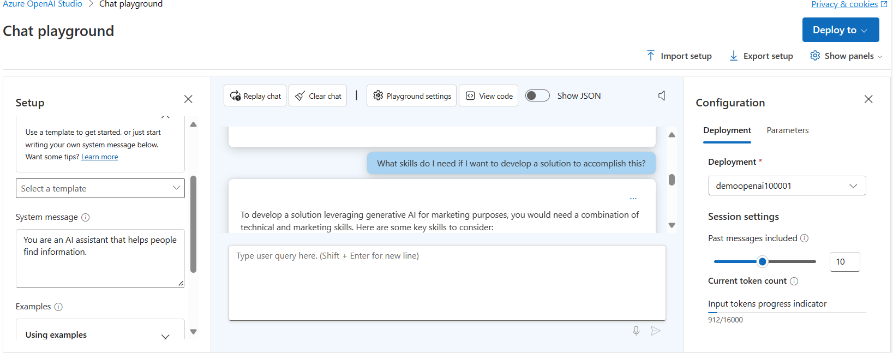

Azure OpenAI Service is currently in limited access. Users need to apply for service access at https://aka.ms/oai/access.

Imagine we want to make an app that helps with support by summarizing text and suggesting code. We can use ChatGPT, a smart chatbot from OpenAI, to do this. ChatGPT works by understanding what people say and responding in a way that seems like a real person wrote it.

ChatGPT uses fancy AI called generative models to make new stuff, like text, code, and pictures, based on what we ask it. These AI models are part of a bigger group called deep learning, which helps with lots of tasks like understanding speech, making decisions, and searching for things.

With Azure OpenAI Service, we can use these powerful generative AI models in our own apps on Azure. This lets us make smart AI solutions that are safe, can handle lots of users, and can connect with other Azure services. We can use these models in our apps through a simple interface called a REST API, special tools for developers (SDKs), and a Studio where we can work on our AI projects. 

### Generative AI models
1. **GPT-4 models** The newest generation of generative pretrained (GPT) models, like GPT-4, have the ability to generate natural language and code completions when given prompts in natural language.
2. **GPT 3.5 models**  including the specialized GPT-35-turbo models, are designed to generate natural language and code completions in response to natural language prompts. These turbo models are specifically optimized for chat-based interactions and perform effectively across a wide range of generative AI tasks.
3. **Embeddings models** convert text into numeric vectors, and are useful in language analytics scenarios such as comparing text sources for similarities.
4. **DALL-E models** make images based on written prompts, but they're still in testing. We won't find DALL-E models in Azure OpenAI Studio, and we don't have to set them up separately.

### Use prompts to get completions from models
After deploying the model, you can evaluate its performance by testing how it responds to prompts. A prompt is the text submitted to the model's completions endpoint, while the generated outputs are called completions. These completions can take various forms, such as text, code, or other formats.

**Prompt types**
<table aria-label="Prompt types" class="table">
<thead>
<tr>
<th style="text-align: left;">Task type</th>
<th style="text-align: left;">Prompt example</th>
<th style="text-align: left;">Completion example</th>
</tr>
</thead>
<tbody>
<tr>
<td style="text-align: left;"><strong>Classifying content</strong></td>
<td style="text-align: left;">Tweet: I enjoyed the trip. <br> Sentiment:</td>
<td style="text-align: left;">Positive</td>
</tr>
<tr>
<td style="text-align: left;"><strong>Generating new content</strong></td>
<td style="text-align: left;">List ways of traveling</td>
<td style="text-align: left;">1. Bike <br> 2. Car ...</td>
</tr>
<tr>
<td style="text-align: left;"><strong>Holding a conversation</strong></td>
<td style="text-align: left;">A friendly AI assistant</td>
<td style="text-align: left;"><a href="/en-us/azure/cognitive-services/openai/how-to/completions#conversation?portal=true" data-linktype="absolute-path">See examples</a></td>
</tr>
<tr>
<td style="text-align: left;"><strong>Transformation</strong> (translation and symbol conversion)</td>
<td style="text-align: left;">English: Hello <br> French:</td>
<td style="text-align: left;">bonjour</td>
</tr>
<tr>
<td style="text-align: left;"><strong>Summarizing content</strong></td>
<td style="text-align: left;">Provide a summary of the content <br> {text}</td>
<td style="text-align: left;">The content shares methods of machine learning.</td>
</tr>
<tr>
<td style="text-align: left;"><strong>Picking up where you left off</strong></td>
<td style="text-align: left;">One way to grow tomatoes</td>
<td style="text-align: left;">is to plant seeds.</td>
</tr>
<tr>
<td style="text-align: left;"><strong>Giving factual responses</strong></td>
<td style="text-align: left;">How many moons does Earth have?</td>
<td style="text-align: left;">One</td>
</tr>
</tbody>
</table>

**Completion Quality**
The quality of completions from a generative AI solution is influenced by several factors:
- Prompt engineering: How we structure the input text affects the output. 
- Model parameters: Adjusting settings like model size and complexity can impact completion quality.
- Training data: The quality and relevance of the data used to train the model play a significant role.

Fine-tuning a custom model offers more control over completions compared to prompt engineering and parameter adjustment alone.

**Playgrounds**
Playgrounds are useful interfaces in Azure OpenAI Studio that we can use to experiment with our deployed models without needing to develop our own client application. 

**Completions playground**
The Completions playground allows you to make calls to your deployed models through a text-in, text-out interface and to adjust parameters. You need to select the deployment name of your model under Deployments. 

**Completions Playground parameters**
We can adjust various parameters to tweak your model's performance:

- Temperature: Regulates randomness. Lowering it yields more predictable responses, while raising it encourages creativity.
- Max length (tokens): Limits the length of each response. The API supports up to 4000 tokens, which include both the prompt and the model's reply.
- Stop sequences: Specifies sequences to end responses, like at the end of sentences or lists, preventing further token generation.
- Top probabilities (Top P): Similar to temperature but with a different approach to randomness. Adjusting it affects token selection.
- Frequency penalty: Decreases the chance of repeating tokens that have already appeared in the text, reducing repetition.
- Presence penalty: Diminishes the likelihood of repeating any token seen in the text, promoting diversity in responses.
- Pre-response text: Inserts text before the model's response, helping to guide its output.
- Post-response text: Adds text after the model's response, encouraging continued conversation.

**Chat playground**
The Chat playground works by taking in messages and generating responses. We can start a session with a system message to set the context.

In the Chat playground, we can include few-shot examples, which are a few instances to help the model understand its task. This is different from zero-shot, where no examples are provided.

In the Assistant setup, we can give examples of user input and the desired assistant response. The assistant learns from these examples to respond in a similar tone, following the rules and format defined in the system message.

**Chat playground parameters**
Chat playground shares the Temperature parameter with the Completions playground but also offers additional parameters:
- Max response: Limits the number of tokens per response, with a maximum of 4000 tokens shared between the prompt and the model's reply.
- Top P: Controls randomness similarly to Temperature but with a different method. Adjusting Top P affects token selection, with lower values favoring likelier tokens and higher values allowing for a broader selection.
- Past messages included: Determines how many previous messages are included in each new API request. This helps provide context for the model when processing new user queries.

The Current token count is displayed in the Chat playground, essential for monitoring token usage and ensuring it stays within the specified limit.

1. Create Open AI resource
2. Azure OpenAI service provides a web-based portal named Azure OpenAI Studio, that we can use to deploy, manage, and explore models. 
3. On the Overview page of our Azure OpenAI resource, use the Go to Azure OpenAI Studio button to open [Azure OpenAI Studio](https://oai.azure.com/) in a new browser tab.
4. Create the deployments model from the Management section


5. Select the Chat page from the Playground section. Chat playground page consists of three main panels 
    - Setup: Establishes the context for the model's responses, typically done at the beginning of a session to provide initial information or instructions.
    - Chat session: Enables users to send chat messages and receive responses from the model, allowing for interactive communication.
    - Configuration: Allows users to adjust settings related to the deployment of the model, such as specifying parameters or adjusting behavior to suit specific requirements.

    
6. In the Configuration panel, make sure you've chosen the deployment of the gpt-35-turbo-16k model.
7. In the Setup panel, check the default System message, which should be "You are an AI assistant that helps people find information." This message sets the context for the model's responses, guiding how the AI agent should interact with users.
8. In the Chat session panel, enter the user query "How can I use generative AI to help me market a new product?"
 
9. Enter the user query "What skills do I need if I want to develop a solution to accomplish this?". Note how the chat session maintains conversational context by incorporating recent history in each prompt, ensuring accurate interpretation of "this" as a marketing-focused generative AI solution.
 
10. Clear chat and confirm that you want to restart the chat session. 
11. Enter the query "Can you help me find resources to learn those skills?"
12. Given the absence of previous chat history, the response is more likely to focus on locating general skill resources rather than addressing the specific requirements for constructing a marketing-oriented generative AI solution.
 
12. Up to this point, we have interacted with our model using the default system message. To exert greater influence over the generated responses, we can tailor the system setup according to our preferences.
13. In the Setup panel, choose the </b>Marketing</be> Writing Assistant template for the system message and confirm the update. Then, examine the revised system message, outlining the expected behavior of the AI agent when generating responses using the model.
14. Enter the user query "Create an advertisement for a new scrubbing brush" in the Chat session panel. Then, examine the response, which should contain creative advertising copy for the scrubbing brush. In actual marketing scenarios, professionals would typically provide the product name and key features for more targeted results from the AI model.
 
15. Enter the prompt "Revise the advertisement for a scrubbing brush named 'Scrubadub 2000', which is made of carbon fiber and reduces cleaning times by half compared to ordinary scrubbing brushes" in the Chat session panel. Then, assess the response, which should incorporate the details provided about the scrubbing brush product. This approach enhances the relevance of the generated content. For further refinement, consider providing few-shot examples to guide the model's responses.
16. In the Setup panel, under <b>Examples</b>, select Add. Then type the following message and response in the designated boxes:
    - User:  Write an advertisement for the lightweight "Ultramop" mop, which uses patented absorbent materials to clean floors.
    - Assistant: 
        Welcome to the future of cleaning!
    
        The Ultramop makes light work of even the dirtiest of floors. Thanks to its patented absorbent materials, it ensures a brilliant shine. Just look at these features:
        - Lightweight construction, making it easy to use.
        - High absorbency, enabling us to apply lots of clean soapy water to the floor.
        - Great low price.
            
        Check out this and other products on our website at www.contoso.com.
17. Apply the changes and enter user query as "Create an advertisement for the Scrubadub 2000 - a new scrubbing brush made of carbon fiber that reduces cleaning time by half"
18. Assess the response, expected to be a fresh advertisement for the "Scrubadub 2000," inspired by the "Ultramop" example outlined in the system setup.
 

```json
Introducing the Scrubadub 2000 - Revolutionize your cleaning routine!

Tired of spending hours scrubbing away at tough stains? Say goodbye to time-consuming cleaning sessions with the incredible Scrubadub 2000. With its state-of-the-art carbon fiber bristles, this scrubbing brush is designed to cut your cleaning time in half!

Here's why the Scrubadub 2000 is the ultimate cleaning tool:

Ultra-efficient cleaning: The carbon fiber bristles are incredibly strong and durable, effortlessly tackling even the toughest grime and stains. You'll be amazed at how quickly you can achieve sparkling clean surfaces.
Lightweight and ergonomic design: The Scrubadub 2000 is crafted with your comfort in mind. Its lightweight construction and ergonomic handle ensure a comfortable grip and effortless maneuverability, minimizing strain and fatigue.
Versatile for all surfaces: Whether it's tiled floors, bathroom fixtures, or kitchen countertops, the Scrubadub 2000 is your go-to tool. Its gentle yet effective scrubbing action is safe to use on a wide range of surfaces, making it a versatile addition to your cleaning arsenal.
Time-saving efficiency: With the Scrubadub 2000, you'll breeze through your cleaning tasks in record time. Spend less time scrubbing and more time doing the things you love.

Don't miss out on this game-changing cleaning innovation! Visit our website at www.contoso.com to order your Scrubadub 2000 today. Cleaning has never been this easy!

```

19. **Prompts** can help refine the responses returned by the model. We can also use parameters to control model behavior.
20. In Configuration panel, select the Parameters tab and set the following parameter values:
        - Max response: 1000
        - Temperature: 1
    
    Clear chat and enter user query "Create an advertisement for a cleaning sponge". Response will have the advertisement text containing a maximum of 1000 tokens and incorporate creative elements.
 
21. Clear the chat and enter the same user query "Create an advertisement for a cleaning sponge" to see different response from the previous one.
22. In the Configuration panel, on the Parameters tab, change the Temperature parameter value to 0.
23. Clear the chat to reset again and enter the user query "Create an advertisement for a cleaning sponge"
 
24. Clear the chat session and enter the same user query "Create an advertisement for a cleaning sponge" and the response would be very similar to the previous
    - The Temperature parameter regulates the level of creativity in the model's response generation. Lower values yield more consistent responses with minimal randomness, while higher values prompt the model to inject creative elements into its output, potentially impacting response accuracy and realism.
25. At the top right of the Chat playground page, in the Deploy to menu, select A new web app to deploy the model to the web app
 
26. Access the deployed web app and enter the chat message " Write an advertisement for the new "WonderWipe" cloth that attracts dust particulates and can be used to clean any household surface."
 
27. This deployment does not incorporate the system settings and parameters configured in the playground, so the response may deviate from the examples specified. In a real-world scenario, we would integrate logic into our application to adjust the prompt to include relevant contextual data for desired responses.

Note: 
- [Open AI service Documentation](https://learn.microsoft.com/en-us/azure/ai-services/openai/)
- [Open AI API reference](https://platform.openai.com/docs/api-reference/introduction) 
- [Open AI API Microsoft Reference](https://learn.microsoft.com/en-us/azure/ai-services/openai/reference)