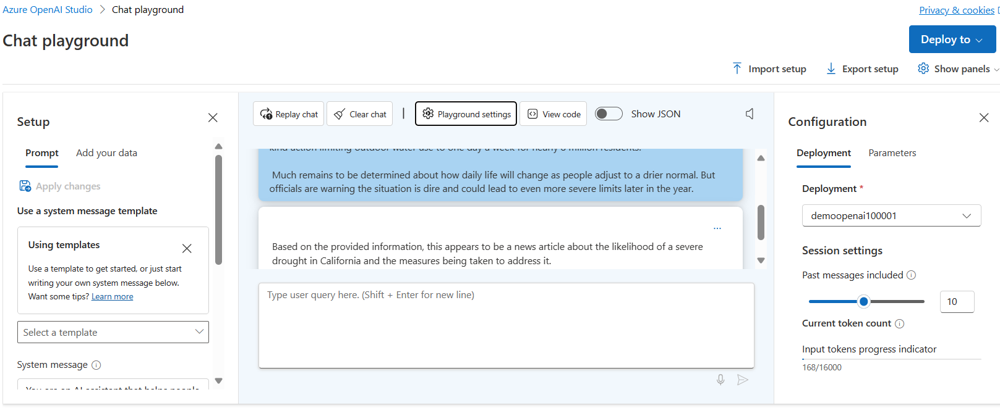
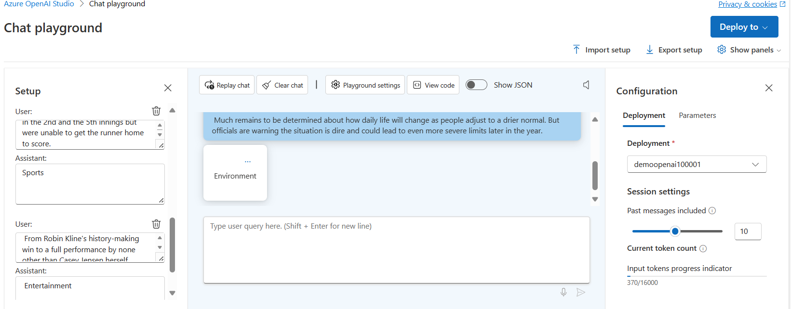
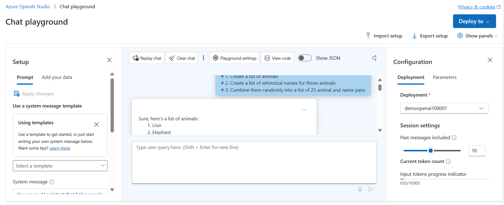
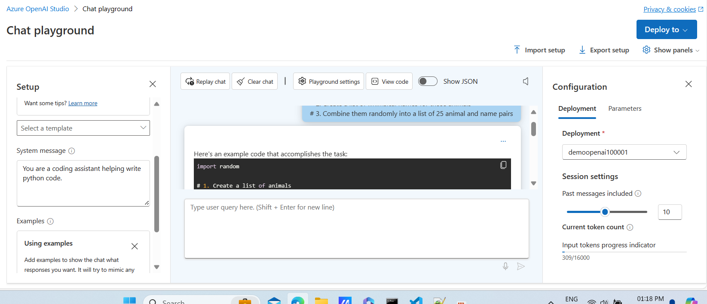
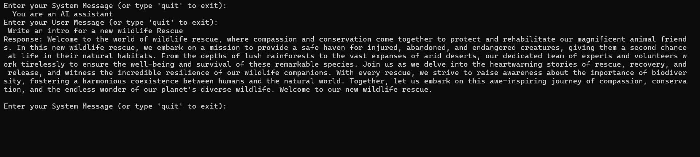
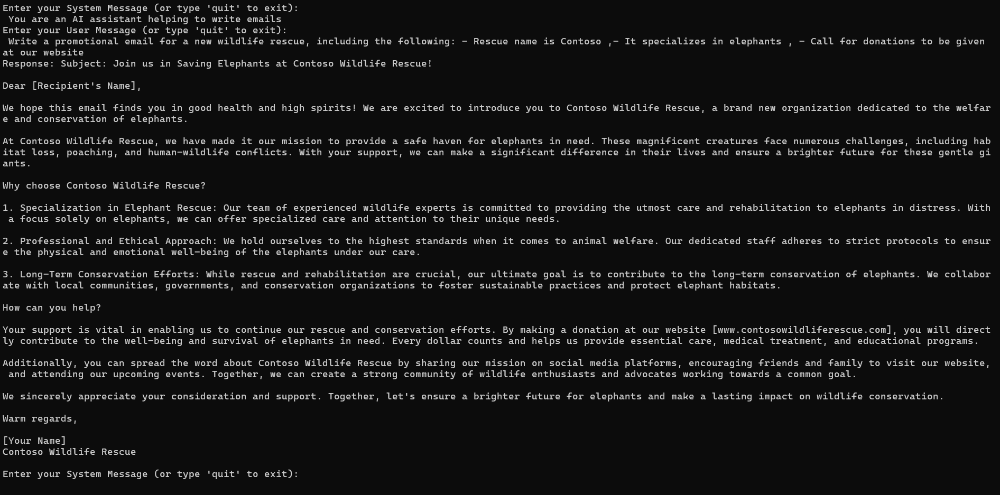
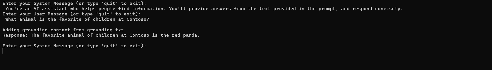

A method that entails crafting prompts for natural language processing models. This approach enhances both the accuracy and relevance of responses, thereby optimizing the model's performance.

Generative AI models, trained on extensive datasets, possess the capability to produce text, images, code, and creative content by extrapolating the most probable continuation of a given prompt.

Prompt engineering constitutes the method of crafting and refining prompts to maximize the utilization of AI models. The effectiveness of prompt engineering hinges on the adept design of prompts, which plays a pivotal role in enhancing the AI model's proficiency across designated tasks. Supplying pertinent, precise, clear, and well-organized prompts aids the model in comprehending context more effectively, leading to the generation of more precise responses.

Let's say we want an OpenAI model to write descriptions for products. We can give it lots of information about the product's features and why it's good. When we do this, the model can create descriptions that are more accurate and helpful.

Prompt engineering can also make AI models fairer. If we make sure the prompts cover a wide range of people and ideas, we can stop the model from favoring one group or viewpoint over another.

# Write more effective prompts
Azure OpenAI models generate accurate responses based on prompt quality. Developers can optimize performance by refining prompts for relevance and clarity.

### Provide clear instructions
One method to get the results we want from the Azure OpenAI model is to be really clear about what we are asking for. The more details we provide, the better the model can give us a response that fits our needs.

Example: Say we want to create a product description for a new water bottle.

**Prompt**
```markdown
Write a product description for a new water bottle
```
**Response**
```markdown
Introducing the latest addition to our product line - the innovative and eco-friendly water bottle.
Made from high-quality, BPA-free materials, this bottle is designed to keep your beverages at the
perfect temperature for hours. Its sleek and stylish design makes it the perfect accessory for any
outdoor activity or workout session. With its convenient carrying handle and leak-proof lid, you 
can take it with you wherever you go, without worrying about spills or leaks. Plus, its easy-to-clean
design ensures that you can use it again and again, making it the perfect choice for anyone looking 
for a reliable and sustainable water bottle.
```
With clear instructions.

**Prompt**
```markdown
Write a product description for a new water bottle that is 100% recycled. Be sure to include that
it comes in natural colors with no dyes, and each purchase removes 10 pounds of plastic from our 
oceans
```
**Response**
```markdown
Introducing our newest water bottle, the eco-friendly choice for the conscious consumer. Made from 
100% recycled materials and available in natural colors with no dyes, this bottle is not only 
stylish but also sustainable. Each purchase of this bottle removes 10 pounds of plastic from 
our oceans, making it a responsible choice for those who care about the environment. Its durable 
and leak-proof design makes it perfect for outdoor activities, while its easy-to-carry handle 
makes it convenient to take on the go. Join us in our mission to reduce plastic waste and choose 
this eco-friendly water bottle for your daily hydration needs.
```

By providing the model with specific instructions, such as a bulleted list of details, desired length, or preferred format for the output, we can guide it to produce results that align closely with our expectations. So, don't hesitate to be precise about what we want to see in the response, and you might be pleasantly surprised by how well the model fulfills your request.

### Format of instructions
How we format instructions can change how the model understands them. Sometimes, the model might focus more on the information towards the end of the instructions than the beginning. To see if this affects the response, we could try repeating the instructions at the end of the prompt and see what happens.

This focusing on recent information can also happen when we use ChatCompletion during a conversation. Messages from the end of the conversation can have a bigger effect on the response. The next part will talk more about using conversations to make responses better, but moving important details to the end of the prompt might make the response even better.

### Use section markers
A way to format instructions is to put them at the start or end of the prompt and enclose the user's content within special tags like --- or ###. These tags help the model better understand what's the instruction and what's the content.

```markdown
Translate the text into French

---
What's the weather going to be like today?
---
```

### Primary, supporting, and grounding content
When you include content for the model to use in its response, it can answer more accurately. There are two types of content: primary and supporting.

**Primary content** is what the query is about, like a sentence to translate or an article to summarize. You usually put this content at the start or end of the prompt, separated by special blocks like ---, along with instructions on what to do with it.
```markdown
--- 
[Insert full article here]
---

Summarize this article and identify three takeaways in a bulleted list:
```

**Supporting content** is extra information that might change the response but isn't the main focus of our prompt. For example, it could be names, preferences, or future dates. When we provide this supporting content, it helps the model give a more thorough and accurate response, making it more likely to include the details we want.

When given a lengthy promotional email, the model can extract vital details, and by adding supporting content to specify what you're seeking, the model can offer a more tailored response, with the email as primary content and the specifics as supporting content.

```markdown
---
<insert full email here, as primary content>
---
<the next line is the supporting content>
Topics I'm very interested in: AI, webinar dates, submission deadlines

Extract the key points from the above email, and put them in a bulleted list:
```

**Grounding content** enables the model to furnish dependable answers, drawn from sources like essays, FAQs, or recent data. It's highly recommended for obtaining reliable and current responses, especially when referencing unpublished or specific information.

Grounding content differs from primary content as it's the source of information to answer the prompt query, instead of the content being operated on for things like summarization or translation. 

When given an unpublished research paper on the history of AI, the model can then respond to questions using that grounding content.

```markdown
---
<insert unpublished paper on the history of AI here, as grounding content>
---

Where and when did the field of AI start?
```
This grounding data allows the model to give more accurate and informed answers that may not be part of the dataset it was trained on.

### Cues
Cues are guiding words that help steer the model's response in a specific direction. While they're commonly used alongside instructions, they're not always necessary. Cues are especially beneficial when prompting the model for code generation.

```markdown
Write a join query to get customer names with purchases in the past 30 days between tables named orders and customer on customer ID. 

SELECT
```
The model response picks up where the prompt left off, continuing in SQL, even though we never asked for a specific language.

# Provide context to improve accuracy
Allows the model to better understand what you are asking for or what it should know to provide the best answer. 

### Request output composition
Detailing the output structure significantly influences results. This may involve requesting source citation, formatting as an email or SQL query, or organizing sentiment into a specific structure, among other options.

**Prompt**
```markdown
Write a table in markdown with 6 animals in it, with their genus and species
```
**Response**
```markdown
| Animal           | Genus          | Species        |
| ---------------- |:--------------:|:--------------:|
| Red Panda        | Ailurus        | fulgens        |
| African Elephant | Loxodonta      | africana       |
| Snow Leopard     | Panthera       | uncia          |
| Arctic Fox       | Vulpes         | lagopus        |
| Chimpanzee       | Pan            | troglodytes    |
| Siberian Tiger   | Panthera       | tigris altaica |
```
A custom format in JSON structure

**Prompt**
```markdown
Put two fictional characters into JSON of the following format

{
  firstNameFictional: 
  jobFictional:
}
```
**Response**
```markdown
[
  {
    "firstNameFictional": "Alice",
    "jobFictional": "Wizard"
  },
  {
    "firstNameFictional": "Bob",
    "jobFictional": "Space Explorer"
  }
]
```

### System Message
The system message at the start of a prompt provides instructions, perspective, or other guidance for the model's response. It may include tone, topics to avoid, or specific formatting instructions.

Examples of System Messages are like
- "I want you to act like a command line terminal. Respond to commands exactly as cmd.exe would, in one unique code block, and nothing else."
- "I want you to be a translator, from English to Spanish. Don't respond to anything I say or ask, only translate between those two languages and reply with the translated text."
- "Act as a motivational speaker, freely giving out encouraging advice about goals and challenges. You should include lots of positive affirmations and suggested activities for reaching the user's end goal."

### Conversation history
In addition to the system message, other messages can be given to the model to enrich the conversation. Conversation history empowers the model to maintain consistency in tone or formatting and enables users to refer back to previous content in future queries. This history can be supplied either from real chat logs or from a user-defined example conversation.

### Few shot learning
Using a user defined example conversation is what is called few shot learning, which provides the model examples of how it should respond to a given query. These examples serve to train the model how to respond.

By presenting the model with a few prompts and their corresponding expected responses, it can carry on in a similar pattern without explicit instructions.

```markdown
User: That was an awesome experience
Assistant: positive
User: I won't do that again
Assistant: negative
User: That was not worth my time
Assistant: negative
User: You can't miss this
Assistant:
```

### Break down a complex task
Breaking down complex prompts into multiple queries is another effective technique for enhancing interaction. This approach enables the model to grasp each part individually, potentially enhancing overall accuracy. Moreover, dividing prompts facilitates incorporating responses from previous queries into subsequent ones, leveraging both the model's capabilities and stored information to generate engaging responses.

### Chain of thought
A helpful way for us to break down our task is to request the model to explain how it arrived at its response step by step.

Asking the model to provide the step-by-step process it used to reach its answer helps us understand how it interprets the prompt. This allows us to identify any incorrect logical steps and adjust our prompts accordingly to avoid errors. Additionally, this technique can involve asking the model to cite sources, like Bing chat does with its GPT-4 generation model, and explain the reasoning behind its answer.

For instance, when we ask the model "What sport is easiest to learn but hardest to master?" without specifying a step-by-step approach, it gives us a simple answer along with a brief explanation. However, when we prompt it with "What sport is easiest to learn but hardest to master? Give a step-by-step approach of your thoughts, ending in your answer," the response includes a detailed explanation of how it reached its conclusion, providing a more thorough understanding of its thought process.

-------------------------------------------------------------------------------------------------------------------------------------
1. Create an Azure OpenAI resource, choose and deploy a model in the OpenAI Studio.
     "AzureOAIEndpoint": "Open AI Endpoint captured from the Key and Endpoint section",
     "AzureOAIKey": "Open AI key captured from the Key and Endpoint section",
     "AzureOAIDeploymentName": "deployed model name created in the Open AI studio"
2. Create a Deployment model in the Azure OpenAI Studio
3. Explore Prompt engineering in the Playground section, select the Chat page. Chat playground consiste of three sections
    - Setup - used to set the context for the model’s responses.
    - Chat session - used to submit chat messages and view responses.
    - Configuration - used to configure settings for the model deployment.
4. Submit the query in the chat session
    ```markdown
     What kind of article is this?
    ---
    Severe drought likely in California
        
    Millions of California residents are bracing for less water and dry lawns as drought threatens to leave a large swath of the region with a growing water shortage.
        
    In a remarkable indication of drought severity, officials in Southern California have declared a first-of-its-kind action limiting outdoor water use to one day a week for nearly 8 million residents.
        
    Much remains to be determined about how daily life will change as people adjust to a drier normal. But officials are warning the situation is dire and could lead to even more severe limits later in the year.
    ```
    

5. Setup the system message as "You are a news aggregator that categorizes news articles."

6. Under the new system message, In the Example section, select ADD
    - User

        ```markdown
        What kind of article is this?
        ---
        New York Baseballers Wins Big Against Chicago
            
        New York Baseballers mounted a big 5-0 shutout against the Chicago Cyclones last night, solidifying their win with a 3 run homerun late in the bottom of the 7th inning.
            
        Pitcher Mario Rogers threw 96 pitches with only two hits for New York, marking his best performance this year.
            
        The Chicago Cyclones' two hits came in the 2nd and the 5th innings but were unable to get the runner home to score.
        ```
    - Assistant
        ```markdown
        Sports
        ```
7. Add another example       
    - User

        ```markdown
        Categorize this article:
        ---
        Joyous moments at the Oscars
            
        The Oscars this past week where quite something!
            
        Though a certain scandal might have stolen the show, this year's Academy Awards were full of moments that filled us with joy and even moved us to tears.
        These actors and actresses delivered some truly emotional performances, along with some great laughs, to get us through the winter.
            
        From Robin Kline's history-making win to a full performance by none other than Casey Jensen herself, don't miss tomorrows rerun of all the festivities.
        ```
    - Assistant
        ```markdown
        Entertainment
        ```
8. Save the changes
9. Resubmit the text in step 4 in the Chat session   
    ```markdown
    What kind of article is this?
    ---
    Severe drought likely in California
        
    Millions of California residents are bracing for less water and dry lawns as drought threatens to leave a large swath of the region with a growing water shortage.
        
    In a remarkable indication of drought severity, officials in Southern California have declared a first-of-its-kind action limiting outdoor water use to one day a week for nearly 8 million residents.
        
    Much remains to be determined about how daily life will change as people adjust to a drier normal. But officials are warning the situation is dire and could lead to even more severe limits later in the year.
    ```
    
10. In Setup section, Change the system message back to "You are an AI assistant that helps people find information." and delete the examples added and save the changes
11. Enter the prompt in the chat session 
    ```markdown
        # 1. Create a list of animals
        # 2. Create a list of whimsical names for those animals
        # 3. Combine them randomly into a list of 25 animal and name pairs
    ```
    The model will likely respond with an answer to satisfy the prompt, split into a numbered list. This is an appropriate response, but suppose what you actually wanted was for the model to write a Python program that performs the tasks you described?
    
12. Change the system message to "You are a coding assistant helping write python code."
13. Resubmit the text in step 11
    ```markdown
    # 1. Create a list of animals
    # 2. Create a list of whimsical names for those animals
    # 3. Combine them randomly into a list of 25 animal and name pairs
    ```
    **ChatCompletions for the above Prompt is**
    ```markdown
    import random  
  
    # 1. Create a list of animals  
    animals = ['lion', 'elephant', 'giraffe', 'zebra', 'tiger', 'monkey', 'penguin', 'koala', 'panda', 'kangaroo']  
    
    # 2. Create a list of whimsical names for those animals  
    names = ['Whiskers', 'Fluffy', 'Bubbles', 'Sprinkles', 'Snuggles', 'Nibbles', 'Sparkle', 'Coco', 'Misty', 'Squiggles']  
    
    # 3. Combine them randomly into a list of 25 animal and name pairs  
    animal_name_pairs = []  
    for _ in range(25):  
        animal = random.choice(animals)  
        name = random.choice(names)  
        animal_name_pairs.append((animal, name))  
    
    # Print the animal and name pairs  
    for pair in animal_name_pairs:  
        print(pair)  
    ``` 
    

-----------------------------------------------------------------------------------------------------------------

14. Install the  Azure AI OpenAI SDK package for the choice of your development language.
    - .NET : Azure.AI.OpenAI
    - Python : openai==1.13.3
15. Run the application setting the System and User messages to observe how the AI model will likely produce a good generic introduction to a wildlife rescue.
    ```markdown
    System message
         You are an AI assistant

    User message
        Write an intro for a new wildlife Rescue
    ```
    

    ```markdown
    System message
        You are an AI assistant helping to write emails
        
    User message
        Write a promotional email for a new wildlife rescue, including the following: 
            - Rescue name is Contoso 
            - It specializes in elephants 
            - Call for donations to be given at our website
    ```
    

16. Update the application to read the grounded context from the text file "grounding.txt" file and pass to the model with the user message
    ```markdown
        System message
        You're an AI assistant who helps people find information. You'll provide answers from the text provided in the prompt, and respond concisely.

        User message
        What animal is the favorite of children at Contoso?
    ```
    