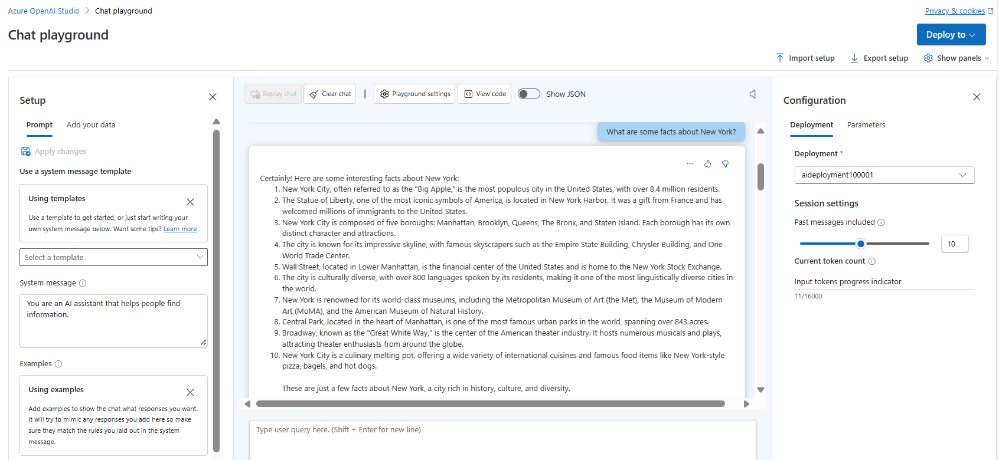
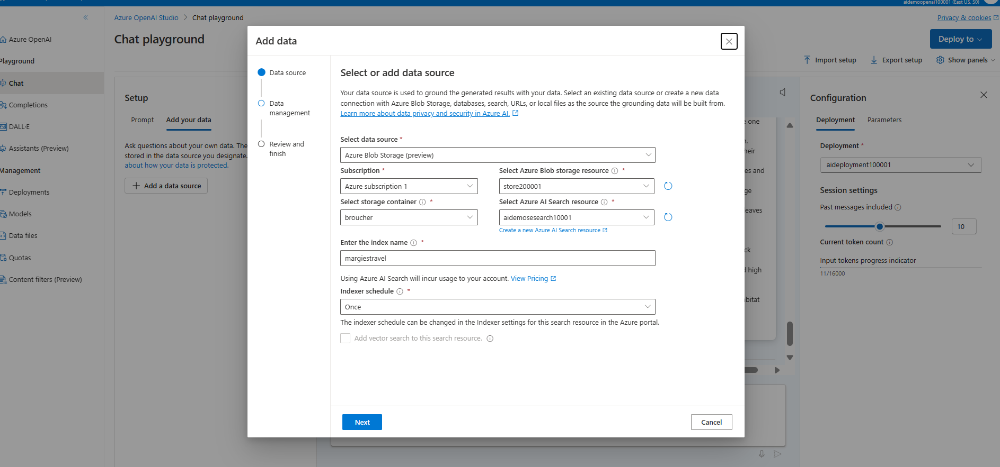
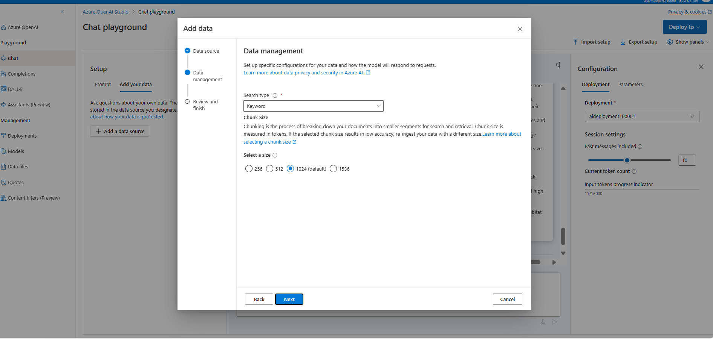
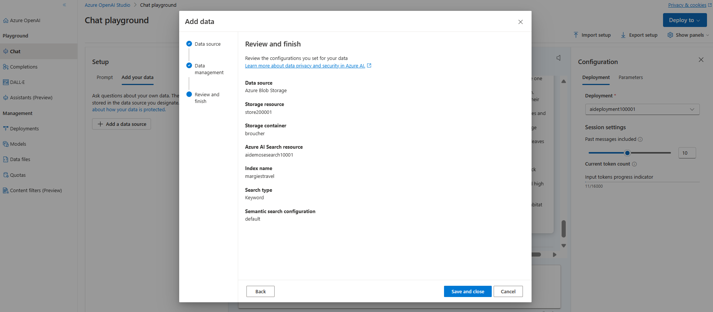
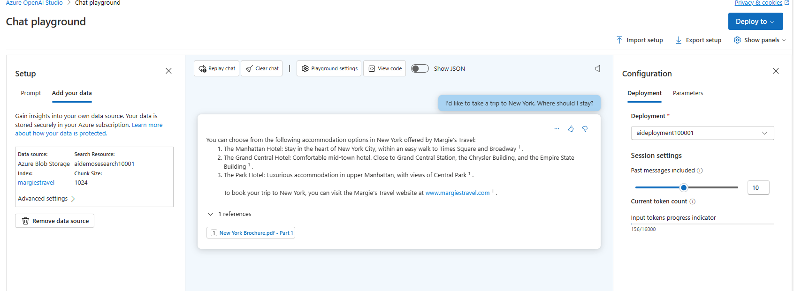
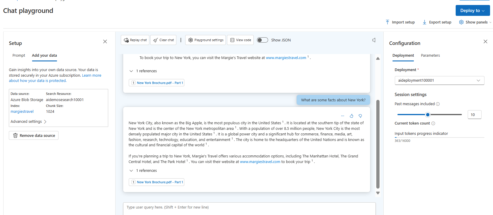
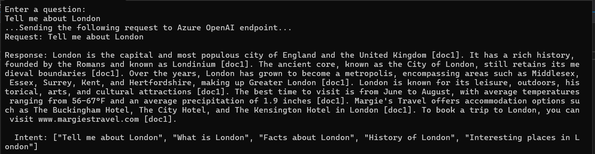

With Azure OpenAI, we can link additional AI chat models to our data, enabling Retrieval Augmented Generation (RAG). These models can use specific data sources to enhance responses, boosting the AI model's capabilities during response generation.

# Understand Retrieval Augmented Generation (RAG)
RAG with Azure OpenAI lets developers use supported AI chat models that can refer to specific information sources to enhance responses. This addition allows the model to draw from both the provided data and its existing knowledge for more effective answers.

Azure OpenAI facilitates RAG by linking pretrained models to our data sources. When Azure OpenAI operates on our data, it utilizes Azure AI Search's search capability to incorporate relevant data segments into the prompt. Here's the process:

1. Receive user prompt.
2. Understand the content and purpose of the prompt.
3. Query the search index with the content and purpose.
4. Include the search result segment in the Azure OpenAI prompt, alongside system message and user prompt.
5. Send the entire prompt to Azure OpenAI.
6. Provide the response and data reference (if applicable) to the user.

By default, Azure OpenAI on our data suggests, but doesn't mandate, the model to respond using only our data. This preference can be deselected when connecting your data, allowing the model to prioritize its pretrained knowledge over our data.

# Fine-tuning vs. RAG
Fine-tuning is a method to customize an existing model, like gpt-35-turbo, by training it with extra data. It can improve request quality more than just prompt engineering, handle larger examples, and need fewer examples for good results. However, it's expensive and time-consuming, so it's best for specific cases where it's needed.

# Add our own data source
To include our data, navigate to Azure OpenAI Studio's Chat playground. Your added data source enhances the prompt sent to the model. We can upload files, access data in a storage account, or connect to an AI Search index. Supported file types include .md, .txt, .html, .pdf, and Microsoft Word or PowerPoint files. For files with graphics or images, response quality depends on text extraction from visual content.


-----------------------------------------------------------------------------------------

1. Create OpenAI resource and deployment model accessing the [azure openai studio](https://oai.azure.com/)
2. Go to chat page and ensure the  default system message is "You are an AI assistant that helps people find information." in setup section.
3. In Chat session, submit the following queries, and review the responses:
    ```markdown
    I'd like to take a trip to New York. Where should I stay?
    ```

    ```markdown
    What are some facts about New York?
    ```
    

4. Create a storage account with blob anonymous access enabled. Create a container and upload the [contents](brochures/)
5. Create an Search service with the basic pricing tier.
6. All the resources created to be in same Azure location.
7. Now we will go back to Azure OpenAI studio, Chat Page, Setup Section and click on Add Data option to configure our own data for the search.
   
   
   
8. Now chat with the model with our own data or grounded data
9. Enter the query to search from the configured data source. Query entered will be searched from the Search service index to retrive the response.
    ```markdown
    I'd like to take a trip to New York. Where should I stay?
    ```

    ```markdown
    What are some facts about New York?
    ```
    
    
10. We’ll notice a very different response this time, with specifics about certain hotels and a mention of Margie’s Travel, as well as references to where the information provided came from. If we open the PDF reference listed in the response, we’ll see the same hotels as the model provided.
11. Try asking it about other cities included in the grounding data, which are Dubai, Las Vegas, London, and San Francisco.
-----------------------------------------------------------------------------------------------------
12.  Install the  Azure AI OpenAI SDK package for the choice of your development language.
    - .NET : Azure.AI.OpenAI
    - Python : openai==1.13.3
13. Update the configurations
    - "AzureOAIEndpoint": "<endpoint>",
    - "AzureOAIKey": "<key>",
    - "AzureOAIDeploymentName": "<deployment_name>",
    - "AzureSearchEndpoint": "<search_endpoint>",
    - "AzureSearchKey": "<search_key>",
    - "AzureSearchIndex": "<search_index>"
14. Run the application
    