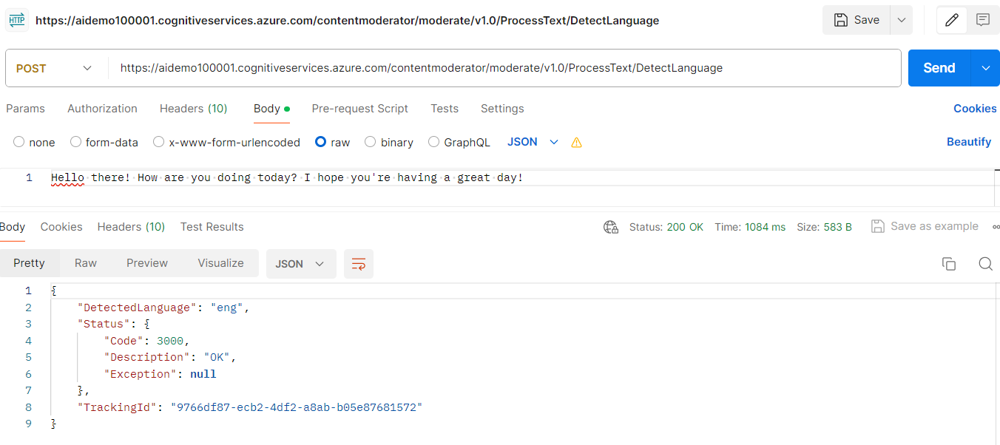
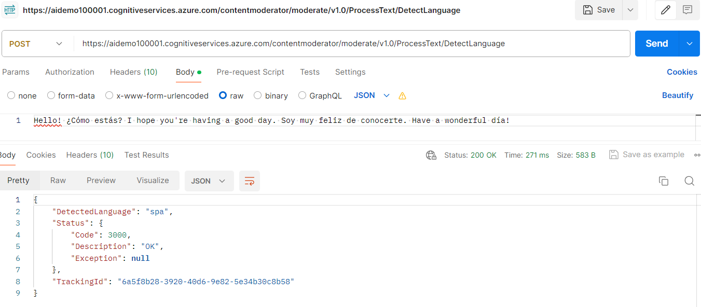

[**Home**](README.md)

Detects the language of given input content. Returns the ISO 639-3 code for the predominant language comprising the submitted text. Over 110 languages supported.

Example: English Text. 
"Hello there! How are you doing today? I hope you're having a great day!"

Example : Spanish and English. 
"Hello! ¿Cómo estás? I hope you're having a good day. Soy muy feliz de conocerte. Have a wonderful día!"
