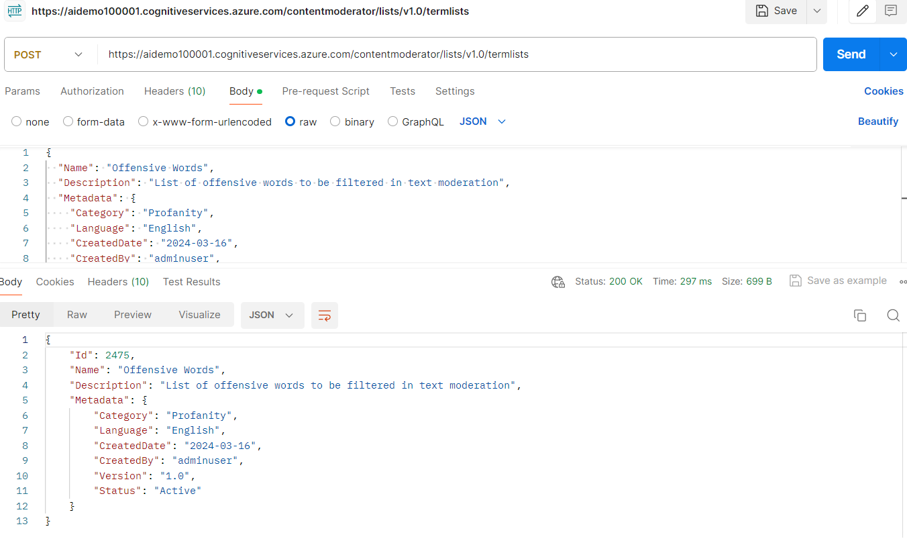

[**Home**](README.md)

Create and manage your custom lists of Images and Text. The lists that you create can be used in the Image/Match and Text/Screen APIs.

[Content Moderator - List Management API console](https://westus.dev.cognitive.microsoft.com/docs/services/57cf755e3f9b070c105bd2c2/operations/57cf755e3f9b070868a1f67b)


### PostMan ###
* Endpoint: https://aidemo100001.cognitiveservices.azure.com/contentmoderator/lists/v1.0/termlists
    aidemo100001 is the name of the Content Moderator resource in Azure
* Headers : Content-Type: application/json
* Headers : Ocp-Apim-Subscription-Key: Key from the resources aidemo100001
* Method : POST
* Body : raw 

Request Input
```json
{
  "Name": "Offensive Words",
  "Description": "List of offensive words to be filtered in text moderation",
  "Metadata": {
    "Category": "Profanity",
    "Language": "English",
    "CreatedDate": "2024-03-16",
    "CreatedBy": "adminuser",
    "Version": "1.0",
    "Status": "Active",
  },
  "Terms": [
    "****",
    "damn",
    "idiot",
    "ass",
    "bastard",
    "crap"
  ]
}
```
Response
```json
{
  "Id": 2475,
  "Name": "Offensive Words",
  "Description": "List of offensive words to be filtered in text moderation",
  "Metadata": {
    "Category": "Profanity",
    "Language": "English",
    "CreatedDate": "2024-03-16",
    "CreatedBy": "adminuser",
    "Version": "1.0",
    "Status": "Active"
  }
}
```
