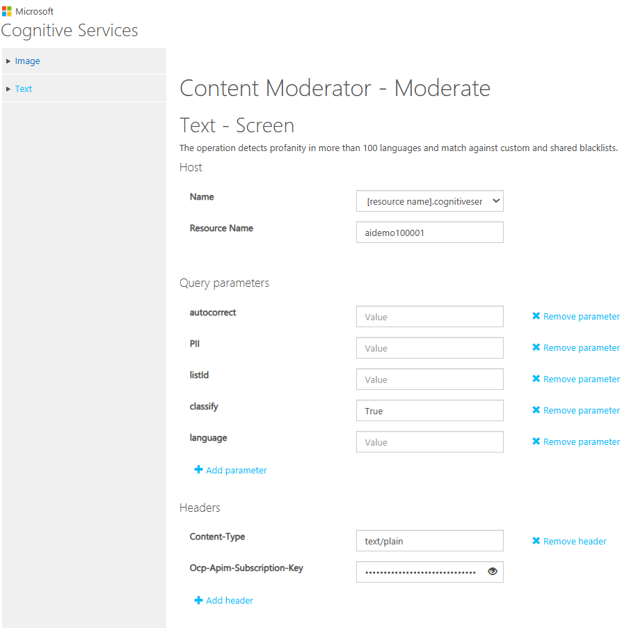
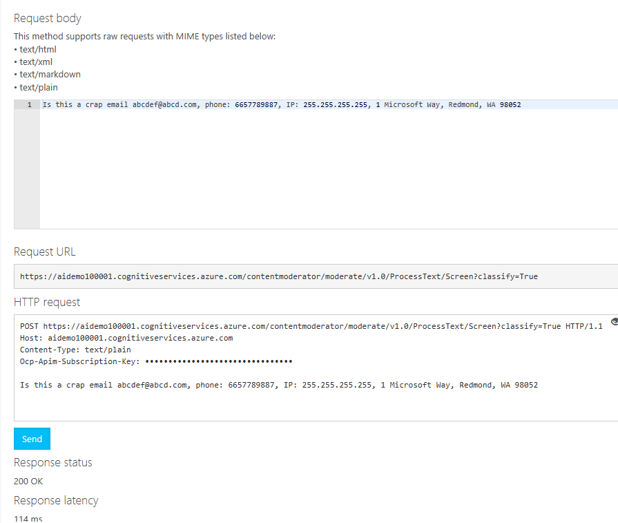
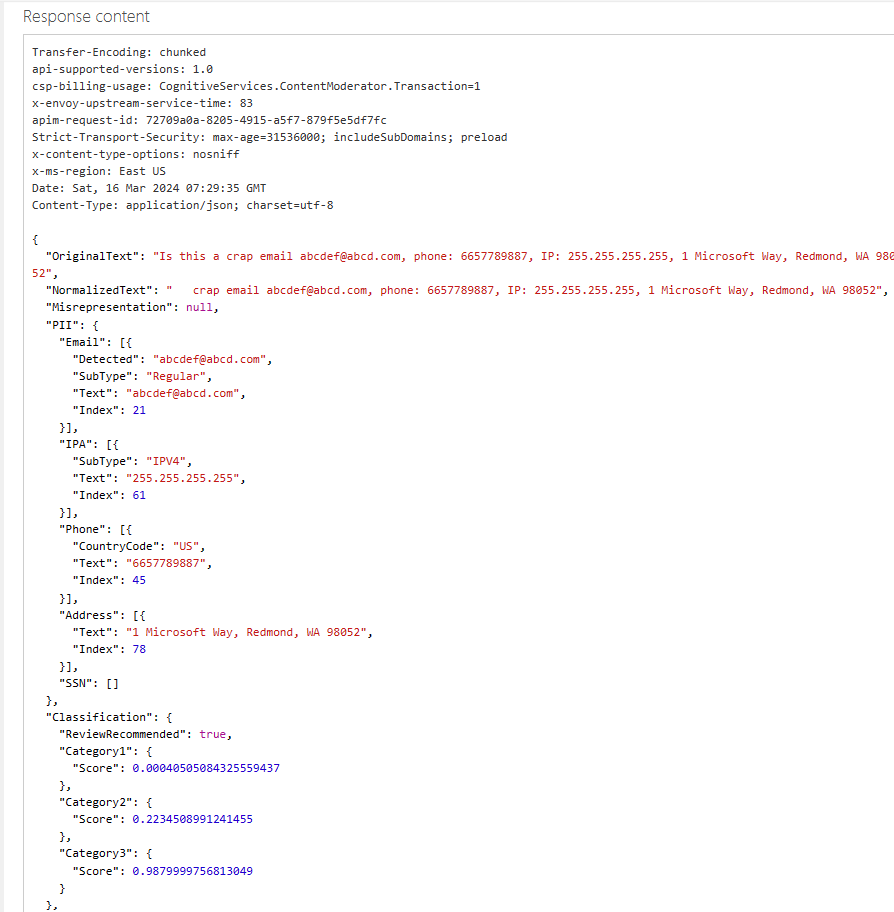
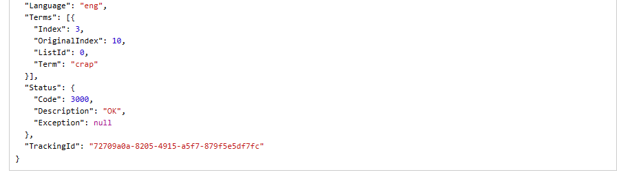

[**Home**](README.md)

Create a Azure Content moderator resource. 
After the creation of resource, access [Content Moderator API Reference page](https://westus.dev.cognitive.microsoft.com/docs/services/57cf753a3f9b070c105bd2c1/operations/57cf753a3f9b070868a1f66f) to test in the API console. Choose the API location same as the Content moderator location for testing content moderation or can use the PostMan tool.

Images need to have a minimum of 128 pixels and a maximum file size of 4MB. Text can be at most 1024 characters long. If the content passed to the text API or the image API exceeds the size limits, the API will return an error code that informs about the issue.

**Moderate Text:**
### Online Content Moderator API Console ###
[Content Moderator for List Management](LIST.md)





Contnet Moderator resource created in the eastus region,
With the Online Content Moderator API Console, end point can be "eastus.api.cognitive.microsoft.com" selected for Moderator.
The domain "eastus.api.cognitive.microsoft.com" is the base endpoint for accessing various Microsoft Cognitive Services APIs, including Azure Content Moderator, specifically within the East US region. When you interact with this domain directly, you're essentially accessing the endpoint for the Cognitive Services APIs hosted in the East US region.

### PostMan ###
* Endpoint: https://aidemo100001.cognitiveservices.azure.com/contentmoderator/moderate/v1.0/ProcessText/Screen?classify=True
    aidemo100001 is the name of the Content Moderator resource in Azure
* Headers : Content-Type: text/plain
* Headers : Ocp-Apim-Subscription-Key: Key from the resources aidemo100001
* Method : POST
* Body : raw 

Additional query qarameters can be apssed and all parameters are optional "autocorrect=true&PII=true&listId=2474&classify=True&language=eng"
* Autocorrect : enable auto-correction on the text
* PII :  detect personally identifiable information
* ListId: specify a custom term list Id. This allows to define more words for Profanity check.
* Classify : perform classification to place text into specific categories
* Language: set the language 

 Example: 1

    "Hey there, this message is a bit concerning. Contact me ASAP at john.doe@email.com or give me a ring at 123-456-7890. Also, my address is 123 Main Street, Anytown, USA. Looking forward to hearing from you!"


```json
{
    "OriginalText": "Hey there, this message is a bit concerning. Contact me ASAP at john.doe@email.com or give me a ring at 123-456-7890. Also, my address is 123 Main Street, Anytown, USA. Looking forward to hearing from you!",
    "NormalizedText": "Hey ,  message   bit concerning. Contact  ASAP  john.doe@email.com     ring  123-456-7890. ,  address  123 Main Street, Anytown, USA. Looking forward  hearing  you!",
    "Misrepresentation": null,
    "PII": {
        "Email": [
            {
                "Detected": "john.doe@email.com",
                "SubType": "Regular",
                "Text": "john.doe@email.com",
                "Index": 64
            }
        ],
        "IPA": [],
        "Phone": [
            {
                "CountryCode": "US",
                "Text": "123-456-7890",
                "Index": 104
            }
        ],
        "Address": [],
        "SSN": []
    },
    "Classification": {
        "ReviewRecommended": false,
        "Category1": {
            "Score": 0.00121889088768512
        },
        "Category2": {
            "Score": 0.08827821910381317
        },
        "Category3": {
            "Score": 0.0373903326690197
        }
    },
    "Language": "eng",
    "Terms": null,
    "Status": {
        "Code": 3000,
        "Description": "OK",
        "Exception": null
    },
    "TrackingId": "ad822b38-d786-484b-848d-71dddb18f27b"
}
```
Example: 2

"What the heck is wrong with you? Stop being such a jerk and get your act together! I'm sick and tired of dealing with your crap."

```json
{
    "OriginalText": "What the heck is wrong with you? Stop being such a jerk and get your act together! I'm sick and tired of dealing with your crap.",
    "NormalizedText": "  heck  wrong  you? Stop    jerk   your act ! I'm sick  tired  dealing  your crap.",
    "Misrepresentation": null,
    "Classification": {
        "ReviewRecommended": true,
        "Category1": {
            "Score": 0.00223451666533947
        },
        "Category2": {
            "Score": 0.08092322945594788
        },
        "Category3": {
            "Score": 0.9879999756813049
        }
    },
    "Language": "eng",
    "Terms": [
        {
            "Index": 77,
            "OriginalIndex": 123,
            "ListId": 0,
            "Term": "crap"
        }
    ],
    "Status": {
        "Code": 3000,
        "Description": "OK",
        "Exception": null
    },
    "TrackingId": "c9437502-cb00-47d8-a0bf-2e7d6c0d4788"
}
```