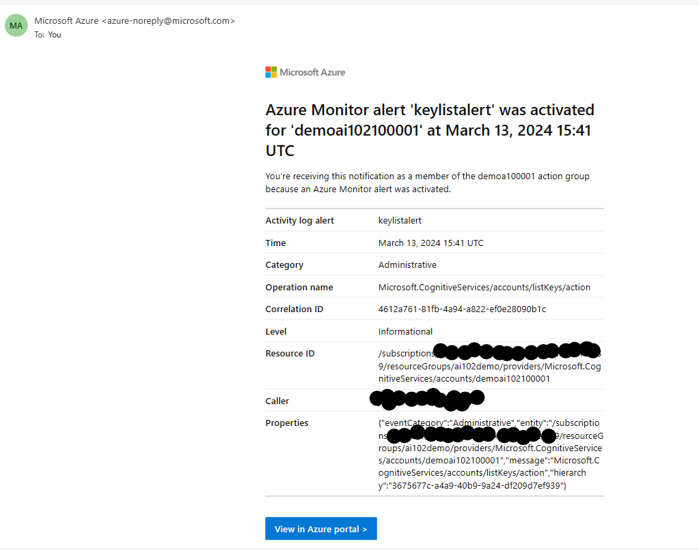

Benefits of using cloud services is that we can gain cost efficiencies by only paying for services as we use them.
Cost estimate of the cloud AI services can be done using [Azure Pricing Calculator](https://azure.microsoft.com/en-us/pricing/calculator/) before deployment.

Overall costs for the subscription can be viewed by selecting the Cost analysis tab.
To view only costs for AI services, add a filter that restricts the data to reflect resources with a service name of Cognitive Services.

It’s important to be able to monitor activity and get alerted to issues that may need attention.

Use alert rules to configure notifications and alerts for cloud resources based on events or metric thresholds. These alerts will ensure that the correct team knows when a problem arises.

Azure Monitor collects metrics for Azure resources at regular intervals so that we can track indicators of resource utilization, health, and performance.

Metrics for an individual resource in the Azure portal can be viewed by selecting the resource and viewing its Metrics page.

Create Azure AI services multi-service account.

With in Azure AI services resource view its Alerts page (in the Monitoring section) and create a alert rule.

While creating the Alert,  
Conditions sections will help to select the right signal, for the example we will consider "List Keys"(When ever there is a Key generated for Key1 or Key2, it will be alerted).

Action sections will help to configure the notifcation email to trigger and trigger the next set of events(Azure functions or Logic App or Event Hub or a web hook)

Complete the creation of alert. Go back to AI resources "Keys and Endpoint" section and regenerate the keys to get notified via email per the configuration.

To view the Metrics, view the Metrics page with in the AI resource and click on New Chart
Select the Metric as "Total Calls" and Aggregation as "Count".

Open Post man and start hitting the [language service](https://demoai102100001.cognitiveservices.azure.com/language/:analyze-text?api-version=2023-04-01) to generate the mutliple requests. 

Refresh the Metrics to view the Total Call count in the chart.  It may take a few minutes for the calls to be reflected in the chart - keep refreshing the chart until it updates to include them.