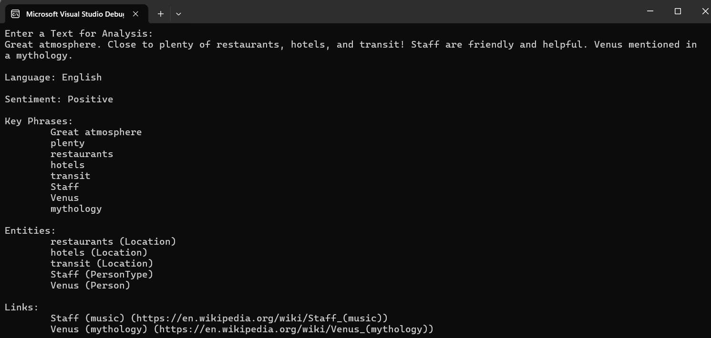

Much of the data we encounter is in the form of text, such as emails, social media updates, online feedback, and various business documents. By employing artificial intelligence methods that leverage statistical and semantic analysis, we can develop applications capable of interpreting and gleaning insights from this textual content.

Azure AI provides functionality

* Identifying the Language: Figuring out what language the text is in.
* Extracting Key Phrases: Finding significant words or phrases that highlight the core ideas.
* Analyzing Sentiment: Measuring the text's positivity or negativity.
* Recognizing Named Entities: Spotting mentions of specific entities like people, places, dates, organizations, etc.
* Linking Entities: Matching identified entities to their Wikipedia articles for more context.

**[Language detection](LANGUAGEDETECTION.md)** returns language identifiers with a score indicating the strength of the analysis. It can work with documents or single phrases. It's important to note that the document size must be under 5,120 characters. The size limit is per document and each collection is restricted to 1,000 items (IDs). 

If we pass in a document that has multilingual content, the service will behave a bit differently. Mixed language content within the same document returns the language with the largest representation in the content, but with a lower positive rating, reflecting the marginal strength of that assessment. 

**[Extract Key Phrase](KEYPHRASE.md)** Key phrase extraction involves analyzing a document's text to pinpoint and highlight its central themes or concepts. Key phrase extraction works best for larger documents (the maximum size that can be analyzed is 5,120 characters).

**[Sentiment Analysis](SENTIMENT.md)**  is used to evaluate how positive or negative a text document is, which can be useful in various workloads, such as:

- Evaluating a movie, book, or product by quantifying sentiment based on reviews.
- Prioritizing customer service responses to correspondence received through email or social media messaging.

**[Extract Entities](ENTITIES.md)** Named Entity Recognition identifies entities that are mentioned in the text. Entities are grouped into categories and subcategories, for example:

- Person
- Location
- DateTime
- Organization
- Address
- Email
- URL

**[Extract linked entities](LINKEDENTITES.md)** entity linking helps differentiate between entities sharing a name by connecting them to a relevant Wikipedia article, using the context within the text to guide the link choice. For instance, ["Venus"]( https://en.wikipedia.org/wiki/Venus) observed in the night sky links to its astronomical page, whereas ["Venus"](https://en.wikipedia.org/wiki/Venus_(mythology)) mentioned in a mythological context points to the article on the Roman goddess.

For example, suppose a travel agency wants to process hotel reviews that have been submitted to the company’s web site. By using the Azure AI Language, they can determine the language each review is written in, the sentiment (positive, neutral, or negative) of the reviews, key phrases that might indicate the main topics discussed in the review, and named entities, such as places, landmarks, or people mentioned in the reviews.

Executing the program and input the text for analysis will provide the response as in the screen

