Natural Language Processing (NLP) presents a prevalent AI challenge, requiring software to comprehend text or speech in the same manner as a human user communicates. Within the expansive domain of NLP, Natural Language Understanding (NLU) specifically focuses on extracting semantic meaning from natural language, typically leveraging trained language models.

A common design pattern for a natural language understanding solution looks like this:

1. An app accepts natural language input from a user.
2. A language model is used to determine semantic meaning (the user's intent).
3. The app performs an appropriate action.

The Azure AI Language service offers a range of capabilities for comprehending human language. These features enable improved communication with users, enhanced understanding of incoming communication, and when combined, provide deeper insight into user intents and inquiries.

Azure AI Language service features are categorized into Pre-configured features and Learned features. While Pre-configured features are readily available for immediate use, Learned features necessitate model building and training to accurately predict suitable labels.

### Pre-configured features
The Azure AI Language service provides certain features without any model labeling or training. Once you create your resource, you can send your data and use the returned results within your app.

**Summarization**
Summarization is available for both documents and conversations, and will summarize the text into key sentences that are predicted to encapsulate the input's meaning.

**Named entity recognition**
Named entity recognition can extract and identify entities, such as people, places, or companies, allowing your app to recognize different types of entities for improved natural language responses. For example, given the text "The waterfront pier is my favorite Seattle attraction", Seattle would be identified and categorized as a location.

**Personally identifiable information (PII) detection**
PII detection allows you to identify, categorize, and redact information that could be considered sensitive, such as email addresses, home addresses, IP addresses, names, and protected health information. For example, if the text "email@contoso.com" was included in the query, the entire email address can be identified and redacted.

**Key phrase extraction**
Key phrase extraction is a feature that quickly pulls the main concepts out of the provided text. For example, given the text "Text Analytics is one of the features in Azure AI Services.", the service would extract "Azure AI Services" and "Text Analytics".

**Sentiment analysis**
Sentiment analysis identifies how positive or negative a string or document is. For example, given the text "Great hotel. Close to plenty of food and attractions we could walk to", the service would identify that as positive with a relatively high confidence score.

**Language detection**
Language detection takes one or more documents, and identifies the language for each. For example, if the text of one of the documents was "Bonjour", the service would identify that as French.

### Learned features
Learned features require you to label data, train, and deploy your model to make it available to use in your application.


**CLU, or Custom Language Understanding**, stands as a fundamental custom feature provided by Azure AI Language. It empowers users to construct personalized natural language understanding models aimed at forecasting overall intent and extracting crucial details from incoming utterances. To achieve accurate predictions of intents and entities, CLU necessitates user-tagged data, which serves to instruct and refine its learning process.

**Custom named entity recognition**
Custom entity recognition takes custom labeled data and extracts specified entities from unstructured text. For example, if you have various contract documents that you want to extract involved parties from, you can train a model to recognize how to predict them.

**Custom text classification**
Custom text classification enables users to classify text or documents as custom defined groups. For example, you can train a model to look at news articles and identify the category they should fall into, such as News or Entertainment.

**Question answering**
Question answering is a mostly pre-configured feature that provides answers to questions provided as input. The data to answer these questions comes from documents like FAQs or manuals.

For example, say you want to make a virtual chat assistant on your company website to answer common questions. You could use a company FAQ as the input document to create the question and answer pairs. Once deployed, your chat assistant can pass input questions to the service, and get the answers as a result.

---------------------------------------------------------------

**Utterances** are the phrases that a user might enter when interacting with an application that uses your language model. 

**Intent** represents a task or action the user wants to perform, or more simply the meaning of an utterance. 

**Entities** are used to add specific context to intents.

<table>
    <thead>
      <tr>
        <th>Utterance</th>
        <th>Intent</th>
        <th>Entities</th>
      </tr>
    </thead>
    <tbody>
        <tr>
            <td>What is the time?</td>
            <td>GetTime</td>
            <td></td>
        </tr>
        <tr>
            <td>What time is it in London?</td>
            <td>GetTime</td>
            <td>Location (London)</td>
        </tr>
        <tr>
            <td>Will I need an umbrella tonight?</td>
            <td>GetWeather</td>
            <td>Time (tonight)</td>
        </tr>
          <tr>
            <td>What's the weather forecast for Paris?</td>
            <td>GetWeather</td>
            <td>Location (Paris)</td>
        </tr>
         <tr>
            <td>What's the forecast for Seattle tomorrow?</td>
            <td>GetWeather</td>
            <td>Location (Seattle), Time (tomorrow)</td>
        </tr>
         <tr>
            <td>Turn the light on.</td>
            <td>TurnOnDevice</td>
            <td>Device (light)</td>
        </tr>
         <tr>
            <td>Switch on the fan.</td>
            <td>TurnOnDevice</td>
            <td>Device (fan)</td>
        </tr>
    </tbody>
  </table>

Entities can be split into a few different component types:

- Learned entities are the most flexible kind of entity, and should be used in most cases. You define a learned component with a suitable name, and then associate words or phrases with it in training utterances. When you train your model, it learns to match the appropriate elements in the utterances with the entity.
- List entities are useful when you need an entity with a specific set of possible values - for example, days of the week. You can include synonyms in a list entity definition, so you could define a DayOfWeek entity that includes the values "Sunday", "Monday", "Tuesday", and so on; each with synonyms like "Sun", "Mon", "Tue", and so on.
- Prebuilt entities are useful for common types such as numbers, datetimes, and names. For example, when prebuilt components are added, you will automatically detect values such as "6" or organizations such as "Microsoft". 


Create a Azure AI Language Resource and then access [Language Studio](https://language.cognitive.azure.com/) to configure the Conversational Language Understanding.

1. Create a new project by selecting the option "Conversational Language Understanding".
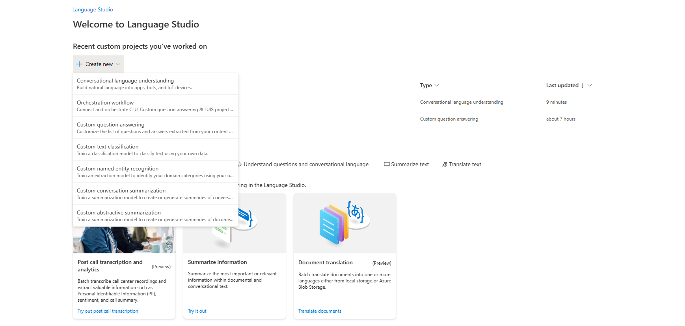
2. Provide the project name as "clock" , description as "Natural language clock" , "Unselect" the option of "Enable languagesin project" and Utterances primary language as "English".
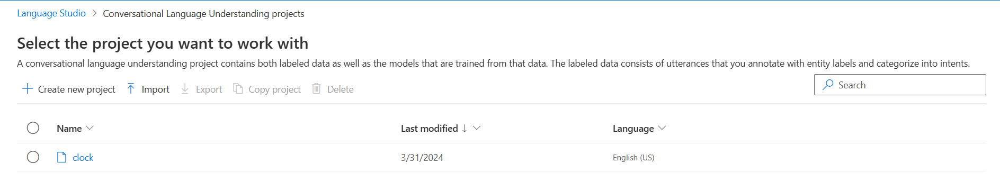
3. On the Schema definition page, on the Intents tab, select ＋ Add to add a new intents "GetTime", "GetDay", "GetDate"
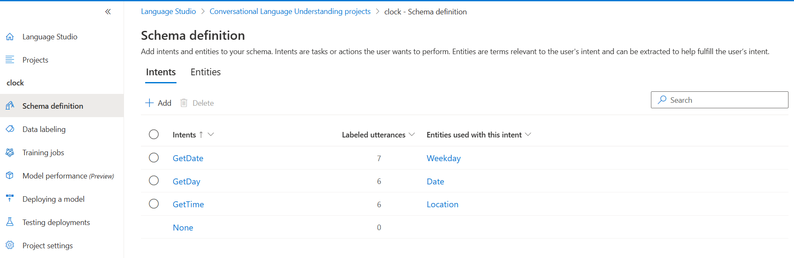
4. Select the Data Labeling page and enter the utterance for the intents.
    * GetTime intent:
      - what's the time?
      - what time is it?
      - tell me the time
    * GetDay
      - what day is it?
      - what's the day?
      - what is the day today?
      - what day of the week is it?
    * GetDate 
      - what date is it?
      - what's the date?
      - what is the date today?
      - what's today's date?

5. After adding utterances for each of the intents,select "Save changes".

6. Select Training jobs. Then select + Start a training job and name it "clock". Select Standard training mode and the default Data splitting options.

7. Select "Train" to begin the process of training the model. When the training is completed, status will show "Training succeeded".
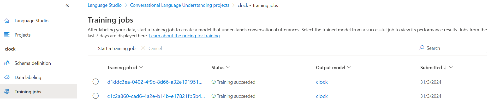
8. Model performance page, review the overall and per-intent evaluation metrics (precision, recall, and F1 score) and the confusion matrix generated by the evaluation that was performed when training (note that due to the small number of sample utterances, not all intents may be included in the results).
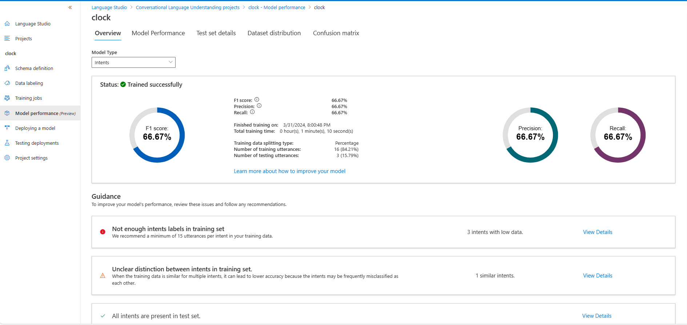
9. Select Deploying a model page and Create a new deployment name "clock" or "production".

10. Select the clock model in the Model field then select Deploy. 
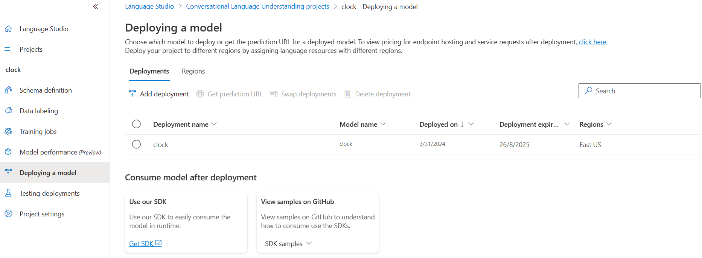
11. When the model has been deployed, select the Testing deployments page, then select the production deployment in the Deployment name field.
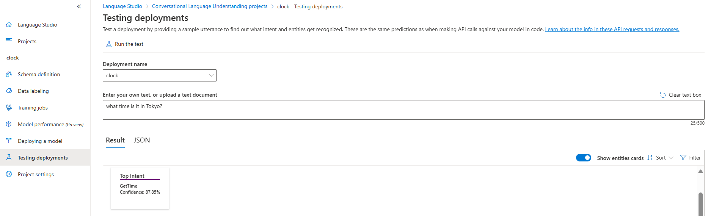

```json
{
    "query": "what's the time now?",
    "prediction": {
        "topIntent": "GetDate",
        "projectKind": "Conversation",
        "intents": [
            {
                "category": "GetDate",
                "confidenceScore": 0.912751
            },
            {
                "category": "GetTime",
                "confidenceScore": 0.9030581
            },
            {
                "category": "GetDay",
                "confidenceScore": 0.8699784
            },
            {
                "category": "None",
                "confidenceScore": 0
            }
        ]
    }
}

{
    "query": "what's the day today?",
    "prediction": {
        "topIntent": "GetDay",
        "projectKind": "Conversation",
        "intents": [
            {
                "category": "GetDay",
                "confidenceScore": 0.97866905
            },
            {
                "category": "GetDate",
                "confidenceScore": 0.96380204
            },
            {
                "category": "GetTime",
                "confidenceScore": 0.81567246
            },
            {
                "category": "None",
                "confidenceScore": 0
            }
        ]
    }
}
```

12. On the Schema definition page and select Entities tab, select ＋ Add to add a new entity.
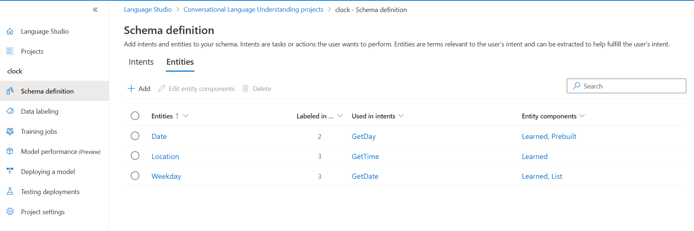
13. Add an entity dialog box, enter the entity name "Location" and ensure that the Learned tab is selected.

14. Once the Location entity has been established, return to the Data labeling page.
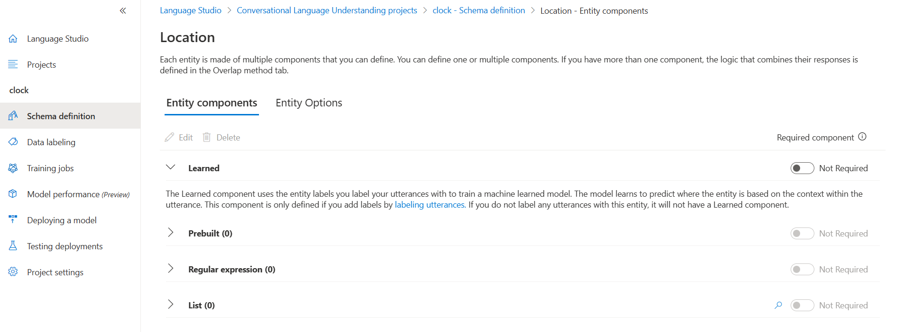
15. Navigate to the GetTime intent and input the following new example utterance: "what time is it in London?", Upon adding the utterance, designate the word "London" as a Location entity from the dropdown list.

16. Include another example utterance for the GetTime intent: "Tell me the time in Paris?", After adding the utterance, map the word "Paris" to the Location entity.

17. Introduce another example utterance for the GetTime intent: "what's the time in New York?", Upon adding the utterance, map the words "New York" to the Location entity.

18. Finally, save the changes to preserve the new utterances.
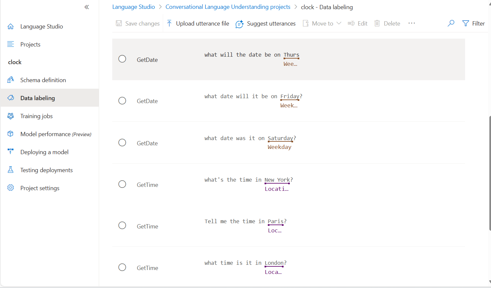
19. Return to the Schema definition page and then on the Entities tab, select ＋ Add to add a new entity.

20. Enter the entity name "Weekday" and select the List entity tab. Then select Add entity.

21. For the Weekday entity, in the Learned section, ensure Not required is selected. Then, in the List section, select ＋ Add new list. Then enter the following value and synonym and select Save:
  <table>
      <thead>
        <tr>
          <th>List key</th>
          <th>synonyms</th>
        </tr>
      </thead>
      <tbody>
          <tr>
              <td>Sunday</td>
              <td>Sun</td>
          </tr>
          <tr>
              <td>Monday</td>
              <td>Mon</td>
          </tr>
          <tr>
              <td>Tuesday</td>
              <td>Tue, Tues</td>
          </tr>
        </tbody>
    </table>

  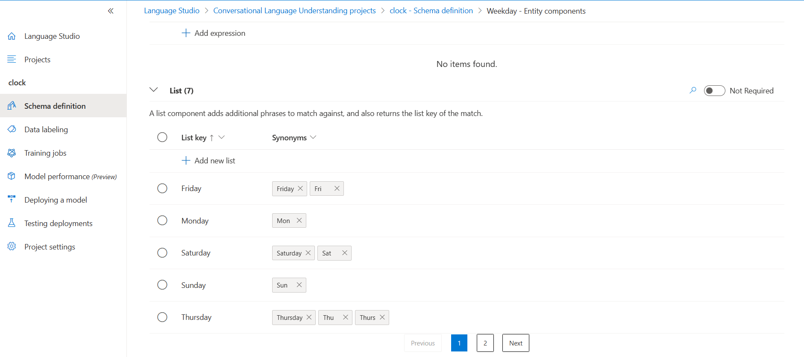

22. Update for all the weekdays, save the changes to list values and return to the Data labeling page.

23. Choose the GetDate intent and input the following new example utterance: "What date was it on Saturday?".  Upon adding the utterance, select the word "Saturday" and from the dropdown list, choose Weekday.

24. Include another example utterance for the GetDate intent: "What date will it be on Friday?". Once added, map "Friday" to the Weekday entity.

25. Add another example utterance for the GetDate intent: "What will the date be on Thurs?". After adding the utterance, map "Thurs" to the Weekday entity.

26. Lastly, save the changes to retain the new utterances.

27. Return to the Schema definition page and create the Prebuilt entity name "Date"

28. On the page for the Date entity, in the Learned section, ensure Not required is selected. Then, in the Prebuilt section, select ＋ Add new prebuilt.

29. In the Select prebuilt list, select DateTime and then select Save.

30. Once the prebuilt entity has been added, navigate back to the Data labeling page.

31. Choose the GetDay intent and input the following new example utterance: "What day was 01/01/1901?". Upon adding the utterance, select "01/01/1901" and from the dropdown list, choose Date.

32. Include another example utterance for the GetDay intent: "What day will it be on Dec 31st 2099?". After adding the utterance, map "Dec 31st 2099" to the Date entity.
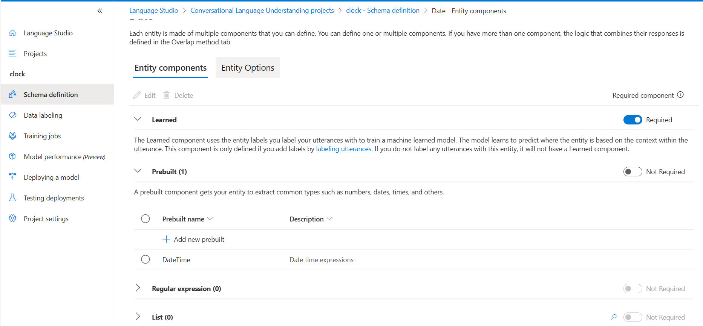

33. Finally, save the changes to retain the new utterances.

34. Retrain and deploy the model. While deploying "select Override an existing deployment name"

35. When the model is deployed, on the Testing deployments page, select the production deployment under the Deployment name field, and then test it with the following text:

what's the time in Edinburgh?

Review the result that is returned, which should hopefully predict the GetTime intent and a Location entity with the text value “Edinburgh”.

Try testing the following utterances:

what time is it in Tokyo?

what date is it on Friday?

what's the date on Weds?

what day was 01/01/2020?

what day will Mar 7th 2030 be?

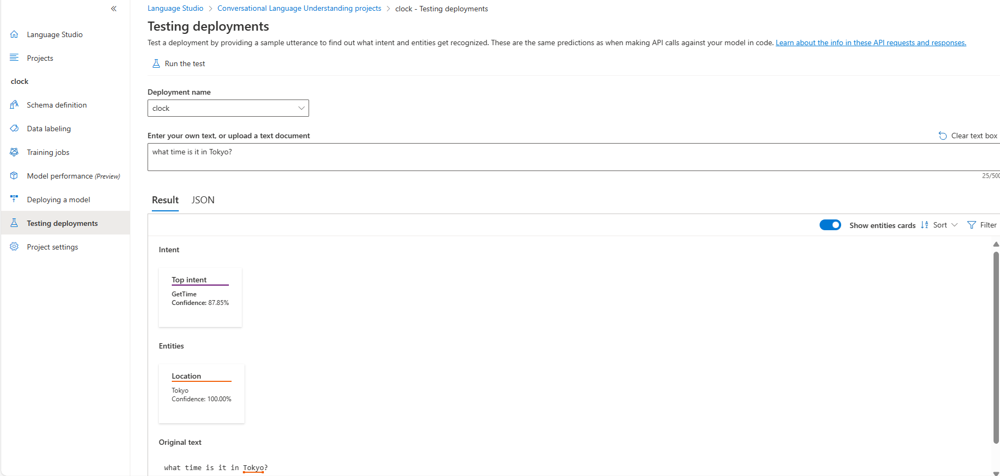
```json

{
    "query": "what time is it in Tokyo?",
    "prediction": {
        "topIntent": "GetTime",
        "projectKind": "Conversation",
        "intents": [
            {
                "category": "GetTime",
                "confidenceScore": 0.8784993
            },
            {
                "category": "GetDate",
                "confidenceScore": 0.7085741
            },
            {
                "category": "GetDay",
                "confidenceScore": 0.66591305
            },
            {
                "category": "None",
                "confidenceScore": 0
            }
        ],
        "entities": [
            {
                "category": "Location",
                "text": "Tokyo",
                "offset": 19,
                "length": 5,
                "confidenceScore": 1
            }
        ]
    }
}
```

36. Add the code necessary to import the required SDK libraries(Azure.AI.Language.Conversations), establish an authenticated connection to your deployed project and submit questions. Update the configurations in the code base,

```json
Enter some text ('quit' to stop)
What time is it?
{
  "kind": "ConversationResult",
  "result": {
    "query": "What time is it?",
    "prediction": {
      "topIntent": "GetTime",
      "projectKind": "Conversation",
      "intents": [
        {
          "category": "GetTime",
          "confidenceScore": 1
        },
        {
          "category": "GetDate",
          "confidenceScore": 0.9446378
        },
        {
          "category": "GetDay",
          "confidenceScore": 0.9086431
        },
        {
          "category": "None",
          "confidenceScore": 0
        }
      ],
      "entities": []
    }
  }
}
--------------------

What time is it?
20:20

Enter some text ('quit' to stop)
hello
{
  "kind": "ConversationResult",
  "result": {
    "query": "hello",
    "prediction": {
      "topIntent": "GetDate",
      "projectKind": "Conversation",
      "intents": [
        {
          "category": "GetDate",
          "confidenceScore": 0.7101506
        },
        {
          "category": "GetDay",
          "confidenceScore": 0.5866046
        },
        {
          "category": "GetTime",
          "confidenceScore": 0.55401665
        },
        {
          "category": "None",
          "confidenceScore": 0
        }
      ],
      "entities": []
    }
  }
}
--------------------

hello
31-03-2024

Enter some text ('quit' to stop)
What’s the time in London?
{
  "kind": "ConversationResult",
  "result": {
    "query": "What\u0027s the time in London?",
    "prediction": {
      "topIntent": "GetTime",
      "projectKind": "Conversation",
      "intents": [
        {
          "category": "GetTime",
          "confidenceScore": 0.96181196
        },
        {
          "category": "GetDate",
          "confidenceScore": 0.7612803
        },
        {
          "category": "GetDay",
          "confidenceScore": 0.72653997
        },
        {
          "category": "None",
          "confidenceScore": 0
        }
      ],
      "entities": [
        {
          "category": "Location",
          "text": "London",
          "offset": 19,
          "length": 6,
          "confidenceScore": 1
        }
      ]
    }
  }
}
--------------------

What's the time in London?
14:50

Enter some text ('quit' to stop)
What’s the date?
{
  "kind": "ConversationResult",
  "result": {
    "query": "What\u0027s the date?",
    "prediction": {
      "topIntent": "GetDate",
      "projectKind": "Conversation",
      "intents": [
        {
          "category": "GetDate",
          "confidenceScore": 0.97462803
        },
        {
          "category": "GetDay",
          "confidenceScore": 0.9402201
        },
        {
          "category": "GetTime",
          "confidenceScore": 0.87869674
        },
        {
          "category": "None",
          "confidenceScore": 0
        }
      ],
      "entities": []
    }
  }
}
--------------------

What's the date?
31-03-2024

Enter some text ('quit' to stop)
What date is Sunday?
{
  "kind": "ConversationResult",
  "result": {
    "query": "What date is Sunday?",
    "prediction": {
      "topIntent": "GetDate",
      "projectKind": "Conversation",
      "intents": [
        {
          "category": "GetDate",
          "confidenceScore": 0.9638305
        },
        {
          "category": "GetDay",
          "confidenceScore": 0.9489914
        },
        {
          "category": "GetTime",
          "confidenceScore": 0.85815746
        },
        {
          "category": "None",
          "confidenceScore": 0
        }
      ],
      "entities": [
        {
          "category": "Weekday",
          "text": "Sunday",
          "offset": 13,
          "length": 6,
          "confidenceScore": 1
        },
        {
          "category": "Date",
          "text": "Sunday",
          "offset": 13,
          "length": 6,
          "confidenceScore": 1,
          "resolutions": [
            {
              "resolutionKind": "DateTimeResolution",
              "dateTimeSubKind": "Date",
              "timex": "XXXX-WXX-7",
              "value": "2024-03-24"
            },
            {
              "resolutionKind": "DateTimeResolution",
              "dateTimeSubKind": "Date",
              "timex": "XXXX-WXX-7",
              "value": "2024-03-31"
            }
          ],
          "extraInformation": [
            {
              "extraInformationKind": "EntitySubtype",
              "value": "datetime.date"
            }
          ]
        }
      ]
    }
  }
}
--------------------

What date is Sunday?
31-03-2024

Enter some text ('quit' to stop)
What day is it?
{
  "kind": "ConversationResult",
  "result": {
    "query": "What day is it?",
    "prediction": {
      "topIntent": "GetDay",
      "projectKind": "Conversation",
      "intents": [
        {
          "category": "GetDay",
          "confidenceScore": 0.97359186
        },
        {
          "category": "GetDate",
          "confidenceScore": 0.9696385
        },
        {
          "category": "GetTime",
          "confidenceScore": 0.9062754
        },
        {
          "category": "None",
          "confidenceScore": 0
        }
      ],
      "entities": []
    }
  }
}
--------------------

What day is it?
Sunday

Enter some text ('quit' to stop)
What day is 01/01/2025?
{
  "kind": "ConversationResult",
  "result": {
    "query": "What day is 01/01/2025?",
    "prediction": {
      "topIntent": "GetDay",
      "projectKind": "Conversation",
      "intents": [
        {
          "category": "GetDay",
          "confidenceScore": 0.9445568
        },
        {
          "category": "GetDate",
          "confidenceScore": 0.9361412
        },
        {
          "category": "GetTime",
          "confidenceScore": 0.8539156
        },
        {
          "category": "None",
          "confidenceScore": 0
        }
      ],
      "entities": [
        {
          "category": "Date",
          "text": "01/01/2025",
          "offset": 12,
          "length": 10,
          "confidenceScore": 1,
          "resolutions": [
            {
              "resolutionKind": "DateTimeResolution",
              "dateTimeSubKind": "Date",
              "timex": "2025-01-01",
              "value": "2025-01-01"
            }
          ],
          "extraInformation": [
            {
              "extraInformationKind": "EntitySubtype",
              "value": "datetime.date"
            }
          ]
        }
      ]
    }
  }
}
--------------------

What day is 01/01/2025?
Wednesday

```

### Model Performance and Confusion Matrix
Models are evaluated using metrics such as F1 Score, Precision, and Recall to assess their performance. 

**F1 Score** is like a balance between two things: how many correct guesses our model makes (Precision) and how many of the actual positive cases it finds (Recall). It tells us how well our model does overall.
Example: If our model correctly identifies 85 out of 100 positive cases, and it doesn't wrongly label too many negative cases as positive, it would get a good F1 Score.

2 * (Precision * Recall) / (Precision + Recall)


**Precision** is about being precise, or not making many mistakes when our model says something is positive.
Example: If our model says "this email is spam," we want to be confident it really is spam and not a mistake. A Precision of 90% means out of 100 emails it labeled as spam, 90 were actually spam.

True Positives / (True Positives + False Positives)

**Recall** is about remembering all the positive cases, or not missing out on any.
Example: If there are 100 positive cases, we want our model to find as many as possible. A Recall of 80% means it found 80 out of 100 positive cases.

True Positives / (True Positives + False Negatives)

So, in simple terms, F1 Score tells us how good our model is overall, Precision tells us how careful it is when it says something is positive, and Recall tells us how well it remembers all the positive cases.

**Confusion Matrix**
A confusion matrix is like a scoreboard for a machine learning model. It shows how well the model did by comparing what it predicted with what actually happened. It's kind of like counting how many times the model got it right and how many times it got it wrong. This is really helpful for seeing if the model is good at sorting things into different categories, like deciding if an email is spam or not.

The matrix displays the number of instances produced by the model on the test data.

- True positives (TP): occur when the model accurately predicts a positive data point.
- True negatives (TN): occur when the model accurately predicts a negative data point.
- False positives (FP): occur when the model predicts a positive data point incorrectly.
- False negatives (FN): occur when the model mispredicts a negative data point.

<table class="wikitable" style="background:transparent; text-align:center;" align="center">
<tbody><tr>
<td rowspan="2" >
</td>
<td >
</td>
<td colspan="2" ><b>Predicted condition</b>
</td></tr>
<tr>
<td >Total population<br><span style="white-space:nowrap;">= P + N</span>
</td>
<td><b>Positive (PP)</b>
</td>
<td ><b>Negative (PN)</b>
</td></tr>
<tr>
<td rowspan="2"><div style="vertical-rl=-webkit-writing-mode: vertical-rl; -o-writing-mode: vertical-rl; -ms-writing-mode: tb-rl;writing-mode: tb-rl; writing-mode: vertical-rl; layout-flow: vertical-ideographic;transform:rotate(180deg);display:inline-block;padding-left:1px;text-align:center;"><b>Actual condition</b></div>
</td>
<td ><b>Positive (P)</b>
</td>
<td ><b>True positive (TP) <br></b>
</td>
<td ><b>False negative (FN) <br></b>
</td></tr>
<tr>
<td ><b>Negative (N)</b>
</td>
<td ><b>False positive (FP) <br></b>
</td>
<td ><b>True negative (TN) <br></b>
</td></tr>
</tbody></table>

Example:
Suppose we have a CLU model for a chatbot designed to identify intents in user queries. Let's say we have 100 test instances with the following confusion matrix:

True Positives (TP): 80
False Positives (FP): 10
False Negatives (FN): 5

Precision = TP / (TP + FP) = 80 / (80 + 10) = 0.8889

Recall = TP / (TP + FN) = 80 / (80 + 5) = 0.9412

F1 Score = 2 * (Precision * Recall) / (Precision + Recall)

= 2 * (0.8889 * 0.9412) / (0.8889 + 0.9412)

= 0.9143

So, in this example, the CLU model has a Precision of 0.8889, Recall of 0.9412, and F1 Score of 0.9143, indicating relatively good performance in identifying intents in user queries.
