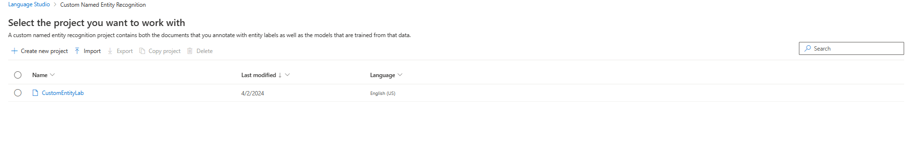

Custom named entity recognition (NER), also referred to as custom entity extraction, is among the array of natural language processing (NLP) capabilities provided by Azure AI Language service. With custom NER, developers can extract specific entities from text documents, even if those documents lack a standardized format, such as legal agreements or online advertisements.

An entity is a person, place, thing, event, skill, or value.

### Project life cycle


Creating an entity extraction model typically follows a similar process to most features in the Azure AI Language service:

**Define entities**: Clearly identify the data and entities you want to extract, such as specific sections of a bank statement.
Tag data: Label your existing data to specify which text corresponds to each entity. Accuracy and completeness are crucial in this step to ensure the model's effectiveness.

**Train model**: Once entities are labeled, train your model to recognize them.

**View model**: Evaluate the model's results, including a score between 0 and 1 based on precision and recall. Identify well-performing entities and areas needing improvement.

**Improve model**: Enhance the model by addressing failures in entity identification and incorrect extractions. Determine necessary data additions for training.

**Deploy model**: Once satisfied with performance, deploy the model to make it accessible via API. For instance, in our scenario, you can utilize the model to extract entities from bank statements.

**Extract entities**: Utilize the deployed model to extract entities as needed.

For optimal performance, it's crucial to train the model with high-quality data and clearly defined entity types.

High-quality data reduces refining time and improves model results.

Consider the following factors:

- Diversity: Use a diverse dataset that mirrors real-world distribution, drawing from various sources and formats.
- Distribution: Ensure an appropriate mix of document types in the dataset to prevent the model from learning incorrect patterns.
- Accuracy: Utilize data that closely resembles real-world scenarios to avoid extraction errors.

Entities should be precisely defined to avoid ambiguity. Providing ample examples of ambiguous entities helps the model differentiate effectively.

Ensuring clear distinctions among entities significantly enhances the model's performance. For instance, attempting to extract "Contact info," which may encompass phone numbers, social media handles, or email addresses, necessitates numerous examples to train the model accurately. Instead, it's beneficial to categorize them into more specific entities like "Phone," "Email," and "Social media," allowing the model to label each type of contact information it encounters.

**Project constraints** for the Azure AI Language service include:
- For training: A minimum of 10 files and a maximum of 100,000.
- Deployments: Limited to 10 deployment names per project.
- APIs:
    - Authoring API: Allows 10 POST and 100 GET requests per minute for creating projects, training, and deployment.
    - Analyze API: Limited to 20 GET or POST requests for extracting entities.
    - Projects: Only one storage account per project, up to 500 projects per resource, and a maximum of 50 trained models per project.
    - Entities: Each entity can contain up to 500 characters, with a maximum of 200 entity types.


Correctly labeling or tagging your data is crucial when creating a custom entity extraction model. Here are three key aspects to focus on:

- Consistency: Ensure that you label your data consistently across all files during training. Consistency helps the model learn effectively without conflicting inputs.
- Precision: Label your entities accurately without adding unnecessary extra words. Precision ensures that only relevant data is included in the extracted entity.
- Completeness: Make sure to label your data comprehensively without missing any entities. Completeness ensures that the model can consistently recognize all relevant entities present in the text.


Understanding how to interpret metrics is crucial for evaluating the performance of your model:

- Precision and Recall: Ideally, we aim for high scores in both precision and recall, indicating effective entity recognition. Low scores in both metrics suggest that the model struggles to recognize entities and often assigns incorrect labels.
- Low Precision, High Recall: This scenario indicates that the model recognizes entities well but frequently mislabels them.
- High Precision, Low Recall: Here, the model may not always recognize entities, but when it does, it typically assigns the correct label.

Create a Azure AI Language Resource and then access [Language Studio](https://language.cognitive.azure.com/) to configure the Custom Named Entity Recognition. Upload all the [example](ads) files to the storage account creating a new container "classifieds".

1. Create a new project by selecting the option "Custom Named Entity Recognition".


2. Provide the project name as "CustomEntityLab" , description as "Custom entities in classified ads" , "Unselect" the option of "Enable languagesin project" and primary language as "English".


3. Navigate to Data labeling on the left side, if it's not already chosen. You'll find a roster of the files you've uploaded to your storage account.


4. On the right-hand side, within the Activity pane, click on + Add Entity. Adds will be grouped into 3 entities to establish: ItemForSale, Price, and Location.

5. Select Ad 1.txt so you can read it. Here you can read the article, define which class this file is, and which dataset (training or testing) to assign it to.
        - Mark the phrase "face cord of firewood" and choose the ItemForSale option.
        - Mark "Denver, CO" and select Location.
        - Mark "$90" and choose Price. 

    In the Activity pane, observe that this document will join the dataset used to train the model.

6. Us the Next document button to move to the next document, and continue assigning text to appropriate entities for the entire set of documents, adding them all to the training dataset. When you have labeled the last document, save the labels.


- While labeling the data set, it can be configured for Training or for testing 
 

7. Initiate a training job from the left-side menu, then commence a new training session named "ExtractAds" while opting for manual split of training and testing data.

8. Choose "Model performance" and pick your "ExtractAds" model to view its scoring, performance metrics, and training timestamp. If the model's scoring isn't 100%, it indicates misclassifications in the test data, pinpointing areas for improvement.


9. Navigate to the "Deploying model" section from the left panel. Click on "Add deployment," then input a name "AdEntities" for the deployment in the "Create a new deployment name" field and choose "ExtractAds" from the "Model" dropdown menu. Select "Deploy" to initiate the deployment process.


10. Test the model deployed

```json
{
    "entities": [
        {
            "text": "Weight set",
            "category": "ItemForSale",
            "offset": 0,
            "length": 10,
            "confidenceScore": 0.91
        },
        {
            "text": "$100",
            "category": "Price",
            "offset": 21,
            "length": 4,
            "confidenceScore": 0.71
        },
        {
            "text": "Phoenix, AZ",
            "category": "Location",
            "offset": 118,
            "length": 11,
            "confidenceScore": 0.99
        }
    ]
}
```
11. Add the code necessary to import the required SDK libraries(Azure.AI.TextAnalytics), establish an authenticated connection to your deployed project and submit text for classification. Update the configurations in the code base.
    - "AIServicesEndpoint": "Endpoint url of the language resources. 'Keys and Endpoint' section has the endpoint and keys info"
    - "AIServicesKey": "Key of the language resource"
    - "ProjectName": "project name created in the Language Studio"
    - "DeploymentName": "Name of the deployment from the step 9."

## Model Performance


Entity type performance refers to how accurately the model identifies and extracts specific types of entities from text data. It evaluates the effectiveness of the model in recognizing and labeling predefined entity types such as names, dates, locations, or custom entities specified by the user(ItemsForSale, Price and Location).


Test set details refer to the information and results obtained when evaluating the model's performance on a separate set of test data. 


Confusion matrix provides a tabular representation of the model's performance in classifying entities. 


Score of 1 in the black box are True positive and rest of the decimal numbers are errors and needs to be corrected with proper labeling or with more samples. 

From the Test set details screens

True Positives (TP): 8
False Positives (FP): 0
False Negatives (FN): 1

Precision = TP / (TP + FP) = 8 / (8 + 0) = 1 = 1 * 100 = 100%

Recall = TP / (TP + FN) = 8 / (8 + 1) = 0.8889 = 0.8889 * 100 = 88.89% (rounding to fourth digit)

F1 Score = 2 * (Precision * Recall) / (Precision + Recall)

= 2 * (1 * 0.8889) / (1 + 0.8889)

= 2 * 0.4705

= 0.94118 * 100

= 0.94112 * 100 (rounding to fourth digit)

= 94.12%