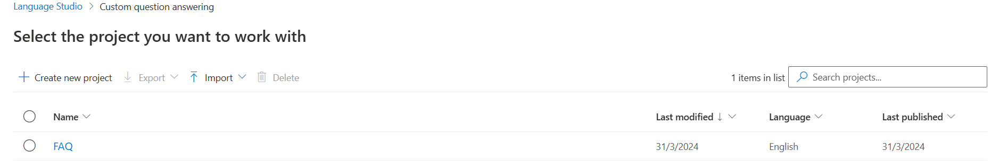
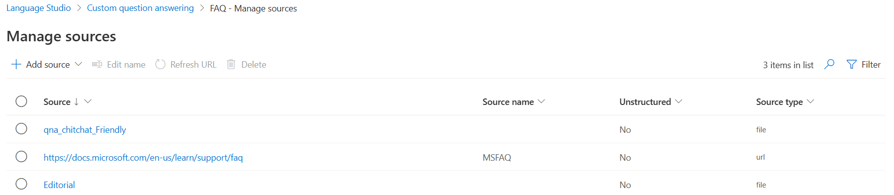
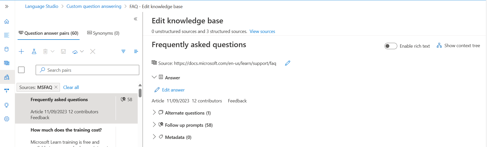
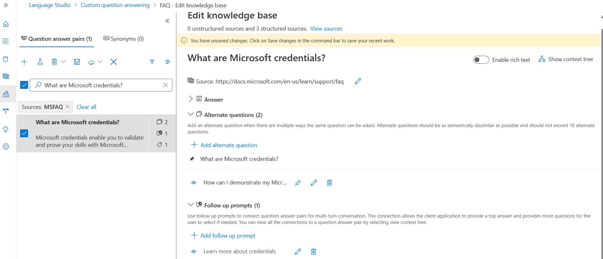
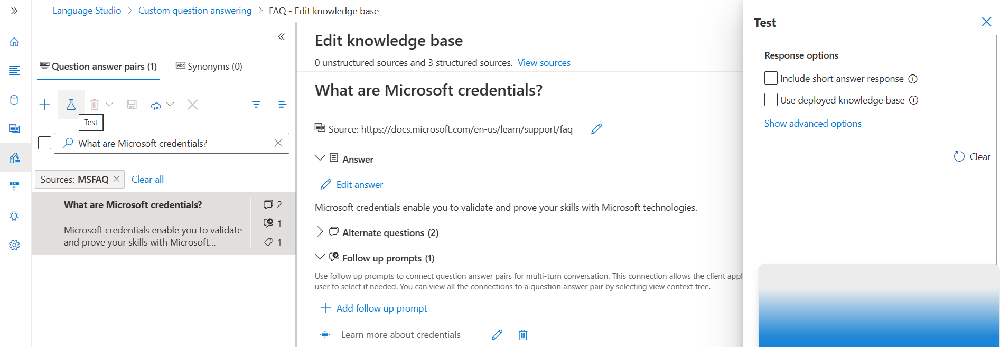
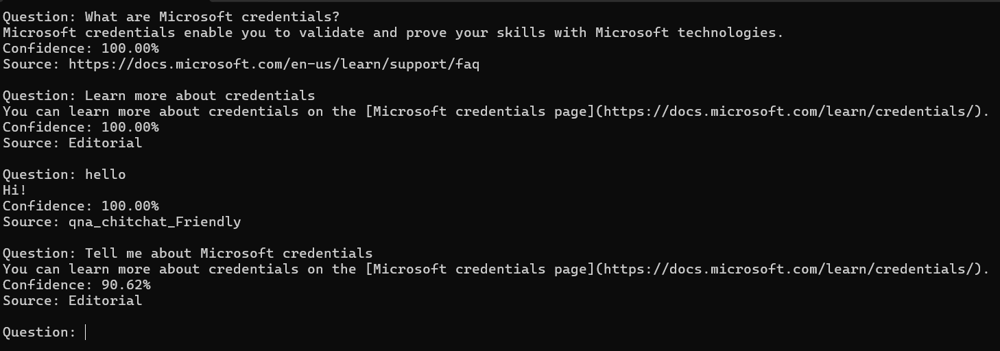

A prevalent approach for "smart" applications involves allowing users to pose questions using natural language and obtain relevant responses. Essentially, this solution imbues traditional frequently asked questions (FAQ) publications with conversational intelligence.

Azure AI Language offers a question answering feature, allowing us to establish a knowledge base comprising question-answer pairs accessible through natural language queries. This knowledge base can be deployed to a REST endpoint and utilized by client applications, often chatbots. The process involves creating the knowledge base from various sources like FAQ webpages, structured text files, or pre-defined chit-chat exchanges to enable conversational apps.

A question answering knowledge base and conversational language understanding capabilities in Azure AI Language serve as forms of language models, prompting consideration of when to utilize each feature.

While both allow defining language models queried via natural language expressions, they differ in their designed use cases, as illustrated below:

<table>
    <thead>
      <tr>
        <th></th>
        <th>Question answering</th>
        <th>Language understanding</th>
      </tr>
    </thead>
    <tbody>
        <tr>
            <td>Usage pattern</td>
            <td>User submits a question, expecting an answer</td>
            <td>User submits an utterance, expecting an appropriate response or action</td>
        </tr>
        <tr>
            <td>Query processing</td>
            <td>Service uses natural language understanding to match the question to an answer in the knowledge base</td>
            <td>Service uses natural language understanding to interpret the utterance, match it to an intent, and identify entities</td>
        </tr>
        <tr>
            <td>Response</td>
            <td>Response is a static answer to a known question</td>
            <td>Response indicates the most likely intent and referenced entities</td>
        </tr>
          <tr>
            <td>Client logic</td>
            <td>Client application typically presents the answer to the user</td>
            <td>Client application is responsible for performing appropriate action based on the detected intent</td>
        </tr>
    </tbody>
  </table>

**Multi-turn conversation**

While individual question-answer pairs can form an effective knowledge base, there are scenarios where follow-up questions are necessary to gather additional information from users before providing a definitive answer. This interaction, known as a multi-turn conversation, allows for more nuanced exchanges and deeper understanding of user queries.

For example, suppose an initial question for a travel booking knowledge base is "How can I cancel a reservation?". A reservation might refer to a hotel or a flight, so a follow-up prompt is required to clarify this detail. The answer might consist of text such as "Cancellation policies depend on the type of reservation" and include follow-up prompts with links to answers about canceling flights and canceling hotels.

After creating and testing a knowledge base, you can improve its performance with <b>active learning</b> and by defining <b>synonyms</b>.

Active learning facilitates ongoing enhancements to improve the accuracy of answering user questions over time. Given that users may pose questions in varied phrasing yet with similar meanings, active learning is beneficial as it allows for the exploration of alternate questions for each question-answer pair. This feature is automatically enabled, aiding in refining responses and accommodating diverse user inquiries effectively.

Synonyms are useful when questions submitted by users might include multiple different words to mean the same thing. For example, a travel agency customer might refer to a "reservation" or a "booking". By defining these as synonyms, the question answering service can find an appropriate answer regardless of which term an individual customer uses.

Create a Azure AI Language Resource and then access [Language Studio](https://language.cognitive.azure.com/) to configure the knowledge base for QnA.

1. Create a Project by clicking on "Create New" and select "Custom Question Answering".

2. Enter name "FAQ" , description "FAQ for Learn" and default answer when no answer is returned as "No Answer Found". 

3. Create the project after all the information provided.


4. To add resources to the knowledge base, click on "Add Sources" in "Managed Sources" and select URL
    - Name: Learn FAQ Page
    - URL: https://docs.microsoft.com/en-us/learn/support/faq

5. Click on "Add Sources" and select ChitChat.

6. Edit the knowledge base on the Question answer pairs tab, select ＋, and create a new question answer pair
    - Source: https://docs.microsoft.com/en-us/learn/support/faq
    - Question: What are Microsoft credentials?
    - Answer: Microsoft credentials enable you to validate and prove your skills with Microsoft technologies.

    

7. Expand Alternate questions and add the alternate question "How can I demonstrate my Microsoft technology skills?" for "What are Microsoft credentials?".


8. Expand Follow-up prompts and add the following follow-up prompt:
Text displayed in the prompt to the user: Learn more about credentials.
    - Select the Create link to new pair tab, and enter this text: You can learn more about credentials on the [Microsoft credentials page](https://docs.microsoft.com/learn/credentials/).
    - Select Show in contextual flow only. This option ensures that the answer is only ever returned in the context of a follow-up question from the original certification question.

    

9. Save Changes.

10. Select the Test button to open the test pane.
 

11. Enter "Hello" message and click send to see suitable response.

12. Enter the message "What is Microsoft Learn?" to see appropriate response from the FAQ.

13. Enter "Thanks!" message to see appropriate chit-chat response.

14. Enter "Tell me about Microsoft credentials" message, response will be a follow-up prompt link based on the info configured in step 8. 

15. Deploy the knowledge base of the production. The production URL after the deployment can be accessed as REST interface from client
```json
https://demolangserv1000001.cognitiveservices.azure.com/language/:query-knowledgebases?projectName=FAQ&api-version=2021-10-01&deploymentName=production
```

16. Add the code necessary to import the required SDK libraries(Azure.AI.Language.QuestionAnswering), establish an authenticated connection to your deployed project and submit questions. Update the configurations in the code base,

    - "AIServicesEndpoint": "Endpoint url of the language resources. 'Keys and Endpoint' section has the endpoint and keys info"
    - "AIServicesKey": "Key of the language resource"
    - "QAProjectName": "project name created in the Language Studio in step 3"
    - "QADeploymentName": "Name of the deployment from the step 15. Default one will be 'production'"

    


