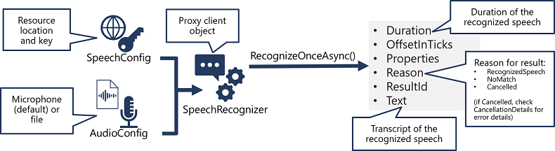

Azure AI Speech offers powerful APIs for developers to integrate speech recognition, synthesis, translation, speaker recognition, and intent recognition into their applications.

**Speech to Text (Speech Recognition)**: It listens to what people say and writes it down so computers can understand it.

**Text to Speech (Speech Synthesis)**: It reads out written words so people can hear them through computers or devices.

**Speech Translation**: It listens to people speaking in one language, changes it into another language, and speaks it out loud in that language.

**Speaker Recognition**n: It can recognize who is speaking by their voice, like how we recognize our friend's voice on the phone.

**Intent Recognition**: It understands what people are asking or saying by listening to their words, like how a smart assistant understands the commands.

## Speech to Text
Azure AI Speech service supports speech recognition through two REST APIs:
  - The Speech to text API, which is the primary way to perform speech recognition.
  - The Speech to text Short Audio API, which is optimized for short streams of audio (up to 60 seconds).


1. Utilize a SpeechConfig object to contain the necessary details for connecting to your Azure AI Speech resource, specifically its location and key. 
2. Optionally, employ an AudioConfig to specify where the audio for transcription comes from. By default, it's set to use the system microphone, but you can also provide an audio file.
3. This tool will help with converting speech to text. Use the SpeechConfig and AudioConfig to instantiate a SpeechRecognizer object. This object acts as a middleman for the Speech to text API.
4. If someone speaks, the tool will convert it to text. Utilize the methods of the SpeechRecognizer object to invoke the underlying API functions. For instance, the RecognizeOnceAsync() method employs the Azure AI Speech service to asynchronously transcribe a single spoken phrase.
5. Analyze the response from the Azure AI Speech service. When using the RecognizeOnceAsync() method, the outcome is a SpeechRecognitionResult object that contains properties such as Duration, OffsetInTicks, Properties, Reason, ResultId, and Text.

When the operation is successful, the Reason property will have the value RecognizedSpeech, indicating that speech was recognized, and the transcription will be found in the Text property.

Alternatively, if no speech was recognized despite successfully processing the audio, the Result property may have the value NoMatch.

If the operation was canceled due to an error, the Result property will indicate Canceled. In such cases, you can inspect the Properties collection for the CancellationReason property to identify 

## Text to Speech
Speech to Text APIs, Azure AI Speech service also provides other REST APIs for speech synthesis:
  - Text to Speech API: This is the main method for synthesizing speech from text. You provide text input, and the API generates corresponding spoken output.
  - Batch Synthesis API: This API is tailored for handling batch operations that involve converting large amounts of text into audio. For instance, it's useful for creating audio-books from written text, efficiently processing large volumes of data.


1. Employ a SpeechConfig object to gather the necessary details for connecting to your Azure AI Speech resource, such as its location and key.
2. Optionally, utilize an AudioConfig to specify where the synthesized speech should be directed. By default, this is set to the system's default speaker, but you can also choose an audio file or set it to null to process the audio stream object directly.
3. Utilize the SpeechConfig and AudioConfig to instantiate a SpeechSynthesizer object. This object serves as a client for the Text to Speech API.
4. Use the methods of the SpeechSynthesizer object to invoke the underlying API functions. For instance, the SpeakTextAsync() method utilizes the Azure AI Speech service to transform text into spoken audio.
5. Handle the response from the Azure AI Speech service. When using the SpeakTextAsync method, the result is a SpeechSynthesisResult object containing properties such as AudioData, Properties, Reason, and ResultId.

When speech synthesis is successful, the Reason property is marked with the SynthesizingAudioCompleted status, and the AudioData property holds the audio stream. Depending on the AudioConfig settings, this audio stream might have been automatically directed to a speaker or saved into a file.

## Configure audio format and voices
### Audio format
The Azure AI Speech service supports multiple output formats for the audio stream that is generated by speech synthesis. Depending on your specific needs, you can choose a format based on the required:
* Audio file type
* Sample-rate
* Bit-depth

The supported formats are indicated in the SDK using the SpeechSynthesisOutputFormat enumeration.

### Voices
The Azure AI Speech service offers a variety of voices to customize your speech-enabled applications. These voices fall into two categories:

* Standard voices: These are synthetic voices generated from recorded audio samples.
* Neural voices: These voices sound more natural as they're created using advanced deep neural networks.

Each voice is identified by a name that indicates both the locale and the name of the person associated with it. For example, en-GB-George represents a British English voice named George.

To select a specific voice for speech synthesis within the SpeechConfig, we can set its SpeechSynthesisVoiceName property to the desired voice's name.

## Speech Synthesis Markup Language
While the Azure AI Speech SDK can turn regular text into speech, it also has a more advanced feature called SSML (Speech Synthesis Markup Language). With SSML, you can:

* Define specific speaking styles, like "excited" or "cheerful," particularly useful when using neural voices.
* Incorporate pauses or silence at specific points in the speech.
* Specify phonemes, enabling precise pronunciation adjustments, such as rendering "SQL" as "sequel."
* Adjust the prosody of the voice, allowing modifications to pitch, timbre, and speaking rate.
* Utilize predefined "say-as" rules to format certain strings as dates, times, telephone numbers, or other designated forms.
* Embed recorded speech or audio, facilitating the inclusion of standard recorded messages or simulating background noise.

To submit an SSML description to the Speech service, we can use the SpeakSsmlAsync() method.


Add the code necessary to import the required SDK libraries(Microsoft.CognitiveServices.Speech), establish an authenticated connection to your deployed project. Update the configurations in the code base.
    - "SpeechKey": "Key of the Speech service resource",
    - "SpeechRegion": "location/region of the  Speech service resource"

**Speech to Text and Text to Speech**
Request
```json
Ready to use speech service in eastus
Speak now..
```
Say the text "What time is it?". Speech to text will hear and write the text.
To see the text and hear back back the time "The time is 13:22". Speech synthesizer will say the time.

**Speech Translation**
Request
```json
Ready to use speech service in eastus
Say something in English...
```
Say the text "What time is it?". to see the translated Text
- English: What time is it?
- French: Quelle heure est-il?

**Speaker Recognize**
Verify the approval status of your subscription for the Speaker Recognition service.
- Enroll the Voice profiles
- Identify the speaker based on the enrolled profiles for the voice input.

**Intent Recognition** 
- Azure Speech Service (Speech to Text): Use Azure Speech Service to convert spoken language into text. This involves capturing spoken input from users and transcribing it into text using speech recognition capabilities provided by Azure Speech Service.
- Azure Cognitive Services (Language Understanding - LUIS): Utilize Azure Cognitive Services such as Language Understanding (LUIS) for intent recognition. LUIS is a natural language understanding service that enables our applications to understand user intentions from natural language input. We can define intents, entities, and utterances in LUIS to train a model that can recognize the user's intent based on their input.
- Integration: After converting speech to text using Azure Speech Service, you can then pass the transcribed text to LUIS for intent recognition. LUIS will analyze the text and determine the user's intent based on the trained model. Once the intent is identified, we can take appropriate actions or trigger relevant processes in our application based on the recognized intent.
- Response: Finally, we can generate a response or perform the necessary actions based on the recognized intent and provide feedback to the users.