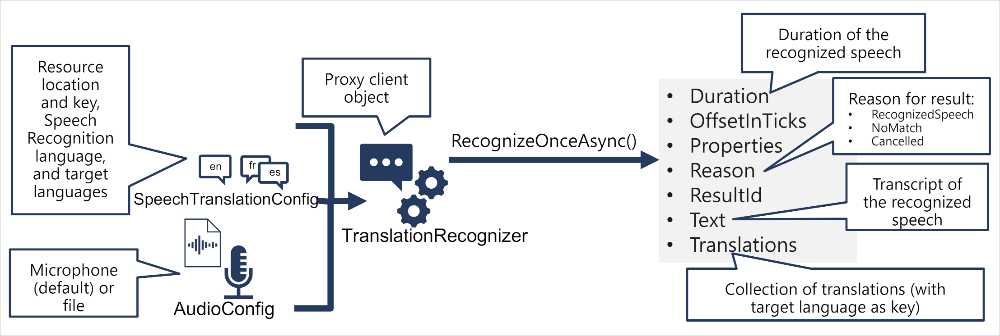

Speech translation extends speech recognition by identifying and converting spoken input in a designated language into text, and then providing translations of the transcribed text into one or multiple other languages.

## Translate speech to text

- Utilize a SpeechTranslationConfig object to encapsulate necessary details for connecting to your Azure AI Speech resource, including its location and key.
- This object serves to designate the speech recognition language (the language of the input speech) and the target languages for translation.
- Optionally, employ an AudioConfig to specify the audio input source for transcription. By default, this source is the system microphone, but you can alternatively specify an audio file.
- Create a TranslationRecognizer object using the SpeechTranslationConfig and AudioConfig. This object acts as a client for the Azure AI Speech translation API.
- Invoke the methods of the TranslationRecognizer object to utilize the underlying API functions. For instance, the RecognizeOnceAsync() method employs the Azure AI Speech service to asynchronously translate a single spoken utterance.
- Handle the response from Azure AI Speech. For RecognizeOnceAsync(), the outcome is a SpeechRecognitionResult object, containing properties such as Duration, OffsetInTicks, Properties, Reason, ResultId, Text, and Translations.

In case of a successful operation, the Reason property will have the value RecognizedSpeech, and the Text property will hold the transcription in the original language. Additionally, you can access the Translations property, which provides a dictionary of translations, using the two-character ISO language code (e.g., "en" for English) as keys.

## Synthesize translations
The TranslationRecognizer provides translated transcriptions of spoken input, effectively converting audible speech into text.

Additionally, you can synthesize the translation into speech, enabling the creation of speech-to-speech translation solutions. There are two methods to achieve this.

**Event Base Synthesis**
For one-to-one translation (translating from one source language into a single target language), you can utilize event-based synthesis to capture the translation as an audio stream. Here's how you can do it:

1. Specify the desired voice for the translated speech in the TranslationConfig.
2. Create an event handler for the Synthesizing event of the TranslationRecognizer object.
3. In the event handler, use the GetAudio() method of the Result parameter to retrieve the byte stream of translated audio.
4. The implementation of an event handler may vary depending on the programming language you're using.

Event triggering may have limitations or constraints with the Azure Speech service that might prevent to trigger.

**Manual synthesis** 
Offers an alternative method to event-based synthesis, eliminating the need for implementing an event handler. With manual synthesis, you can generate audio translations for one or more target languages.

The manual synthesis process involves two distinct operations:
- Utilize a TranslationRecognizer to translate spoken input into text transcriptions in one or multiple target languages.
- Iterate through the Translations dictionary in the result of the translation operation. Use a SpeechSynthesizer to synthesize an audio stream for each language.

------------------------------------------------------------------------------------------

Add the code necessary to import the required SDK libraries(Microsoft.CognitiveServices.Speech), establish an authenticated connection to your deployed project. Update the configurations in the code base.
    - "SpeechKey": "Key of the Speech service resource",
    - "SpeechRegion": "location/region of the  Speech service resource"

