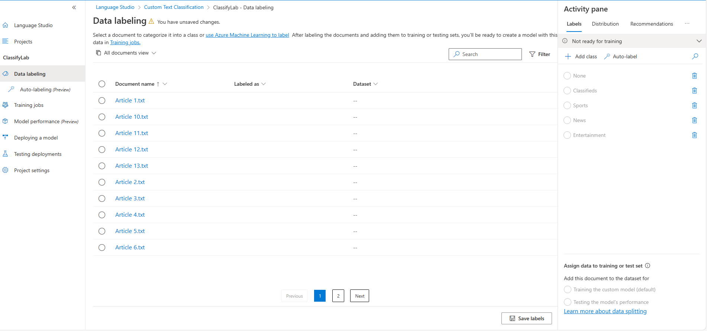
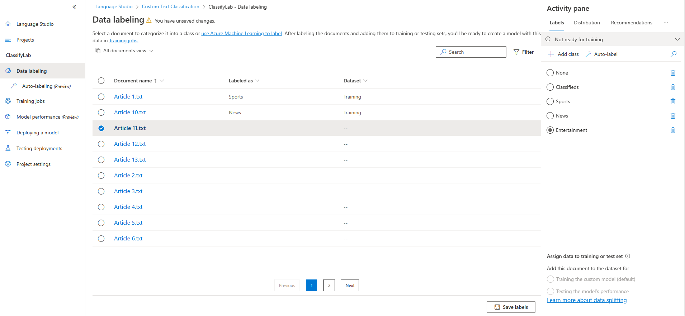

Custom text classification is the ability to classify text.

For example, a video game summary might be classified as "Adventure", "Strategy", "Action" or "Sports".

Custom text classification encompasses two project types:

**Single-label classification**: Each file is assigned only one class. For instance, a video game summary can be categorized solely as "Adventure" or "Strategy," but not both.

**Multiple-label classification**: Multiple classes can be assigned to each file. In this scenario, a video game summary could be labeled as "Adventure," "Strategy," or both simultaneously.

**Life Cycle**


**Define Categories**: Begin by understanding the data you aim to categorize and identifying potential labels. In our video game example, these labels could include "Action," "Adventure," "Strategy," and others.

**Label Data**: Assign tags or labels to your existing data, indicating the category or categories each file belongs to. Proper labeling is crucial as it enables your model to learn how to classify future files accurately. It's essential to ensure clear distinctions between labels to avoid ambiguity and provide diverse examples for effective learning. For instance, label the game "Quest for the Mine Brush" as "Adventure" and "Flight Trainer" as "Action."

**Train the Model**: Proceed to train your model using the labeled data. Training enables the model to understand which types of video game summaries correspond to specific genres.

**Evaluate Model Performance**: Once the model is trained, assess its performance by examining the results. The model's score, ranging from 0 to 1, is based on the precision and recall of the tested data. Note any genres where the model's performance is suboptimal.

**Refine the Model**: Enhance your model by identifying misclassifications, analyzing label distribution, and determining areas for improvement. For instance, if the model confuses "Adventure" and "Strategy" games, consider augmenting the dataset with additional examples of each label for retraining.

**Deployment**: When the model meets your requirements, deploy it to make it accessible via the API. You might name your model "GameGenres," and once deployed, it can classify game summaries effectively.

**Text Classification**: Utilize your model for text classification purposes.

Create a Azure AI Language Resource and then access [Language Studio](https://language.cognitive.azure.com/) to configure the Custom Text Classification.

While creating the language resource, it will also create the Storage account. In the settings tab of the storage account enable "Allow Blob anonymous access" then select Save. Upload all the [articles](articles) to the container.

Create a container in the storage account by name "articles" and set Anonymous access level(anonymous read access for containers and blobs).

1. In the Language studio to start creating the project by selecting "Custom text classification".


2. Connect storage page, all values will already have been filled. Select Next to Select project type as "Single label classification".

3. Enter basic information, 
    - Name: ClassifyLab
    - Text primary language: English (US)
    - Description: Custom text lab

4. Select next to choose the storage account container "articles" and select the "No, I need to label my files as part of this project" option and complete the project creation.

5. Navigate to Data labeling on the left side, if it's not already chosen. You'll find a roster of the files you've uploaded to your storage account.

6. On the right-hand side, within the Activity pane, click on + Add class. Articles will  be grouped into four classes that need to establish: Classifieds, Sports, News, and Entertainment.

7. Select Article 1 to start. Here you can read the article, define which class this file is, and which dataset (training or testing) to assign it to.

8. Use the Activity pane on the right to designate each article with the relevant class and dataset (either training or testing). Choose a label from the list provided on the right and specify whether each article is for training or testing using the options located at the bottom of the Activity pane. Simply select Next document to proceed to the subsequent document. For the lab's objectives, we will specify which articles are allocated for training the model and which ones are for testing the model.


9. Save the labels.

10. Initiate a training job from the left-side menu, then commence a new training session named "ClassifyArticles" while opting for manual split of training and testing data.


11. Evaluate and improve the model to verify it’s performing as expected.

12. Choose "Model performance" and pick your "ClassifyArticles" model to view its scoring, performance metrics, and training timestamp. If the model's scoring isn't 100%, it indicates misclassifications in the test data, pinpointing areas for improvement.


13. Navigate to the "Test set details" tab to review any discrepancies. This tab displays articles marked for testing along with their predicted labels, allowing you to identify conflicts with their assigned test labels. By toggling the "Show mismatches only" option, you can view all tested articles and their corresponding predictions.

14. Navigate to the "Deploying model" section from the left panel. Click on "Add deployment," then input a name for the deployment in the "Create a new deployment name" field and choose "ClassifyArticles" from the "Model" dropdown menu. Select "Deploy" to initiate the deployment process.

15. Test the model deployed
```json
{
    "classes": [
        {
            "category": "Sports",
            "confidenceScore": 0.3
        }
    ]
}


{
    "classes": [
        {
            "category": "Entertainment",
            "confidenceScore": 0.3
        }
    ]
}
```


16. Add the code necessary to import the required SDK libraries(Azure.AI.TextAnalytics), establish an authenticated connection to your deployed project and submit text for classification. Update the configurations in the code base.
    - "AIServicesEndpoint": "Endpoint url of the language resources. 'Keys and Endpoint' section has the endpoint and keys info"
    - "AIServicesKey": "Key of the language resource"
    - "ProjectName": "project name created in the Language Studio"
    - "DeploymentName": "Name of the deployment from the step 14."

```json
Article 1.txt
  Predicted the following class:

  Category: Sports
  Confidence score: 0.46

Article 10.txt
  Predicted the following class:

  Category: News
  Confidence score: 0.37

Article 11.txt
  Predicted the following class:

  Category: Entertainment
  Confidence score: 0.4

Article 12.txt
  Predicted the following class:

  Category: News
  Confidence score: 0.33

Article 13.txt
  Predicted the following class:

  Category: Sports
  Confidence score: 0.41

Article 2.txt
  Predicted the following class:

  Category: Sports
  Confidence score: 0.44

Article 3.txt
  Predicted the following class:

  Category: Classifieds
  Confidence score: 0.47

Article 4.txt
  Predicted the following class:

  Category: Classifieds
  Confidence score: 0.45

Article 5.txt
  Predicted the following class:

  Category: Entertainment
  Confidence score: 0.27

Article 6.txt
  Predicted the following class:

  Category: Entertainment
  Confidence score: 0.3

Article 7.txt
  Predicted the following class:

  Category: News
  Confidence score: 0.38

Article 8.txt
  Predicted the following class:

  Category: News
  Confidence score: 0.36

Article 9.txt
  Predicted the following class:

  Category: Entertainment
  Confidence score: 0.42
```