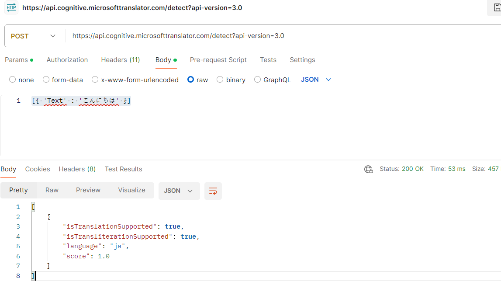
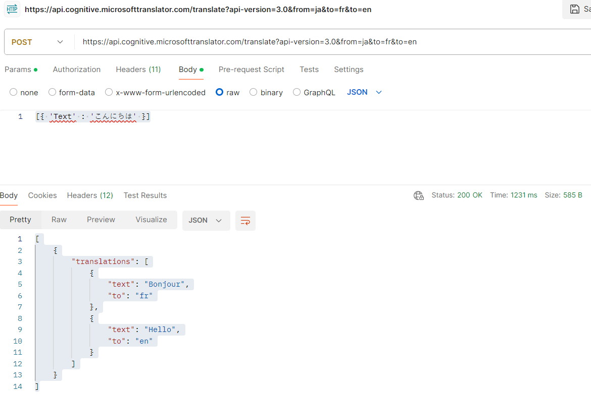
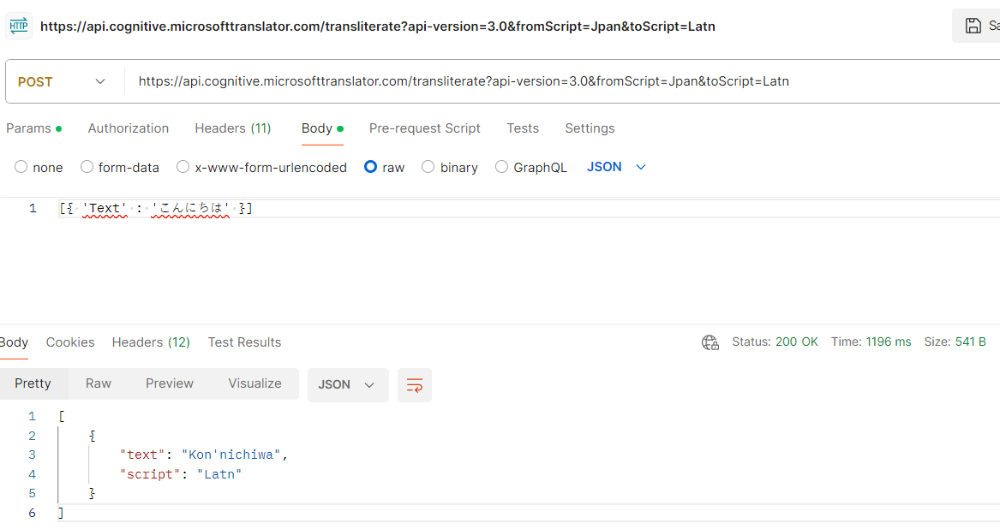

The Azure AI Translator provides an API for translating text between 90 supported languages.

Provides a multilingual text translation API 

- Language detection.
- One-to-many translation.
- Script transliteration (converting text from its native script to an alternative script).


### Language Detection
Use the Detect function of the REST API to detect the language in which text is written.

* Endpoint: https://api.cognitive.microsofttranslator.com/detect?api-version=3.0
   
    Create a Translator service resource in Azure and in "Keys and Endpoint" capture "Text Translation" endpoint.
* Headers : Content-Type: application/json
* Headers : Ocp-Apim-Subscription-Key: Key from the resources Translator service
* Headers : Ocp-Apim-Subscription-Region: location/region of the resources Translator service
* Method : POST
* Body : raw 
Request
```json
[{ 'Text' : 'こんにちは' }]
```
Response
```json
[
    {
        "isTranslationSupported": true,
        "isTransliterationSupported": true,
        "language": "ja",
        "score": 1.0
    }
]
```


### Translation
To translate text from one language to another, use the Translate function; specifying a single from parameter to indicate the source language, and one or more to parameters to specify the languages into which you want the text translated.

* Endpoint: https://api.cognitive.microsofttranslator.com/translate?api-version=3.0&from=ja&to=fr&to=en
   
    Create a Translator service resource in Azure and in "Keys and Endpoint" capture "Text Translation" endpoint.
* Headers : Content-Type: application/json
* Headers : Ocp-Apim-Subscription-Key: Key from the resources Translator service
* Headers : Ocp-Apim-Subscription-Region: location/region of the resources Translator service
* Method : POST
* Body : raw 
Request
```json
[{ 'Text' : 'こんにちは' }]
```
Response
```json
[
    {
        "translations": [
            {
                "text": "Bonjour",
                "to": "fr"
            },
            {
                "text": "Hello",
                "to": "en"
            }
        ]
    }
]
```


### Transliteration
Japanese text is written using Hiragana script, so rather than translate it to a different language, you may want to transliterate it to a different script - for example to render the text in Latin script (as used by English language text).

* Endpoint: https://api.cognitive.microsofttranslator.com/transliterate?api-version=3.0&fromScript=Jpan&toScript=Latn
    
    Create a Translator service resource in Azure and in "Keys and Endpoint" capture "Text Translation" endpoint.
* Headers : Content-Type: application/json
* Headers : Ocp-Apim-Subscription-Key: Key from the resources Translator service
* Headers : Ocp-Apim-Subscription-Region: location/region of the resources Translator service
* Method : POST
* Body : raw 
Request
```json
[{ 'Text' : 'こんにちは' }]
```
Response
```json
[
    {
        "text": "Kon'nichiwa​",
        "script": "Latn"
    }
]
```


**Alignment of words** refers to their positioning and relationship in a sentence. While in English, words are separated by spaces, in other languages, such as Simplified Chinese, this isn't always the case. For instance, translating "Smart Services" to "智能服务" in Chinese may not clearly show the connection between the source and translated text. To address this, you can use the includeAlignment parameter set to true in your translation call.

* Endpoint: https://api.cognitive.microsofttranslator.com/translate?api-version=3.0&from=en&to=zh&to=ja&includeAlignment=true
   
    Create a Translator service resource in Azure and in "Keys and Endpoint" capture "Text Translation" endpoint.
* Headers : Content-Type: application/json
* Headers : Ocp-Apim-Subscription-Key: Key from the resources Translator service
* Headers : Ocp-Apim-Subscription-Region: location/region of the resources Translator service
* Method : POST
* Body : raw 
Request
```json
[
    { 
        'Text' : 'Smart Services'
    }
]
```
Response
```json
[
    {
        "translations": [
            {
                "text": "智能服务",
                "to": "zh-Hans",
                "alignment": {
                    "proj": "0:4-0:1 6:13-2:3"
                }
            },
            {
                "text": "スマートサービス",
                "to": "ja",
                "alignment": {
                    "proj": "0:4-0:3 6:13-4:7"
                }
            }
        ]
    }
]
```
The above results tell us that characters 0 to 4 in the source correspond to characters 0 to 1 in the translation, while characters 6 to 13 in the source correspond to characters 2 to 3 in the translation.

**Sentence length** can be crucial for determining the best way to present translated text, especially in user interfaces. To obtain this information, you can enable the includeSentenceLength parameter, which provides the length of each translated sentence.

* Endpoint: https://api.cognitive.microsofttranslator.com/translate?api-version=3.0&from=en&to=fr&includeSentenceLength=true
   
    Create a Translator service resource in Azure and in "Keys and Endpoint" capture "Text Translation" endpoint.
* Headers : Content-Type: application/json
* Headers : Ocp-Apim-Subscription-Key: Key from the resources Translator service
* Headers : Ocp-Apim-Subscription-Region: location/region of the resources Translator service
* Method : POST
* Body : raw 
Request
```json
[
    { 
        'Text' : 'Smart Services'
    }
]
```
Response
```json
[
    {
        "translations": [
            {
                "text": "Services intelligents",
                "to": "fr",
                "sentLen": {
                    "srcSentLen": [
                        14
                    ],
                    "transSentLen": [
                        21
                    ]
                }
            }
        ]
    }
]
```

**Profanity filtering** is essential for managing text that contains offensive language. By setting the profanityAction parameter, you can control how profanities are handled during translation:

- NoAction: Profanities remain unchanged in the translation.
- Deleted: Profanities are removed entirely from the translation.
- Marked: Profanities are highlighted using the specified profanityMarker parameter. The default marker is Asterisk, which replaces characters with "*". Alternatively, you can use Tag to enclose profanities in XML tags.

* Endpoint:https://api.cognitive.microsofttranslator.com/translate?api-version=3.0&from=en&to=fr&profanityAction=Marked&profanityMarker=*
   
    Create a Translator service resource in Azure and in "Keys and Endpoint" capture "Text Translation" endpoint.
* Headers : Content-Type: application/json
* Headers : Ocp-Apim-Subscription-Key: Key from the resources Translator service
* Headers : Ocp-Apim-Subscription-Region: location/region of the resources Translator service
* Method : POST
* Body : raw 
Request
```json
[
    { 
        'Text' : '<obscene words in the text>'
    }
]
```
Response
```json
[
    {
        "translations": [
            {
                "text": "JSON est *** de génial !",
                "to": "fr"
            }
        ]
    }
]
```

Add the code necessary to import the required SDK libraries(Azure.AI.Translation.Text), establish an authenticated connection to your deployed project and submit text for classification. Update the configurations in the code base.
    - "CognitiveServiceKey": "Key of the translator resource",
    - "CognitiveServiceRegion": "location/region of the  translator resource"

Translator endpoint to use is "https://api.cognitive.microsofttranslator.com" from the "Keys and Endpoint".

```json
-------------
review1.txt

Good Hotel and staff
The Royal Hotel, London, UK
3/2/2018
Clean rooms, good service, great location near Buckingham Palace and Westminster Abbey, and so on. We thoroughly enjoyed our stay. The courtyard is very peaceful and we went to a restaurant which is part of the same group and is Indian ( West coast so plenty of fish) with a Michelin Star. We had the taster menu which was fabulous. The rooms were very well appointed with a kitchen, lounge, bedroom and enormous bathroom. Thoroughly recommended.
Language: en

-------------
review2.txt

Tired hotel with poor service
The Royal Hotel, London, United Kingdom
5/6/2018
This is a old hotel (has been around since 1950's) and the room furnishings are average - becoming a bit old now and require changing. The internet didn't work and had to come to one of their office rooms to check in for my flight home. The website says it's close to the British Museum, but it's too far to walk.
Language: en

-------------
review3.txt

Good location and helpful staff, but on a busy road.
The Lombard Hotel, San Francisco, USA
8/16/2018
We stayed here in August after reading reviews. We were very pleased with location, just behind Chestnut Street, a cosmopolitan and trendy area with plenty of restaurants to choose from. The
Marina district was lovely to wander through, very interesting houses. Make sure to walk to the San Francisco Museum of Fine Arts and the Marina to get a good view of Golden Gate bridge and the city. On a bus route and easy to get into centre. Rooms were clean with plenty of room and staff were friendly and helpful. The only down side was the noise from Lombard Street so ask to have a room furthest away from traffic noise.
Language: en

-------------
review4.txt

Very noisy and rooms are tiny
The Lombard Hotel, San Francisco, USA
9/5/2018
Hotel is located on Lombard street which is a very busy SIX lane street directly off the Golden Gate Bridge. Traffic from early morning until late at night especially on weekends. Noise would not be so bad if rooms were better insulated but they are not. Had to put cotton balls in my ears to be able to sleep--was too tired to enjoy the city the next day. Rooms are TINY. I picked the room because it had two queen size beds--but the room barely had space to fit them. With family of four in the room it was tight. With all that said, rooms are clean and they've made an effort to update them. The hotel is in Marina district with lots of good places to eat, within walking distance to Presidio. May be good hotel for young stay-up-late adults on a budget

Language: en

-------------
review5.txt

Un hôtel agréable
L'Hotel Buckingham, Londres, UK
J’adore cet hôtel. Le personnel est très amical et les chambres sont confortables.
Language: fr

Translation:(Translate if not already English)
A pleasant hotel
The Buckingham Hotel, London, UK
I love this hotel. The staff is very friendly and the rooms are comfortable.
```

### [Custom translation solutions](https://portal.customtranslator.azure.ai/)
Although the default translation model in Azure AI Translator is proficient for general purposes, <b>custom translation solutions</b> might be necessary for businesses or industries with specialized terminologies. These sectors often demand translations tailored to their unique vocabulary and context.

