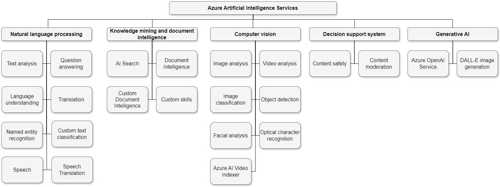

## Azure Artificial Intelligence ##
Consider AI as software that demonstrates one or more human-like capabilities.

<b>Data Science</b> helps us understand and find patterns in data. Combing through a lot of data (like numbers, texts, and images) to find patterns or insights that can help make decisions. 
For example, a data scientist might look at sales data to predict what products will be popular next month.

<b>Machine Learning (ML)</b> is a subset of AI focusing on the idea of teaching computers to learn from data, make predictions, or decide without being explicitly programmed for each task. For example, Netflix uses machine learning to recommend movies to you based on what you and others have watched.

<b>Artificial Intelligence (AI)</b> Computers are designed to perform tasks that normally require human intelligence. This includes things like understanding natural language (the way we speak), recognizing objects in images, or making decisions. 
For example, Smart assistants like Siri or Alexa, can understand your questions and respond in a human-like way.

Many AI systems depend on predictive models that require training with sample data. The training process examines the data to identify correlations between the features (the data attributes expected to appear in new instances) and the label (the outcome the model aims to predict). Once the model is trained, you can input new data with known feature values, and the model will predict the most probable label. This use of the model to make predictions is known as inferencing.

The predictions made by machine learning models are based on probability. It's important to understand that predictions reflect statistical likelihood, not absolute truth. In most cases, predictions have an associated confidence score that reflects the probability on which the prediction is being made. 

<b>Responsible AI</b> 
<b>Fairness:</b>  Treat all people fairly.
Imagine you develop a machine learning model to assist with a bank's loan approval process. This model is designed to predict whether a loan should be approved, ensuring it does not include biases related to gender, ethnicity, or other characteristics that could lead to unfair advantages or disadvantages for certain groups of applicants.

<b>Reliability and safety:</b>  Perform reliably and safely.
For instance, think about a software system powered by AI for a self-driving car, or a machine-learning model that assesses patient symptoms and suggests medications. If these systems are unreliable, they could pose significant risks to human safety.

<b>Privacy and security:</b>  Secure and respect privacy.
The machine learning models underlying AI systems rely on extensive datasets, often containing personal information that requires strict confidentiality. Even after the models are trained and the system is operational, they continue to process new data for predictions or actions, potentially raising privacy and security issues. Therefore, it's crucial to establish suitable safeguards to protect both data and customer confidentiality.

<b>Inclusiveness:</b>  Empower everyone and engage people.
AI should offer advantages to all segments of society, irrespective of physical ability, gender, sexual orientation, ethnicity, or any other distinguishing factor.

<b>Transparency:</b>  Understandable. Users should be thoroughly informed about the system's purpose, functionality, and potential limitations.

<b>Accountability:</b>  Accountable. While AI systems may appear autonomous, developers hold the responsibility to ensure adherence to ethical and legal standards. This entails establishing governance frameworks and organizational principles to guarantee compliance and accountability throughout the system's design and implementation process.

Azure AI Services:

[Azure APIs](https://centraluseuap.dev.cognitive.microsoft.com/docs/services?pageSize=0)

Note: This repository is self learning and understanding documentation crafted referencing the Microsoft AI-102 documentation
