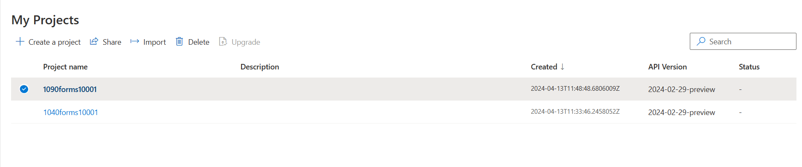
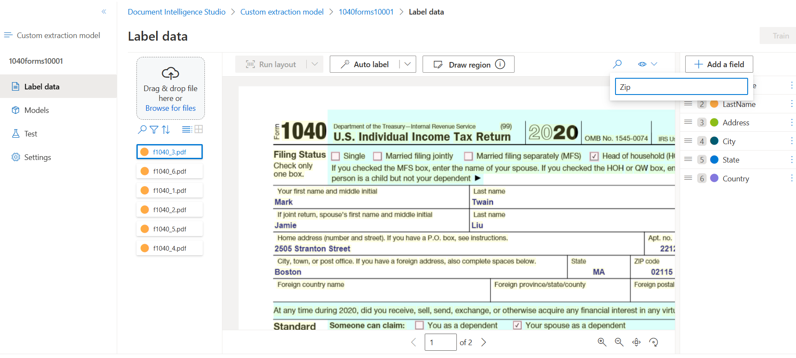
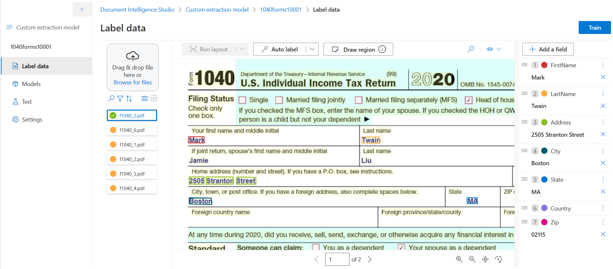
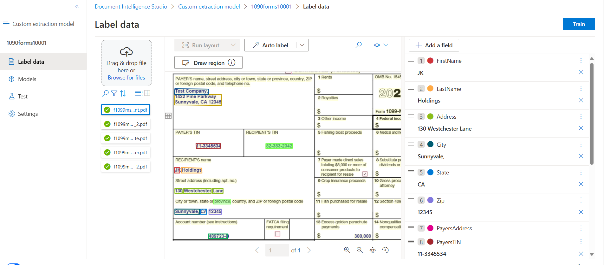
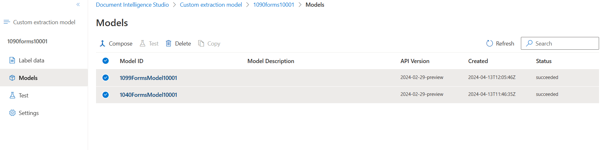
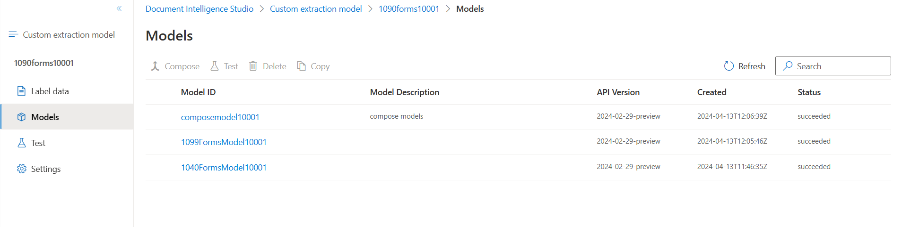
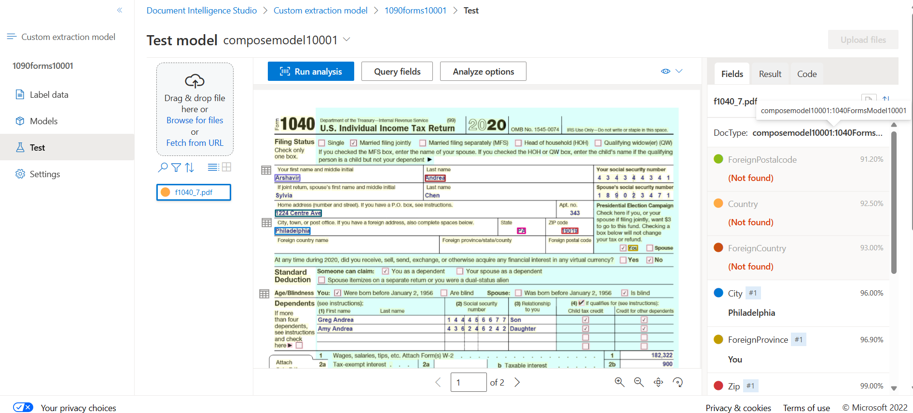
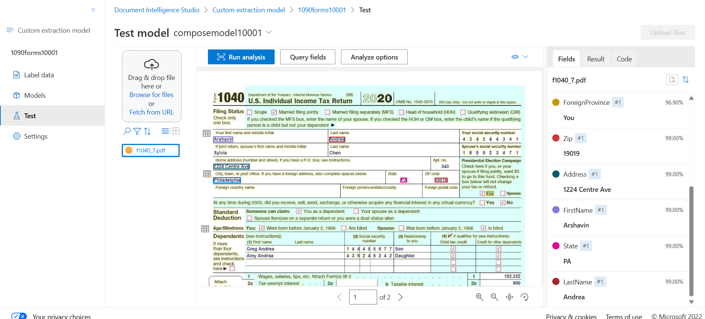
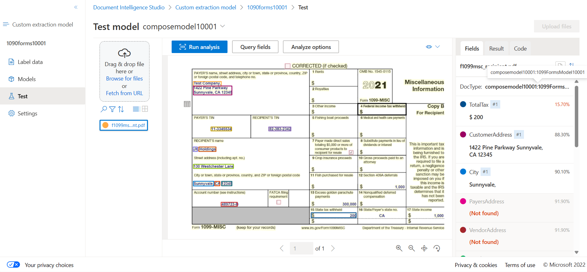
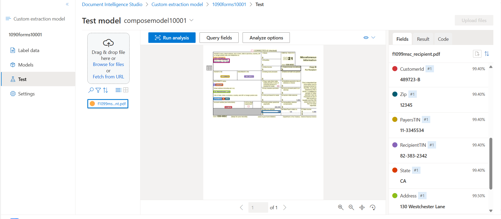

Composed models in Azure AI Document Intelligence enable users to submit a form when they don't know which is the best model to use.

In the polling company, we often change versions of the forms we use to collect data from respondents. When our users submit these forms for analysis, they sometimes choose the wrong custom model. we'd like to find a way for them to submit forms without having to specify the model version.

If we encounter forms with uncommon or distinct formats, Azure AI Document Intelligence allows you to develop and train custom models tailored to our needs. These custom models enable field extraction specific to our form's unique data and generate targeted data tailored to our business application.

**Custom models of two types**:
- Custom template models. Use custom template models when your forms have a consistent visual template. The formatting and layout should be consistent across all completed examples of the form.
- Custom neural models. Use custom neural models when your forms are less consistent, semi-structured or unstructured.

Create two Custom extraction project

Add Fields in the "Label data"

In the Document select select John and then select FirstName. Similary for Lastname and other fields
- Model 1 (Fields: FirstName, LastName, Address, City, State, Zip, ForeignCountryName, ForeignProvience,ForeignPostalcode)

- Model 2 (Fields: FirstName, LastName, Address, City, State, Zip, PayersAddress, PayersTIN,RecipientTIN)

Click the "Train" button to train the models 

After composing the two custom model, results in a new model with a name provided as "composemodel10001"

Testing the composed model. Sample results [JSON](images/composemodeltest.json)

