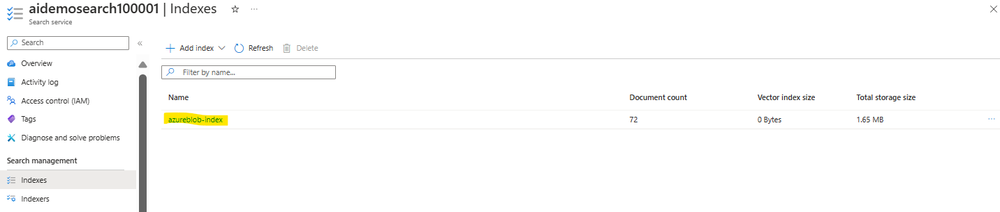

While Azure AI Search offers predefined skills for enriching an index with additional information from source data, there might be instances where specific data extraction requirements cannot be fulfilled with these predefined skills, necessitating custom functionality.

For instance:
- Utilize the Form Recognizer service to extract data from forms.
- Incorporate Azure Machine Learning model predictions into an index.
- Implement custom logic, such as integrating external data sources.

To accommodate these scenarios, you can develop custom skills as web-hosted services (e.g., Azure Functions) that adhere to the necessary interface for integration into a skillset.

## Custom Skill

Custom skill must implement the expected schema for input and output data that is expected by skills in an Azure AI Search skillset.

**Input Schema**
The input schema for a custom skill defines a JSON structure containing a record for each document to be processed. Each document has a unique identifier, and a data payload with one or more inputs.

**Output schema**
The schema for the results returned by your custom skill reflects the input schema. It is assumed that the output contains a record for each input record, with either the results produced by the skill or details of any errors that occurred.

The output value is like a bag that can hold any type of JSON structure. This reflects that index fields can contain not just simple data, but also more complex types of information.

## Add a custom skill to a skillset
To incorporate a custom skill into your indexing setup, weou need to include it in a skillset using the Custom.WebApiSkill skill type.

Here's what the skill definition requires:
- Provide the URI to your web API endpoint, including any required parameters and headers.
- Define the context to indicate where in the document hierarchy the skill should operate.
- Specify input values, typically derived from existing document fields.
- Save the output in a new field, optionally naming the target field (if not specified, the output name is used).

-------------------------------------------------------------------------------
We will create a custom skill that tabulates the frequency of individual words in a document to generate a list of the top five most used words, and add it to a search solution.

Create following resources,
- Azure AI Search resource, which will manage indexing and querying.
- Azure AI Services(multi service account) resource, which provides AI services for skills that our search solution can use to enrich the data in the data source with AI-generated insights.
- Storage account with a blob container in which the documents to be searched are stored.

Steps can be followed as mentioned in [Search Solution](../SearchSolution/README.md) to create the Skills, Indexes and Indexers.

1. Create Azure Function App 
    - Publish: Code
    - Runtime stack: Node.js
    - Version: 18 LTS
    - Region: The same region as your Azure AI Search resource
    - Operating System: Linux
2. On the Overview page select Create in Azure portal option to create a new function with the following settings:
    - Setup a development environment”
    - Development environment: Develop in portal
    - Select a template”
    - Template: HTTP Trigger
    - Template details:
    - New Function: wordcount
    - Authorization level: Function
3. After creation of above fucntion, select the Code + Test tab to replace the default function code with the following code:
```javascript
module.exports = async function (context, req) {
    context.log('JavaScript HTTP trigger function processed a request.');

    if (req.body && req.body.values) {

        vals = req.body.values;

        // Array of stop words to be ignored
        var stopwords = ['', 'i', 'me', 'my', 'myself', 'we', 'our', 'ours', 'ourselves', 'you', 
        "youre", "youve", "youll", "youd", 'your', 'yours', 'yourself', 
        'yourselves', 'he', 'him', 'his', 'himself', 'she', "shes", 'her', 
        'hers', 'herself', 'it', "its", 'itself', 'they', 'them', 
        'their', 'theirs', 'themselves', 'what', 'which', 'who', 'whom', 
        'this', 'that', "thatll", 'these', 'those', 'am', 'is', 'are', 'was',
        'were', 'be', 'been', 'being', 'have', 'has', 'had', 'having', 'do', 
        'does', 'did', 'doing', 'a', 'an', 'the', 'and', 'but', 'if', 'or', 
        'because', 'as', 'until', 'while', 'of', 'at', 'by', 'for', 'with', 
        'about', 'against', 'between', 'into', 'through', 'during', 'before', 
        'after', 'above', 'below', 'to', 'from', 'up', 'down', 'in', 'out', 
        'on', 'off', 'over', 'under', 'again', 'further', 'then', 'once', 'here', 
        'there', 'when', 'where', 'why', 'how', 'all', 'any', 'both', 'each', 
        'few', 'more', 'most', 'other', 'some', 'such', 'no', 'nor', 'not', 
        'only', 'own', 'same', 'so', 'than', 'too', 'very', 'can', 'will',
        'just', "dont", 'should', "shouldve", 'now', "arent", "couldnt", 
        "didnt", "doesnt", "hadnt", "hasnt", "havent", "isnt", "mightnt", "mustnt",
        "neednt", "shant", "shouldnt", "wasnt", "werent", "wont", "wouldnt"];

        res = {"values":[]};

        for (rec in vals)
        {
            // Get the record ID and text for this input
            resVal = {recordId:vals[rec].recordId, data:{}};
            txt = vals[rec].data.text;

            // remove punctuation and numerals
            txt = txt.replace(/[^ A-Za-z_]/g,"").toLowerCase();

            // Get an array of words
            words = txt.split(" ")

            // count instances of non-stopwords
            wordCounts = {}
            for(var i = 0; i < words.length; ++i) {
                word = words[i];
                if (stopwords.includes(word) == false )
                {
                    if (wordCounts[word])
                    {
                        wordCounts[word] ++;
                    }
                    else
                    {
                        wordCounts[word] = 1;
                    }
                }
            }

            // Convert wordcounts to an array
            var topWords = [];
            for (var word in wordCounts) {
                topWords.push([word, wordCounts[word]]);
            }

            // Sort in descending order of count
            topWords.sort(function(a, b) {
                return b[1] - a[1];
            });

            // Get the first ten words from the first array dimension
            resVal.data.text = topWords.slice(0,9)
              .map(function(value,index) { return value[0]; });

            res.values[rec] = resVal;
        };

        context.res = {
            body: JSON.stringify(res),
            headers: {
            'Content-Type': 'application/json'
        }

        };
    }
    else {
        context.res = {
            status: 400,
            body: {"errors":[{"message": "Invalid input"}]},
            headers: {
            'Content-Type': 'application/json'
        }

        };
    }
};
```
4. Save the function and open the Test/Run pane.
    - Replace the existing body with 
```Json
     {
     "values": [
         {
             "recordId": "a1",
             "data":
             {
             "text":  "Tiger, tiger burning bright in the darkness of the night.",
             "language": "en"
             }
         },
         {
             "recordId": "a2",
             "data":
             {
             "text":  "The rain in spain stays mainly in the plains! That's where you'll find the rain!",
             "language": "en"
             }
         }
     ]
 }
```


5. Click Run and view the HTTP response content that is returned by your function. 


6. Close the Test/Run pane, then in the wordcount function blade, click on "Get function URL." Copy the URL with the default key to the clipboard.

7. Next, add your function(wordcount) as a custom skill in the search solution's skillset. Then, map the results it generates to a field in the index.
    - Edit Skills
        * "get-top-word" skill is a Custom Skill from the Azure Function
        * "get-sentiment" is adding enrichment to the fields in the search service.
        * inputs read fromt eh source path "source": "/document/merged_content"
        * Resuslt is mapped to "outputs" filed "targetName".

           
            ```javascript
            {
                "@odata.type": "#Microsoft.Skills.Custom.WebApiSkill",
                "name": "get-top-words",
                "description": "custom skill to get top 10 most frequent words",
                "context": "/document",
                "uri": "https://aidemosearchfunc100001.azurewebsites.net/api/wordcount?code=1cWfrIfrLzjzyAqMqhmmts0H09CMFKALCr_SCjRUQ2P3AzFubedsxw==",
                "httpMethod": "POST",
                "timeout": "PT30S",
                "batchSize": 1,
                "degreeOfParallelism": null,
                "inputs": [
                    {
                    "name": "text",
                    "source": "/document/merged_content"
                    },
                    {
                    "name": "language",
                    "source": "/document/language"
                    }
                ],
                "outputs": [
                    {
                    "name": "text",
                    "targetName": "topWords"
                    }
                ],
                "httpHeaders": {}
            },
            {
                "@odata.type": "#Microsoft.Skills.Text.V3.SentimentSkill",
                "name": "get-sentiment",
                "description": "Evaluate sentiment",
                "context": "/document",
                "defaultLanguageCode": "en",
                "modelVersion": null,
                "includeOpinionMining": false,
                "inputs": [
                    {
                    "name": "text",
                    "source": "/document/merged_content"
                    },
                    {
                    "name": "languageCode",
                    "source": "/document/language"
                    }
                ],
                "outputs": [
                    {
                    "name": "sentiment",
                    "targetName": "sentimentLabel"
                    }
                ]
            }
            ```
       
        
        

    - Edit Index
        * "sentiment" and "url" are mapping fileds for the enrichment defined in the skills
        *  "top_words" are the mapping fields for the custom function defined in the skills

       ```javascript
        {
            "name": "sentiment",
            "type": "Edm.String",
            "searchable": true,
            "filterable": true,
            "retrievable": true,
            "stored": true,
            "sortable": true,
            "facetable": false,
            "key": false,
            "indexAnalyzer": null,
            "searchAnalyzer": null,
            "analyzer": null,
            "normalizer": null,
            "dimensions": null,
            "vectorSearchProfile": null,
            "synonymMaps": []
            },
        {
            "name": "url",
            "type": "Edm.String",
            "searchable": false,
            "filterable": true,
            "retrievable": true,
            "stored": true,
            "sortable": false,
            "facetable": false,
            "key": false,
            "indexAnalyzer": null,
            "searchAnalyzer": null,
            "analyzer": null,
            "normalizer": null,
            "dimensions": null,
            "vectorSearchProfile": null,
            "synonymMaps": []
            },
        {
            "name": "top_words",
            "type": "Collection(Edm.String)",
            "searchable": true,
            "filterable": true,
            "retrievable": true,
            "stored": true,
            "sortable": false,
            "facetable": false,
            "key": false,
            "indexAnalyzer": null,
            "searchAnalyzer": null,
            "analyzer": null,
            "normalizer": null,
            "dimensions": null,
            "vectorSearchProfile": null,
            "synonymMaps": []
            }
       ```
        
        
        
    - Edit Indexer
        * It will take the outputs obtained from the skills within the skillset, alongside the data and metadata values gathered from the original data source, to align them with fields in the index.
        * In the FieldMappings "url" is used without base 64 encoding. This will show the path of the document referred for search.
        * The sentimentLabel(target name in the skills output) value extracted by our sentiment skill to the sentiment field added to the index
        * The topWords(target name in the skills output) value extracted by our custom skill to the topWords field added to the index
        
       ```javascript
        {
            "sourceFieldName": "metadata_storage_path",
            "targetFieldName": "url",
            "mappingFunction": null
        }
       ```
       ```javascript
       {
        "sourceFieldName": "/document/sentimentLabel",
        "targetFieldName": "sentiment"
        },
        {
        "sourceFieldName": "/document/topWords",
        "targetFieldName": "top_words"
        }
       ```
        
        
        
        

8. Return to the Overview page for your Azure AI Search resource in the Azure portal and view the Index page. Select Index to "Reset" and "Run" to re-index the document for the modifications.
9. After the run is success all the documents will be re-indexed.
10. Azure AI Search resource, select Search explorer. In Search explorer, in the Query string box.
    
    Enter the search string
       
        {
            "search": "*Las Vegas",
            "count": true,
            "select": "metadata_storage_name,metadata_author,locations,url,top_words,sentiment"
        }
     
    

    Sample output

    ```json
    {
    "@odata.context": "https://aidemosearch100001.search.windows.net/indexes('azureblob-index')/$metadata#docs(*)",
    "@odata.count": 15,
    "value": [
        {
        "@search.score": 25.567228,
        "metadata_storage_name": "Las Vegas Brochure.pdf",
        "metadata_author": "Margies Travel",
        "locations": [
            "Las Vegas",
            "Vegas",
            "United",
            "States",
            "city",
            "Nevada",
            "Clark County",
            "Valley",
            "Mojave Desert",
            "Las",
            "Volcano Hotel",
            "Strip",
            "casino hotel",
            "pool area",
            "The Fountain Hotel",
            "restaurants",
            "Italian",
            "suite",
            "Grand Canyon"
        ],
        "sentiment": "positive",
        "url": "https://store200001.blob.core.windows.net/search/Las%20Vegas%20Brochure.pdf",
        "top_words": [
            "vegas",
            "las",
            "city",
            "hotel",
            "margies",
            "travel",
            "known",
            "populated",
            "nevada"
        ]
        },
        {
        "@search.score": 17.442612,
        "metadata_storage_name": "201850.pdf",
        "metadata_author": "Reviewer",
        "locations": [
            "Canal Hotel",
            "Las Vegas",
            "USA",
            "registration desk",
            "lobby",
            "suite",
            "living room",
            "shops",
            "canals",
            "Italian",
            "St. Mark's Square"
        ],
        "sentiment": "mixed",
        "url": "https://store200001.blob.core.windows.net/search/201850.pdf",
        "top_words": [
            "experience",
            "hotel",
            "las",
            "vegas",
            "way",
            "marble",
            "elegant",
            "world",
            "class"
        ]
        },
        {
        "@search.score": 16.305132,
        "metadata_storage_name": "201845.pdf",
        "metadata_author": "Reviewer",
        "locations": [
            "The Volcano Hotel",
            "Las Vegas",
            "USA",
            "volcano",
            "hotel",
            "room",
            "strip",
            "bathroom",
            "bar",
            "casino"
        ],
        "sentiment": "mixed",
        "url": "https://store200001.blob.core.windows.net/search/201845.pdf",
        "top_words": [
            "hotel",
            "great",
            "room",
            "beds",
            "volcano",
            "las",
            "vegas",
            "view",
            "also"
        ]
        },
        {
        "@search.score": 15.397059,
        "metadata_storage_name": "201853.pdf",
        "metadata_author": "Reviewer",
        "locations": [
            "The Fountain Hotel",
            "Las Vegas",
            "USA",
            "hotel",
            "Vegas",
            "strip",
            "bedrooms",
            "Dublin",
            "rooms",
            "lobby",
            "mono-rail",
            "Rooms"
        ],
        "sentiment": "mixed",
        "url": "https://store200001.blob.core.windows.net/search/201853.pdf",
        "top_words": [
            "hotel",
            "vegas",
            "strip",
            "bedrooms",
            "stay",
            "rooms",
            "would",
            "massive",
            "fountain"
        ]
        },
        {
        "@search.score": 14.265516,
        "metadata_storage_name": "201859.pdf",
        "metadata_author": "Reviewer",
        "locations": [
            "Vegas",
            "The Fountain Hotel",
            "Las Vegas",
            "USA",
            "hotel",
            "property",
            "rooms",
            "gym",
            "hotels",
            "outlets",
            "room"
        ],
        "sentiment": "mixed",
        "url": "https://store200001.blob.core.windows.net/search/201859.pdf",
        "top_words": [
            "vegas",
            "hotel",
            "everything",
            "would",
            "business",
            "pretty",
            "good",
            "fountain",
            "las"
        ]
        },
        {
        "@search.score": 11.974779,
        "metadata_storage_name": "201847.pdf",
        "metadata_author": "Reviewer",
        "locations": [
            "Las Vegas",
            "The Fountain Hotel",
            "USA",
            "place",
            "common areas",
            "Deluxe",
            "Room",
            "bathroom",
            "pool area",
            "buffet",
            "THIS",
            "WORLD",
            "casino"
        ],
        "sentiment": "mixed",
        "url": "https://store200001.blob.core.windows.net/search/201847.pdf",
        "top_words": [
            "place",
            "free",
            "good",
            "las",
            "vegas",
            "luxurious",
            "world",
            "u",
            "fresh"
        ]
        }
    }

    ```
