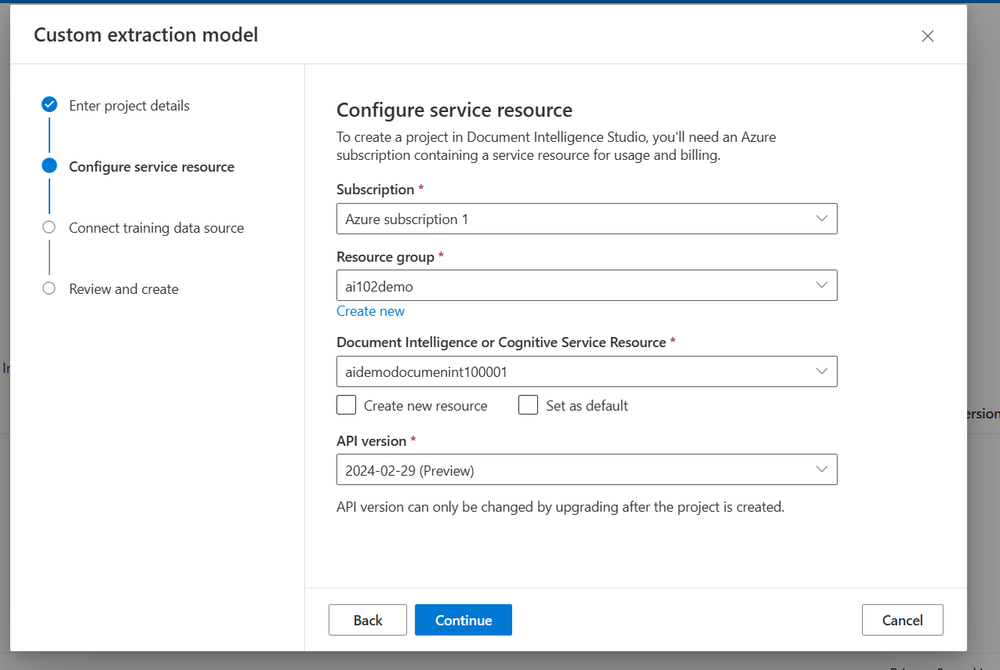
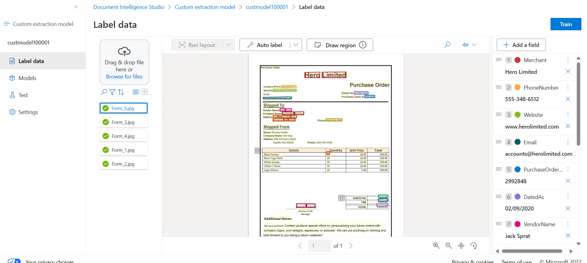
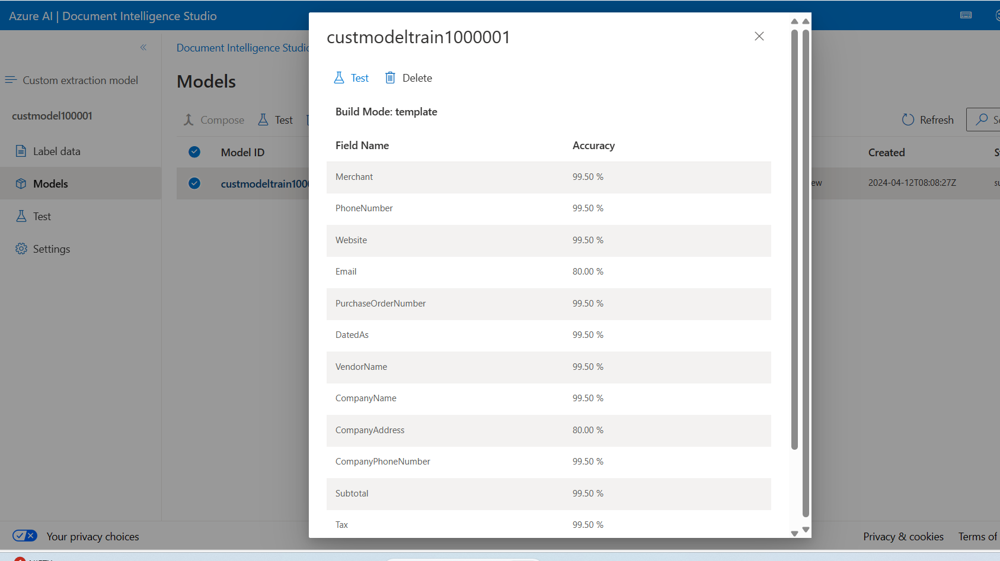
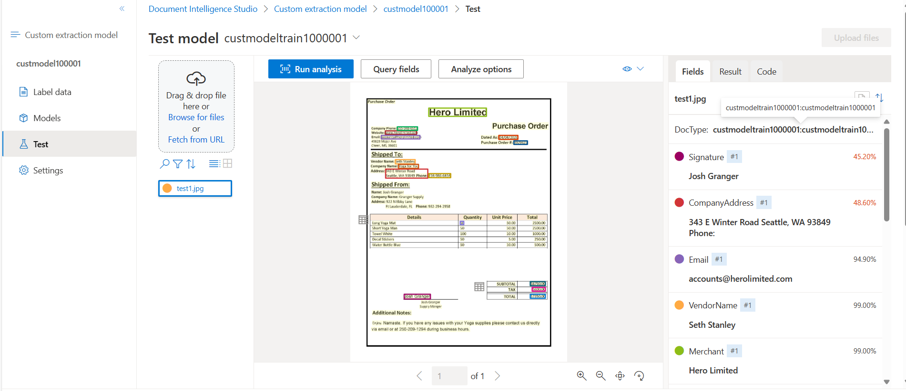

Forms are used to communicate information in every industry, every day. Many people still manually extract data from forms to exchange information.

Let's explore various scenarios where individuals require form data processing:
1. When submitting claims
2. When registering new patients into an online management system
3. When inputting data from receipts into an expense report
4. When scrutinizing operations reports for irregularities
5. When extracting data from a report to provide to stakeholders

In the absence of AI services, individuals must manually sift through form documents to pinpoint crucial details and subsequently manually input this data for recording purposes. Some may even need to carry out these tasks on the spot while interacting with customers.

Azure Document Intelligence automates data extraction from form documents, offering accuracy and scalability. Azure Document Intelligence is a Vision API that extracts key-value pairs and table data from form documents.

Azure Document Intelligence uses Optical Character Recognition (OCR) capabilities and deep learning models to extract text, key-value pairs, selection marks, and tables from documents.

Integrate AI Search with an Azure AI Document Intelligence solution, we can enrich the index with fields that our Azure AI Document Intelligence models are trained to extract.
 
A firm is conducting polls for private companies and political groups, users submit responses via paper forms or online PDFs. Leveraging Azure AI Document Intelligence, we've developed a response analysis service. It extracts data from poll responses captured by users' mobile devices. Additionally, we've implemented an Azure AI Search service to aid users in finding documents. Now, our aim is to integrate key-value pair extraction, aligning with youourr polling models' capabilities, into the search solution.

In the polling company, users can submit queries to our search service, which is built on Azure AI Services. However, users need to be able to locate a completed polling form by searching for a voter ID. We've already trained an Azure AI Document Intelligence model to extract the voter ID from various polling forms. Now we want to ensure that the voter ID is included in our AI Search index so users can locate the forms they need.

Search service quickly finds documents containing specific words by checking against an index, making searches much faster than scanning each document individually.

Throughout the indexing process, AI Search traverses the content, analyzes it, and generates a compilation of words earmarked for inclusion in the index, along with their respective locations. This process unfolds across five distinct stages:

- Document Cracking. In document cracking, the indexer opens the content files and extracts their content.
- Field Mappings. Fields such as titles, names, dates, and more are extracted from the content. You can use field mappings to control how they're stored in the index.
- Skillset Execution. In the optional skillset execution stage, custom AI processing is done on the content to enrich the final index.
- Output field mappings. If you're using a custom skillset, its output is mapped to index fields in this stage.
- Push to index. The results of the indexing process are stored in the index in Azure AI Search.


## what component of Azure Document Intelligence to use?
For capturing document analysis with OCR, utilize Layout, Read, or General Document models.

For extracting data from W-2s, Invoices, Receipts, ID documents, Health insurance, vaccination records, and business cards, use prebuilt models; no training required. Azure Document Intelligence services analyze documents and provide JSON output.

For industry-specific form data extraction, create a custom model. Train it on sample documents for analyzing new documents and providing JSON output.

## Train custom models
Azure Document Intelligence service offers supervised machine learning support. We can train custom models and compose composite models using form documents and JSON documents containing labeled fields.
1. Store sample forms in an Azure blob container, along with JSON files containing layout and label field information.
    - You can generate an ocr.json file for each sample form using the Azure Document Intelligence's Analyze document function. Additionally, you need a single fields.json file describing the fields you want to extract, and a labels.json file for each sample form mapping the fields to their location in that form.
2. Generate a shared access security (SAS) URL for the container.
3. Use the Build model REST API function (or equivalent SDK method).
4. Use the Get model REST API function (or equivalent SDK method) to get the trained model ID.

OR

5. Use the Azure Document Intelligence Studio to label and train. There are two types of underlying models for custom forms custom template models or custom neural models.
    - Custom template models accurately extract labeled key-value pairs, selection marks, tables, regions, and signatures from documents. Training only takes a few minutes, and more than 100 languages are supported.
    - Custom neural models are deep learned models that combine layout and language features to accurately extract labeled fields from documents.This model is best for semi-structured or unstructured documents.

**Confidence scores**

If the confidence values of the analyzeResult are low, try to improve the quality of your input documents.
To ensure accurate analysis, verify that the form being analyzed resembles those in the training set if confidence values are low. If form appearances vary significantly, consider training multiple models, each specialized for a specific form format.

Depending on the application, a confidence score of 80% or higher may suffice for low-risk scenarios. However, for sensitive cases such as medical records or billing statements, a confidence score of 100% is recommended.

---------------------------------------------------------------------------------------

Create a Custom  Project by selecting Custom extraction model


During the creation of the project it will connect to the Storage account selected to read the sample forms in the container


Once your project is created, select Train to train your model. Use the following configurations:
    - Model ID: Provide a globally unique name (you’ll need the model ID name in the next step).
    - Build Mode: Template.

After the model is trained


Select "Test" and provide the sample test form and click on "Run Analysis"


Add the code necessary to import the required SDK libraries(Azure.AI.FormRecognizer), establish an authenticated connection to your deployed project and submit text for classification. Update the configurations in the code base.
    - Your Document Intelligence endpoint.
    - Your Document Intelligence key.
    - The Model ID generated you provided when training your model.
    
   ```json
    Analyzing document from Uri: https://raw.githubusercontent.com/MicrosoftLearning/mslearn-ai-document-intelligence/main/Labfiles/02-custom-document-intelligence/test1.jpg
Document was analyzed with model with ID: custmodeltrain1000001
Document of type: custmodeltrain1000001:custmodeltrain1000001
Field 'PurchaseOrderNumber':
  Content: '3929423'
  Confidence: '0.994'
Field 'CompanyPhoneNumber':
  Content: '234-986-6454'
  Confidence: '0.995'
Field 'Signature':
  Content: 'Josh Granger'
  Confidence: '0.452'
Field 'Total':
  Content: '$7350.00'
  Confidence: '0.994'
Field 'Website':
  Content: 'www.herolimited.com'
  Confidence: '0.99'
Field 'Quantity':
  Content: '50'
  Confidence: '0.99'
Field 'CompanyName':
  Content: 'Yoga for You'
  Confidence: '0.991'
Field 'CompanyAddress':
  Content: '343 E Winter Road
Seattle, WA 93849 Phone:'
  Confidence: '0.486'
Field 'VendorName':
  Content: 'Seth Stanley'
  Confidence: '0.99'
Field 'Email':
  Content: 'accounts@herolimited.com'
  Confidence: '0.949'
Field 'Merchant':
  Content: 'Hero Limited'
  Confidence: '0.99'
Field 'Subtotal':
  Content: '$6750.00'
  Confidence: '0.994'
Field 'Tax':
  Content: '$600.00'
  Confidence: '0.993'
Field 'DatedAs':
  Content: '04/04/2020'
  Confidence: '0.994'
Field 'PhoneNumber':
  Content: '555-348-6512'
  Confidence: '0.99'
   ```