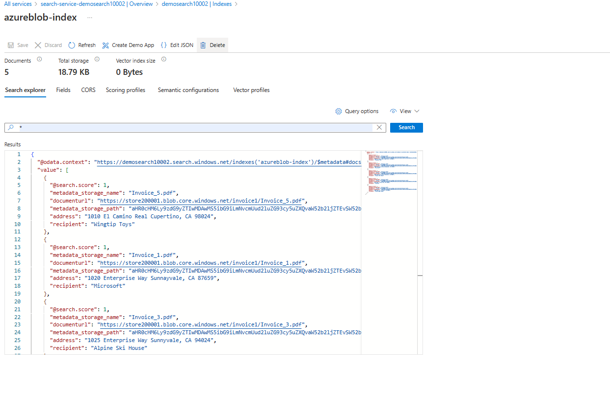

Azure AI Search is a powerful tool that helps users find information they need from various sources. It can understand and index content in different formats, making it easier for users to search through documents, images, and more.

One neat thing about Azure AI Search is its ability to expand its capabilities through skills. These skills can perform extra tasks when indexing content. For example, if you use a skill that connects to Azure AI Document Intelligence, you can enhance your search index with additional information extracted by your Document Intelligence models.

Let's say you work for a company that conducts surveys for both private companies and political organizations. People submit their responses either on paper forms or as PDFs online. With Azure AI Document Intelligence, you've created a tool that can extract data from these survey responses, even when users submit scanned copies using their smartphones.

Now, you've set up an Azure AI Search service to help users find these survey responses quickly. To make your search even more effective, you want it to automatically extract important information, like key details from the surveys, such as names, addresses, or responses to specific questions. This way, users can easily locate and analyze the data they need without manually sorting through each document.

**Custom skills serve two main purposes**:

- Filling Gaps: When the existing built-in skills don't cover the specific type of AI enhancement you need, custom skills come in handy. They allow you to tailor the enrichment process to your requirements.
- Training Custom Models: Sometimes, you may want to train your own model to analyze data in a way that suits your business needs better. Custom skills enable you to integrate these models into your AI Search pipeline seamlessly.

**There are two types of custom skills available**:

- Azure Machine Learning (AML) Custom Skills: These are used to enrich your search index by leveraging an AML model. You can customize these skills to perform tasks specific to your data.
- Custom Web API Skills: This type of custom skill allows you to enrich your index by calling a web service. This web service can include Azure applied AI services, such as Azure AI Document Intelligence, among others.

When developing a web service to integrate into an AI Search indexing pipeline, it must adhere to certain requirements:

- Input and Output Format: The service should accept a JSON payload as input and return another JSON payload as output.
- Output Structure: The output JSON should have a top-level entity named "values," containing an array of objects.
- Data Matching: The number of objects returned should match the number of objects in the "values" entity.
- Object Properties: Each object in "values" should include a unique "recordId" property, a "data" property containing the returned information, and optional properties like "warnings" and "errors" for handling exceptions and alerts.


1. Storage account with a blob container in which the documents to be indexed are stored. Ensure to have blob anonymous access allowed on the container.
2. Create DocumentIntelligence resource and create a [model](https://documentintelligence.ai.azure.com/) by training with sample invoices
3. Create a function App and execute the command from the folder to deploy the functions
  ```json
  func azure functionapp publish <FunctionName> --python
  ```  
4. Configure following keys in the environment variables in the azure function created
  - FORMS_RECOGNIZER_ENDPOINT : endpoint of the DocumentIntelligence
  - FORMS_RECOGNIZER_KEY : Primary Key from the "Keys and endpoint" section 
  - FORMS_RECOGNIZER_MODEL_ID: ModelId of the model created for the DocumentIntelligence 
5. Test the function "AnalyzeInvoice" by accessing Code/Test and provide the JSON body, 
```json
{
    "values": [
        {
            "recordId": "record1",
            "data": { 
                "formUrl": "URL path of the PDF file for document analysis",
                "formSasToken": "?<Generate the SAS signature by selecting the start , end and operations to perform ont he file>"
            }
        }
    ]
}
```
SAS Token to generate at individual document level

SAS Token to generate at container level holding the documents

**Generate the SAS token in Azure Cognitive Search:**
- Navigate to Azure Cognitive Search resource.
- Go to the "Keys" section under the "Settings" menu.
- Generate a SAS token with the required permissions (read, write, etc.) for the specific data source or blob container you want to access.
- Copy the generated SAS token.
6. Response from the function will be 
```json
{
    "values": [
        {
            "recordId": "0",
            "data": {
                "CustomerAddress": "1020 Enterprise Way Sunnayvale, CA 87659",
                "CustomerAddressRecipient": "Microsoft",
                "CustomerName": "Microsoft",
                "DueDate": "2017-06-24",
                "InvoiceDate": "2017-06-18",
                "InvoiceId": "34278587",
                "Items": [
                    null
                ],
                "VendorAddress": "1 Redmond way Suite 6000 Redmond, WA 99243",
                "VendorName": "Contoso"
            }
        }
    ]
}
```


7. Create Azure AI services multi-service account and AI Search service
8. Configure the custom skill,Index,Indexer and pointing the connection string to the forms to be analyzed.
Updating Skills with the function app call information
```json
{
  "@odata.context": "https://aidemo100002.search.windows.net/$metadata#skillsets/$entity",
  "@odata.etag": "\"0x8DC5FE27B1479F4\"",
  "name": "azureblob-skillset",
  "description": "Skillset that calls an Azure AI Document Intelligence custom skill",
  "skills": [
    {
      "@odata.type": "#Microsoft.Skills.Custom.WebApiSkill",
      "name": "formrecognizer",
      "description": "Analyze invoices and extract fields.",
      "context": "/document",
      "uri": "https://demofunc100001.azurewebsites.net/api/AnalyzeInvoice?code=KEJNUInBx6ynB62nxli_BEU7tv4LlGOEbs2Nv1HlljdDAzFujBe5Ag==",
      "httpMethod": "POST",
      "timeout": "PT3M50S",
      "batchSize": 1,
      "degreeOfParallelism": null,
      "authResourceId": null,
      "inputs": [
        {
          "name": "formUrl",
          "source": "/document/documenturl"
        }
      ],
      "outputs": [
        {
          "name": "CustomerAddress",
          "targetName": "address"
        },
        {
          "name": "CustomerAddressRecipient",
          "targetName": "recipient"
        }
      ],
      "httpHeaders": {},
      "authIdentity": null
    }
  ],
  "cognitiveServices": {
    "@odata.type": "#Microsoft.Azure.Search.DefaultCognitiveServices",
    "description": null
  },
  "knowledgeStore": null,
  "indexProjections": null,
  "encryptionKey": null
}
```
Indexes
```json
{
  "@odata.context": "https://aidemo100002.search.windows.net/$metadata#indexes/$entity",
  "@odata.etag": "\"0x8DC5FE39740F636\"",
  "name": "azureblob-index",
  "defaultScoringProfile": "",
  "fields": [
    {
      "name": "content",
      "type": "Edm.String",
      "searchable": true,
      "filterable": false,
      "retrievable": false,
      "stored": true,
      "sortable": false,
      "facetable": false,
      "key": false,
      "indexAnalyzer": null,
      "searchAnalyzer": null,
      "analyzer": "standard.lucene",
      "normalizer": null,
      "dimensions": null,
      "vectorSearchProfile": null,
      "synonymMaps": []
    },
    {
      "name": "metadata_storage_content_type",
      "type": "Edm.String",
      "searchable": false,
      "filterable": false,
      "retrievable": false,
      "stored": true,
      "sortable": false,
      "facetable": false,
      "key": false,
      "indexAnalyzer": null,
      "searchAnalyzer": null,
      "analyzer": null,
      "normalizer": null,
      "dimensions": null,
      "vectorSearchProfile": null,
      "synonymMaps": []
    },
    {
      "name": "metadata_storage_size",
      "type": "Edm.Int64",
      "searchable": false,
      "filterable": false,
      "retrievable": false,
      "stored": true,
      "sortable": false,
      "facetable": false,
      "key": false,
      "indexAnalyzer": null,
      "searchAnalyzer": null,
      "analyzer": null,
      "normalizer": null,
      "dimensions": null,
      "vectorSearchProfile": null,
      "synonymMaps": []
    },
    {
      "name": "metadata_storage_last_modified",
      "type": "Edm.DateTimeOffset",
      "searchable": false,
      "filterable": false,
      "retrievable": false,
      "stored": true,
      "sortable": false,
      "facetable": false,
      "key": false,
      "indexAnalyzer": null,
      "searchAnalyzer": null,
      "analyzer": null,
      "normalizer": null,
      "dimensions": null,
      "vectorSearchProfile": null,
      "synonymMaps": []
    },
    {
      "name": "metadata_storage_content_md5",
      "type": "Edm.String",
      "searchable": false,
      "filterable": false,
      "retrievable": false,
      "stored": true,
      "sortable": false,
      "facetable": false,
      "key": false,
      "indexAnalyzer": null,
      "searchAnalyzer": null,
      "analyzer": null,
      "normalizer": null,
      "dimensions": null,
      "vectorSearchProfile": null,
      "synonymMaps": []
    },
    {
      "name": "metadata_storage_name",
      "type": "Edm.String",
      "searchable": false,
      "filterable": false,
      "retrievable": true,
      "stored": true,
      "sortable": false,
      "facetable": false,
      "key": false,
      "indexAnalyzer": null,
      "searchAnalyzer": null,
      "analyzer": null,
      "normalizer": null,
      "dimensions": null,
      "vectorSearchProfile": null,
      "synonymMaps": []
    },
    {
      "name": "documenturl",
      "type": "Edm.String",
      "searchable": false,
      "filterable": false,
      "retrievable": true,
      "stored": true,
      "sortable": false,
      "facetable": false,
      "key": false,
      "indexAnalyzer": null,
      "searchAnalyzer": null,
      "analyzer": null,
      "normalizer": null,
      "dimensions": null,
      "vectorSearchProfile": null,
      "synonymMaps": []
    },
    {
      "name": "metadata_storage_path",
      "type": "Edm.String",
      "searchable": false,
      "filterable": false,
      "retrievable": true,
      "stored": true,
      "sortable": false,
      "facetable": false,
      "key": true,
      "indexAnalyzer": null,
      "searchAnalyzer": null,
      "analyzer": null,
      "normalizer": null,
      "dimensions": null,
      "vectorSearchProfile": null,
      "synonymMaps": []
    },
    {
      "name": "metadata_storage_file_extension",
      "type": "Edm.String",
      "searchable": false,
      "filterable": false,
      "retrievable": false,
      "stored": true,
      "sortable": false,
      "facetable": false,
      "key": false,
      "indexAnalyzer": null,
      "searchAnalyzer": null,
      "analyzer": null,
      "normalizer": null,
      "dimensions": null,
      "vectorSearchProfile": null,
      "synonymMaps": []
    },
    {
      "name": "metadata_content_type",
      "type": "Edm.String",
      "searchable": false,
      "filterable": false,
      "retrievable": false,
      "stored": true,
      "sortable": false,
      "facetable": false,
      "key": false,
      "indexAnalyzer": null,
      "searchAnalyzer": null,
      "analyzer": null,
      "normalizer": null,
      "dimensions": null,
      "vectorSearchProfile": null,
      "synonymMaps": []
    },
    {
      "name": "metadata_language",
      "type": "Edm.String",
      "searchable": false,
      "filterable": false,
      "retrievable": false,
      "stored": true,
      "sortable": false,
      "facetable": false,
      "key": false,
      "indexAnalyzer": null,
      "searchAnalyzer": null,
      "analyzer": null,
      "normalizer": null,
      "dimensions": null,
      "vectorSearchProfile": null,
      "synonymMaps": []
    },
    {
      "name": "metadata_author",
      "type": "Edm.String",
      "searchable": false,
      "filterable": false,
      "retrievable": false,
      "stored": true,
      "sortable": false,
      "facetable": false,
      "key": false,
      "indexAnalyzer": null,
      "searchAnalyzer": null,
      "analyzer": null,
      "normalizer": null,
      "dimensions": null,
      "vectorSearchProfile": null,
      "synonymMaps": []
    },
    {
      "name": "metadata_title",
      "type": "Edm.String",
      "searchable": false,
      "filterable": false,
      "retrievable": false,
      "stored": true,
      "sortable": false,
      "facetable": false,
      "key": false,
      "indexAnalyzer": null,
      "searchAnalyzer": null,
      "analyzer": null,
      "normalizer": null,
      "dimensions": null,
      "vectorSearchProfile": null,
      "synonymMaps": []
    },
    {
      "name": "metadata_creation_date",
      "type": "Edm.DateTimeOffset",
      "searchable": false,
      "filterable": false,
      "retrievable": false,
      "stored": true,
      "sortable": false,
      "facetable": false,
      "key": false,
      "indexAnalyzer": null,
      "searchAnalyzer": null,
      "analyzer": null,
      "normalizer": null,
      "dimensions": null,
      "vectorSearchProfile": null,
      "synonymMaps": []
    },
    {
      "name": "merged_content",
      "type": "Edm.String",
      "searchable": true,
      "filterable": false,
      "retrievable": false,
      "stored": true,
      "sortable": false,
      "facetable": false,
      "key": false,
      "indexAnalyzer": null,
      "searchAnalyzer": null,
      "analyzer": "standard.lucene",
      "normalizer": null,
      "dimensions": null,
      "vectorSearchProfile": null,
      "synonymMaps": []
    },
    {
      "name": "text",
      "type": "Collection(Edm.String)",
      "searchable": true,
      "filterable": false,
      "retrievable": false,
      "stored": true,
      "sortable": false,
      "facetable": false,
      "key": false,
      "indexAnalyzer": null,
      "searchAnalyzer": null,
      "analyzer": "standard.lucene",
      "normalizer": null,
      "dimensions": null,
      "vectorSearchProfile": null,
      "synonymMaps": []
    },
    {
      "name": "layoutText",
      "type": "Collection(Edm.String)",
      "searchable": true,
      "filterable": false,
      "retrievable": false,
      "stored": true,
      "sortable": false,
      "facetable": false,
      "key": false,
      "indexAnalyzer": null,
      "searchAnalyzer": null,
      "analyzer": "standard.lucene",
      "normalizer": null,
      "dimensions": null,
      "vectorSearchProfile": null,
      "synonymMaps": []
    },
    {
      "name": "imageTags",
      "type": "Collection(Edm.String)",
      "searchable": true,
      "filterable": false,
      "retrievable": false,
      "stored": true,
      "sortable": false,
      "facetable": false,
      "key": false,
      "indexAnalyzer": null,
      "searchAnalyzer": null,
      "analyzer": "standard.lucene",
      "normalizer": null,
      "dimensions": null,
      "vectorSearchProfile": null,
      "synonymMaps": []
    },
    {
      "name": "imageCaption",
      "type": "Collection(Edm.String)",
      "searchable": true,
      "filterable": false,
      "retrievable": false,
      "stored": true,
      "sortable": false,
      "facetable": false,
      "key": false,
      "indexAnalyzer": null,
      "searchAnalyzer": null,
      "analyzer": "standard.lucene",
      "normalizer": null,
      "dimensions": null,
      "vectorSearchProfile": null,
      "synonymMaps": []
    },
    {
      "name": "metadata_storage_sas_token",
      "type": "Edm.String",
      "searchable": false,
      "filterable": false,
      "retrievable": false,
      "stored": true,
      "sortable": false,
      "facetable": false,
      "key": false,
      "indexAnalyzer": null,
      "searchAnalyzer": null,
      "analyzer": null,
      "normalizer": null,
      "dimensions": null,
      "vectorSearchProfile": null,
      "synonymMaps": []
    },
    {
      "name": "address",
      "type": "Edm.String",
      "searchable": false,
      "filterable": true,
      "retrievable": true,
      "stored": true,
      "sortable": false,
      "facetable": false,
      "key": false,
      "indexAnalyzer": null,
      "searchAnalyzer": null,
      "analyzer": null,
      "normalizer": null,
      "dimensions": null,
      "vectorSearchProfile": null,
      "synonymMaps": []
    },
    {
      "name": "recipient",
      "type": "Edm.String",
      "searchable": false,
      "filterable": true,
      "retrievable": true,
      "stored": true,
      "sortable": false,
      "facetable": false,
      "key": false,
      "indexAnalyzer": null,
      "searchAnalyzer": null,
      "analyzer": null,
      "normalizer": null,
      "dimensions": null,
      "vectorSearchProfile": null,
      "synonymMaps": []
    }
  ],
  "scoringProfiles": [],
  "corsOptions": null,
  "suggesters": [],
  "analyzers": [],
  "normalizers": [],
  "tokenizers": [],
  "tokenFilters": [],
  "charFilters": [],
  "encryptionKey": null,
  "similarity": {
    "@odata.type": "#Microsoft.Azure.Search.BM25Similarity",
    "k1": null,
    "b": null
  },
  "semantic": null,
  "vectorSearch": null
}
```
Indexers
```json
{
  "@odata.context": "https://aidemo100002.search.windows.net/$metadata#indexers/$entity",
  "@odata.etag": "\"0x8DC5FE3DF936BC1\"",
  "name": "azureblob-indexer",
  "description": "",
  "dataSourceName": "demo100002",
  "skillsetName": "azureblob-skillset",
  "targetIndexName": "azureblob-index",
  "disabled": null,
  "schedule": null,
  "parameters": {
    "batchSize": null,
    "maxFailedItems": 0,
    "maxFailedItemsPerBatch": 0,
    "base64EncodeKeys": null,
    "configuration": {
      "dataToExtract": "contentAndMetadata",
      "parsingMode": "default",
      "imageAction": "generateNormalizedImages"
    }
  },
  "fieldMappings": [
    {
      "sourceFieldName": "metadata_storage_path",
      "targetFieldName": "metadata_storage_path",
      "mappingFunction": {
        "name": "base64Encode",
        "parameters": null
      }
    },
    {
      "sourceFieldName": "metadata_storage_path",
      "targetFieldName": "documenturl",
      "mappingFunction": null
    }
  ],
  "outputFieldMappings": [
    {
      "sourceFieldName": "/document/merged_content",
      "targetFieldName": "merged_content"
    },
    {
      "sourceFieldName": "/document/normalized_images/*/text",
      "targetFieldName": "text"
    },
    {
      "sourceFieldName": "/document/normalized_images/*/layoutText",
      "targetFieldName": "layoutText"
    },
    {
      "sourceFieldName": "/document/normalized_images/*/imageTags/*/name",
      "targetFieldName": "imageTags"
    },
    {
      "sourceFieldName": "/document/normalized_images/*/imageCaption",
      "targetFieldName": "imageCaption"
    },
    {
      "sourceFieldName": "/document/address",
      "targetFieldName": "address"
    },
    {
      "sourceFieldName": "/document/recipient",
      "targetFieldName": "recipient"
    }
  ],
  "cache": null,
  "encryptionKey": null
}
```
9. Go to Search explorer to view the documents indexed

```json
{
  "@odata.context": "https://demosearch10002.search.windows.net/indexes('azureblob-index')/$metadata#docs(*)",
  "value": [
    {
      "@search.score": 1,
      "metadata_storage_name": "Invoice_5.pdf",
      "documenturl": "https://store200001.blob.core.windows.net/invoice1/Invoice_5.pdf",
      "metadata_storage_path": "aHR0cHM6Ly9zdG9yZTIwMDAwMS5ibG9iLmNvcmUud2luZG93cy5uZXQvaW52b2ljZTEvSW52b2ljZV81LnBkZg2",
      "address": "1010 El Camino Real Cupertino, CA 98024",
      "recipient": "Wingtip Toys"
    },
    {
      "@search.score": 1,
      "metadata_storage_name": "Invoice_1.pdf",
      "documenturl": "https://store200001.blob.core.windows.net/invoice1/Invoice_1.pdf",
      "metadata_storage_path": "aHR0cHM6Ly9zdG9yZTIwMDAwMS5ibG9iLmNvcmUud2luZG93cy5uZXQvaW52b2ljZTEvSW52b2ljZV8xLnBkZg2",
      "address": "1020 Enterprise Way Sunnayvale, CA 87659",
      "recipient": "Microsoft"
    },
    {
      "@search.score": 1,
      "metadata_storage_name": "Invoice_3.pdf",
      "documenturl": "https://store200001.blob.core.windows.net/invoice1/Invoice_3.pdf",
      "metadata_storage_path": "aHR0cHM6Ly9zdG9yZTIwMDAwMS5ibG9iLmNvcmUud2luZG93cy5uZXQvaW52b2ljZTEvSW52b2ljZV8zLnBkZg2",
      "address": "1025 Enterprise Way Sunnyvale, CA 94024",
      "recipient": "Alpine Ski House"
    },
    {
      "@search.score": 1,
      "metadata_storage_name": "Invoice_2.pdf",
      "documenturl": "https://store200001.blob.core.windows.net/invoice1/Invoice_2.pdf",
      "metadata_storage_path": "aHR0cHM6Ly9zdG9yZTIwMDAwMS5ibG9iLmNvcmUud2luZG93cy5uZXQvaW52b2ljZTEvSW52b2ljZV8yLnBkZg2",
      "address": "456 49th st New York, NY 87643",
      "recipient": "Contoso"
    },
    {
      "@search.score": 1,
      "metadata_storage_name": "Invoice_4.pdf",
      "documenturl": "https://store200001.blob.core.windows.net/invoice1/Invoice_4.pdf",
      "metadata_storage_path": "aHR0cHM6Ly9zdG9yZTIwMDAwMS5ibG9iLmNvcmUud2luZG93cy5uZXQvaW52b2ljZTEvSW52b2ljZV80LnBkZg2",
      "address": "1060 Main St. Atlanta, GA 65024",
      "recipient": "Southridge Video"
    }
  ]
}
```
10. Update the search query to filter recipient to show for "Microsoft"
```json
{
  "search": "*",
  "filter": "recipient eq 'Microsoft'"
}
```
Search will look through the indexes to filter instead of going through the entire document scans to list the result
```json
{
      "@search.score": 1,
      "metadata_storage_name": "Invoice_1.pdf",
      "documenturl": "https://store200001.blob.core.windows.net/invoice1/Invoice_1.pdf",
      "metadata_storage_path": "aHR0cHM6Ly9zdG9yZTIwMDAwMS5ibG9iLmNvcmUud2luZG93cy5uZXQvaW52b2ljZTEvSW52b2ljZV8xLnBkZg2",
      "address": "1020 Enterprise Way Sunnayvale, CA 87659",
      "recipient": "Microsoft"
    }
```