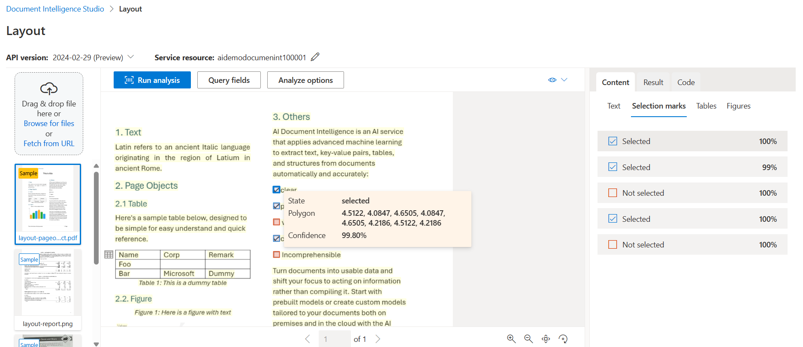

Azure AI Document Intelligence leverages Azure AI Services to examine the content of scanned documents and transform them into structured data. It's adept at identifying textual information within standard forms as well as custom forms tailored to the organization's needs.

Until recently, transferring data from completed forms into databases or other data repositories necessitated manual input. This process is slow, labor-intensive, and can incur significant costs, especially when dealing with large volumes of forms. Human operators are prone to reading and typing errors, leading to inaccuracies in the data.

Manual data entry was previously the sole option due to the difficulty computers faced in recognizing printed or handwritten text. However, the advent of AI has revolutionized this process by enabling computers to accurately identify patterns, such as letter shapes in text. Leveraging AI as an alternative to manual data entry results in reduced costs and fewer errors in the extracted data.

Azure AI Document Intelligence, three of the prebuilt models are for general document analysis:
- Read
- General document
- Layout

The other prebuilt models expect a common type of form or document:
- Invoice
- Receipt
- W-2 US tax declaration
- ID Document
- Business card
- Health insurance card

## Model Type
Azure AI Document Intelligence employs models to understand and categorize various types of documents and forms. You have two options:

- Prebuilt Models: These are ready-made models designed for common document types like invoices, receipts, and ID documents.
- Custom Models: Tailored to your specific needs, these models are trained based on the unique structure of your documents.

For the polling company, where we handle diverse survey forms for different clients, some fields like "Respondent Name" and "Contact Telephone" are consistent across forms, while others vary. We'll need to decide whether to use prebuilt models for common fields or create custom models to accommodate the unique aspects of each client's forms.

## General document analysis models
- **Read**: This model serves to extract text from both printed and handwritten documents while also identifying the language utilized within the document.
- **General document model**: is utilized to extract key-value pairs and tables present within your documents.
- **Layout model**: is employed to extract text, tables, and structural details from forms. Additionally, it can identify selection marks like check boxes and radio buttons.

## Specific document type models
- **Invoice**: Use this model to extract key information from sales invoices in English and Spanish.
- **Receipt**: Use this model to extract data from printed and handwritten receipts.
- **W-2**: Use this model to extract data from United States government's W-2 tax declaration form.
- **ID document**: Use this model to extract data from United States driver's licenses and international passports.
- **Business card**: Use this model to extract names and contact details from business cards.

The **prebuilt models** have been crafted to extract various forms of data from submitted documents and forms. To determine the most suitable model for your needs, it's essential to grasp the following functionalities:

- **Text extraction**: All prebuilt models are capable of extracting lines of text and individual words from both handwritten and printed text.
- **Key-value pairs**: Many models are equipped to extract spans of text within documents that serve as labels or keys along with their corresponding responses or values. For instance, a key like "Weight" may be paired with its value, such as "31 kg".
- **Entities**: Some models can identify and extract text that comprises common, intricate data structures known as entities. These entities encompass various types like people, locations, and dates.
- **Selection marks**: Certain models can detect and extract spans of text indicating choices, such as radio buttons and check boxes, as selection marks.
- **Tables**: A significant number of models have the capability to extract tables from scanned forms, capturing data contained in cells, the column and row counts, as well as headings for both columns and rows. Additionally, models can handle tables with merged cells.
- **Fields**: Models tailored for specific form types excel at identifying values within a fixed set of fields. For instance, the Invoice model may recognize fields like CustomerName and InvoiceTotal.

<table class="table">
<thead>
<tr>
<th>Model</th>
<th>Text extraction</th>
<th>Key-value pairs</th>
<th>Entities</th>
<th>Selection marks</th>
<th>Tables</th>
<th>Fields</th>
</tr>
</thead>
<tbody>
<tr>
<td>Read</td>
<td>X</td>
<td></td>
<td></td>
<td></td>
<td></td>
<td></td>
</tr>
<tr>
<td>General document</td>
<td>X</td>
<td>X</td>
<td>X</td>
<td>X</td>
<td>X</td>
<td></td>
</tr>
<tr>
<td>Layout</td>
<td>X</td>
<td></td>
<td></td>
<td>X</td>
<td>X</td>
<td></td>
</tr>
<tr>
<td>Invoice</td>
<td>X</td>
<td>X</td>
<td></td>
<td>X</td>
<td>X</td>
<td>X</td>
</tr>
<tr>
<td>Receipt</td>
<td>X</td>
<td>X</td>
<td></td>
<td></td>
<td></td>
<td>X</td>
</tr>
<tr>
<td>W2</td>
<td>X</td>
<td>X</td>
<td></td>
<td>X</td>
<td>X</td>
<td>X</td>
</tr>
<tr>
<td>ID document</td>
<td>X</td>
<td>X</td>
<td></td>
<td></td>
<td></td>
<td>X</td>
</tr>
<tr>
<td>Business card</td>
<td>X</td>
<td>X</td>
<td></td>
<td></td>
<td></td>
<td>X</td>
</tr>
<tr>
<td></td>
<td></td>
<td></td>
<td></td>
<td></td>
<td></td>
<td></td>
</tr>
</tbody>
</table>

## Custom Models
If the prebuilt models don't meet our needs, we can develop a custom model tailored to analyze the specific document types users submit to Azure AI Document Intelligence. While the general document analyzer prebuilt models might suffice for extracting basic data, a custom model trained on forms with similar structures and content will yield more consistent and standardized results for unique form types.

Training a custom model requires a minimum of five examples of completed forms, but providing more examples increases the confidence levels of the analysis. The diversity of the documents, in terms of structure and terminology, determines the number of examples needed for a reliable model. You can either provide labeled datasets describing expected data or let the model identify key-value pairs and tables based on example forms. Ensure training forms cover the full spectrum of possible inputs, including both handwritten and printed entries if applicable.

**Types of custom model**

**Custom Template Models**: If the forms have consistent visual templates even after removing user-entered data, a custom template model is ideal. These models support nine languages for handwritten text and a wide range of languages for printed text. If you have various form template variations, train a model for each and combine them into a single model. The service will select the best-suited model to analyze the document.

**Custom Neural Models**: For documents ranging from unstructured contracts to highly structured forms, a custom neural model is versatile. While it excels in English, it also maintains high accuracy in Latin-based languages like German, French, Italian, Spanish, and Dutch. If our scenario fits the model's capabilities, consider using a custom neural model first.

## Composed Models
A composed model combines multiple custom models and is beneficial in various scenarios. It helps when you need to classify and analyze documents of unknown types or when you have multiple variations of a form, each with its trained model. When a user submits a document to the composed model, Document Intelligence automatically classifies it to determine the appropriate custom model for analysis. This eliminates the need for users to know the document type before submission, which is useful for handling similar forms or when you want to streamline your endpoint for all form types.

--------------------------------------------------------------------------------------------------------------

1. Create Document Intelligence resource.

2. Under Resource Management, select Keys and Endpoint.
3. Copy either KEY 1 or KEY 2 and the Endpoint values and store them for use in your application code.
4. upload the [document](images/sample-invoice.pdf) to anonymous access storage container and get the URL updated in the application code.
5. Response of the document analysis will be

6. Access [Document Intelligence Studio](https://documentintelligence.ai.azure.com/studio?source=azureportal) to analyze the documents with prebuilt model.
  - **Read**
  
  - **Layout**
   
   **Layout Selections**
   
   **Layout Tables**
   
   **Layout Figure**
   
   **Layout Query Fields**
   
  - **General**
  
7. Specific Document Type models
  - Receipt
   
  - Identity
   
  - Credit Cards
   

