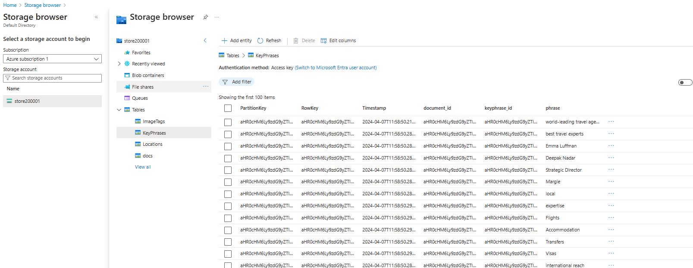

Azure AI Search allows you to build search solutions where a sequence of AI skills enriches data and fills an index. These skills provide additional insights like the document's language, key topics, sentiment, mentioned entities, and image descriptions. This enriched data enhances search solutions, going beyond simple full-text searches of the original content.

## Knowledge stores
Although the index is the main result of indexing, the enriched data within can serve other purposes:

- Exporting JSON objects from the index allows integration into data workflows, like Azure Data Factory, for orchestration.
- Normalizing index records into relational tables enables analysis and reporting with tools like Microsoft Power BI.
- Extracting embedded images during indexing may prompt saving them as separate files for various uses.

Azure AI Search facilitates these scenarios by allowing you to establish a knowledge store within the skillset, encapsulating your enrichment pipeline. This store comprises projections of the enriched data, such as JSON objects, tables, or image files. When an indexer executes the pipeline to build or update an index, the projections are created and stored in the knowledge store.

## Projections
The projections of data to be stored in our knowledge store are based on the document structures generated by the enrichment pipeline in our indexing process. Each skill in our skillset iteratively builds a JSON representation of the enriched data for the documents being indexed, and you can persist some or all of the fields in the document as projections.

**Shaper Skill**
The indexing process gradually constructs a detailed document featuring various output fields from the skills in the skillset. This can lead to a convoluted schema, including collections of basic data values that are not neatly structured as JSON.

To streamline the mapping of these field values to projections in a knowledge store, the Shaper skill is often employed to generate a new field with a more straightforward structure for the desired fields.
```json
 {
      "@odata.type": "#Microsoft.Skills.Util.ShaperSkill",
      "name": "define-projection",
      "description": "Prepare projection fields",
      "context": "/document",
      "inputs": [
        {
          "name": "file_id",
          "source": "/document/metadata_storage_path"
        },
        {
          "name": "file_name",
          "source": "/document/metadata_storage_name"
        },
        {
          "name": "url",
          "source": "/document/url"
        },
        {
          "name": "language",
          "source": "/document/language"
        },
        {
          "name": "sentiment",
          "source": "/document/sentimentLabel"
        },
        {
          "name": "key_phrases",
          "sourceContext": "/document/merged_content/keyphrases/*",
          "inputs": [
            {
              "name": "phrase",
              "source": "/document/merged_content/keyphrases/*"
            }
          ]
        },
        {
          "name": "locations",
          "sourceContext": "/document/merged_content/locations/*",
          "inputs": [
            {
              "name": "location",
              "source": "/document/merged_content/locations/*"
            }
          ]
        },
        {
          "name": "image_tags",
          "sourceContext": "/document/normalized_images/*/imageTags/*",
          "inputs": [
            {
              "name": "tag",
              "source": "/document/normalized_images/*/imageTags/*/name"
            }
          ]
        }
      ],
      "outputs": [
        {
          "name": "output",
          "targetName": "knowledge_projection"
        }
      ]
    }
```


Response is a shaper skill creating a projection with the following structure

The resulting JSON document is well-formed, and easier to map to a projection in a knowledge store than the more complex document that has been built iteratively by the previous skills in the enrichment pipeline.
```json
{
    "file_id": "aHR0cHM6Ly9zdG9yZTIwMDAwMS5ibG9iLmNvcmUud2luZG93cy5uZXQvc2VhcmNoL01hcmdpZXMlMjBUcmF2ZWwlMjBDb21wYW55JTIwSW5mby5wZGY1",
    "file_name": "Margies Travel Company Info.pdf",
    "url": "https://store200001.blob.core.windows.net/search/Margies%20Travel%20Company%20Info.pdf",
    "language": "en",
    "sentiment": "neutral",
    "key_phrases": [
        {
            "phrase": "world-leading travel agency"
        },
        {
            "phrase": "best travel experts"
        },
        {
            "phrase": "international reach"
        },
        {
            "phrase": "Currency Exchange"
        },
        {
            "phrase": "Las Vegas"
        },
        {
            "phrase": "New York"
        },
        {
            "phrase": "San Francisco"
        },
        {
            "phrase": "leadership team"
        },
        {
            "phrase": "Marjorie Long"
        },
        {
            "phrase": "Logan Reid"
        },
        {
            "phrase": "Emma Luffman"
        },
        {
            "phrase": "Deepak Nadar"
        },
        {
            "phrase": "Strategic Director"
        },
        {
            "phrase": "Margie"
        },
        {
            "phrase": "local"
        },
        {
            "phrase": "expertise"
        },
        {
            "phrase": "Flights"
        },
        {
            "phrase": "Accommodation"
        },
        {
            "phrase": "Transfers"
        },
        {
            "phrase": "Visas"
        },
        {
            "phrase": "Excursions"
        },
        {
            "phrase": "trips"
        },
        {
            "phrase": "Dubai"
        },
        {
            "phrase": "London"
        },
        {
            "phrase": "CEO"
        },
        {
            "phrase": "CFO"
        },
        {
            "phrase": "website"
        }
    ],
    "locations": [
        {
            "location": "Accommodation"
        },
        {
            "location": "Dubai"
        },
        {
            "location": "Las Vegas"
        },
        {
            "location": "London"
        },
        {
            "location": "New York"
        },
        {
            "location": "San Francisco"
        }
    ],
    "image_tags": [
        {
            "tag": "outdoor"
        },
        {
            "tag": "text"
        },
        {
            "tag": "palm tree"
        },
        {
            "tag": "sky"
        },
        {
            "tag": "tree"
        },
        {
            "tag": "arecales"
        },
        {
            "tag": "plant"
        },
        {
            "tag": "beach"
        },
        {
            "tag": "attalea speciosa"
        },
        {
            "tag": "tropics"
        },
        {
            "tag": "elaeis"
        },
        {
            "tag": "palm"
        },
        {
            "tag": "date palm"
        },
        {
            "tag": "vacation"
        }
    ]
}
```
------------------------------------------------------------------------------
Create following resources,
- Azure AI Search resource, which will manage indexing and querying.
- Azure AI Services(multi service account) resource, which provides AI services for skills that our search solution can use to enrich the data in the data source with AI-generated insights.
- Storage account with a blob container in which the documents to be searched are stored.

Steps can be followed as mentioned in [Search Solution](../SearchSolution/README.md) to create the Skills, Indexes and Indexers.

To set up the knowledge store and its projections, you'll create a knowledgeStore object within the skillset. This object includes the Azure Storage connection string for the storage account where the projections will be stored, along with definitions for the projections themselves.

```json
{
    "storageConnectionString": "DefaultEndpointsProtocol=https;AccountName=store200001;AccountKey=l0cpYsrZyDuIDKfe26gRnuJNwEb3nTkm9hXrXA6IgOFcLNmBNGGG5fVRJJMGIXp1/89dO1XfxAg9+AStTnWE+Q==;EndpointSuffix=core.windows.net",
    "identity": null,
    "projections": [
      {
        "tables": [],
        "objects": [
          {
            "storageContainer": "knowledgestore",
            "referenceKeyName": null,
            "generatedKeyName": "knowledgestoreKey",
            "source": "/document/knowledge_projection",
            "sourceContext": null,
            "inputs": []
          }
        ],
        "files": []
      },
      {
        "tables": [],
        "objects": [],
        "files": [
          {
            "storageContainer": "knowledgeimage",
            "referenceKeyName": null,
            "generatedKeyName": "knowledgeimageKey",
            "source": "/document/normalized_images/*",
            "sourceContext": null,
            "inputs": []
          }
        ]
      },
      {
        "tables": [
          {
            "tableName": "KeyPhrases",
            "referenceKeyName": null,
            "generatedKeyName": "keyphrase_id",
            "source": "/document/knowledge_projection/key_phrases/*",
            "sourceContext": null,
            "inputs": []
          },
          {
            "tableName": "Locations",
            "referenceKeyName": null,
            "generatedKeyName": "location_id",
            "source": "/document/knowledge_projection/locations/*",
            "sourceContext": null,
            "inputs": []
          },
          {
            "tableName": "ImageTags",
            "referenceKeyName": null,
            "generatedKeyName": "tag_id",
            "source": "/document/knowledge_projection/image_tags/*",
            "sourceContext": null,
            "inputs": []
          },
          {
            "tableName": "docs",
            "referenceKeyName": null,
            "generatedKeyName": "document_id",
            "source": "/document/knowledge_projection",
            "sourceContext": null,
            "inputs": []
          }
        ],
        "objects": [],
        "files": []
      }
    ],
    "parameters": {
      "synthesizeGeneratedKeyName": true
    }
  }
```


You can define object, table, and file projections based on your storage needs. Remember that each type of projection requires a separate definition, even though each definition can include lists for tables, objects, and files. Since projection types are mutually exclusive, you'll need to specify a separate projection for each type if you choose to create all three kinds.

8. Return to the Overview page for your Azure AI Search resource in the Azure portal and view the Index page. Select Index to "Reset" and "Run" to re-index the document for the modifications.
9. After the run is success all the documents will be re-indexed.

## View the Knowledge Store
10. **Object projections** Navigate the toe storage account container "knowledgestore" to view the JSON files. 


11. Open any of the folders to view the knowledge-projection.json file content.


12. Download and open the [knowledge-projection.json](images/knowledge_projection.json) file it contains. Each JSON file contains a representation of an indexed document, including the enriched data extracted by the skillset 

13. **File projections** This container contains a folder for each document that contained images.

14. Open any of the folders and view its contents - each folder contains at least one *.jpg file.


15. Open any of the image files to verify that they contain images extracted from the documents.


16. **Table projections** The table projections defined in the skillset form a relational schema of enriched data.

17. In the Storage browser interface in the Azure portal, expand Tables.


18. Select the docs table to view its columns.

19. Other tables that were created by the indexing process.




Being able to generate table projections allows for the development of analytical and reporting solutions that can query the relational schema. This is particularly useful for tools like Microsoft Power BI. The automatically generated key columns can facilitate joining tables in queries, allowing you to retrieve specific data, such as all the locations mentioned in a particular document.
