Every organization depends on information to guide decision-making, address inquiries, and operate smoothly. The primary challenge faced by most organizations is not the absence of information but rather the difficulty of locating and retrieving it from the vast array of documents, databases, and other sources where it resides.

For example, suppose Margie's Travel is a travel agency that specializes in organizing trips to cities around the world. Over time, the company has amassed a huge amount of information in documents such as brochures, as well as reviews of hotels submitted by customers. This data is a valuable source of insights for travel agents and customers as they plan trips, but the sheer volume of data can make it difficult to find relevant information to answer a specific customer question.

To address this challenge, Margie's Travel can implement a solution in which the documents are indexed and made easy to search. This solution enables agents and customers to query the index to find relevant documents and extract information from them.

**Azure AI Search** is like a smart search engine in the cloud. It helps businesses organize and search through all kinds of data, like documents or databases, making it easy to find what they need. It's powerful, handling large amounts of data and creating advanced search tools for businesses to use.
- Index documents and data from a range of sources.
- Use cognitive skills to enrich index data.
- Store extracted insights in a knowledge store for analysis and integration.

## Replicas and partitions
**Replicas** act as copies of the search service, similar to nodes in a cluster. By adding more replicas, you increase the capacity to handle multiple search requests simultaneously and manage ongoing data indexing tasks effectively.

**Partitions** are divisions within an index that help distribute data across multiple storage locations. This splitting of data allows for more efficient processing of operations like searching or rebuilding the index, as they can be performed in parallel across different partitions.

* The combination of replicas and partitions configured determines the search units used by our solution. 
* The number of search units is the number of replicas multiplied by the number of partitions (R x P = SU). 
* For example, a resource with four replicas and three partitions is using 12 search units.

## Search Components
**Search solution** consists of multiple components, each playing an important part in the process of extracting, enriching, indexing, and searching data.

**Data Source** Many search solutions typically begin with a data source containing the desired information. Azure AI Search facilitates various types of data sources, such as:
- Unstructured files stored in Azure blob storage containers.
- Tables housed within Azure SQL Database.
- Documents stored in Cosmos DB.

Azure AI Search can extract data from these sources to create an index.

Alternatively, applications have the option to directly inject JSON data into an index without the need to retrieve it from an existing data repository.

**Skills** In a simple search setup, you'd collect and organize data from its source. This could include pulling details from databases or documents. While basic indexing captures essential data, modern users often seek deeper insights. With Azure AI Search, you can enhance this process using AI skills during indexing. These skills, organized within a skillset, create an enrichment pipeline. Each step in this pipeline augments the original data with additional insights, such as sentiment analysis or entity recognition, making the search results more valuable and relevant to users.

Examples of the kind of information that can be extracted by an AI skill include:
- The language in which a document is written.
- Key phrases that might help determine the main themes or topics discussed in a document.
- A sentiment score that quantifies how positive or negative a document is.
- Specific locations, people, organizations, or landmarks mentioned in the content.
- AI-generated descriptions of images, or image text extracted by optical character recognition.
- Custom skills that you develop to meet specific requirements.

**Indexer** acts as the central component or engine of the indexing process. It utilizes the outputs obtained from the skills within the skillset, alongside the data and metadata values gathered from the original data source, to align them with fields in the index.

Once created, an indexer automatically initiates its operation. It can be set to run periodically or manually to include additional documents in the index. At times, like when incorporating new fields into an index or adding new skills to a skillset, it may be necessary to reset the index before re-executing the indexer.

**Index** is the searchable result of the indexing process. It consists of a collection of JSON documents, with fields that contain the values extracted during indexing. Client applications can query the index to retrieve, filter, and sort information.
- Key: Fields serving as unique identifiers for index records.
- Searchable: Fields enabling full-text search queries.
- Filterable: Fields eligible for filtering documents based on specified criteria.
- Sortable: Fields applicable for sorting search results.
- Facetable: Fields determining values for facets, aiding in result filtering.
- Retrievable: Fields included in search results, unless explicitly excluded.

## Indexing Process
The indexing process involves creating a document for each item you want to index. As data gets indexed, a pipeline enhances these documents by adding metadata from the data source and extra information from cognitive skills. Think of each document as a JSON structure with fields like "metadata_storage_name" and "metadata_author."

If your data includes images, you can set up the indexer to extract image data and store it separately, like in a "normalized_images" collection. This lets you use the images for skills that analyze image data.

Skills add more details to the document. For instance, a language detection skill might add a "language" field.

The document structure is organized, allowing skills to process specific parts. For example, an optical character recognition (OCR) skill can analyze text within each image.

The outputs from these skills can be used as inputs for other skills. For instance, you could combine the original text with text from images to create a new "merged_content" field containing all the text in the document, including text from images.

The final document structure's fields are connected to index fields by the indexer in two main ways:
- Fields extracted directly from the source data are linked to index fields. This mapping can happen implicitly (fields automatically match with fields of the same name in the index) or explicitly (a defined mapping connects a source field to an index field, often renaming or applying functions to the data value during mapping).
- Output fields from skills in the skillset are specifically linked from their hierarchical position in the output to the designated field in the index.

## Search an Index 
After you have created and populated an index, you can query it to search for information in the indexed document content. While you could retrieve index entries based on simple field value matching, most search solutions use full text search semantics to query an index.

**Full text search** is a way to find words or phrases within documents. In Azure AI Search, it uses a system called Lucene query syntax, which has many options for searching, filtering, and organizing data in indexes.
- Simple - An intuitive syntax that makes it easy to perform basic searches that match literal query terms submitted by a user.
- Full - An extended syntax that supports complex filtering, regular expressions, and other more sophisticated queries.

Query processing involves four key stages:

- **Query parsing**: The search expression is analyzed and broken down into subqueries, such as term queries (looking for specific words - for example hotel), phrase queries (searching for phrases within quotation marks - for example, "free parking"), and prefix queries (finding terms with specified beginnings - for example air*).
- **Lexical analysis**: Query terms undergo linguistic rules to refine them. This includes converting text to lowercase, removing nonessential words (like "the" and "is"), stemming words to their root form (e.g., "comfortable" becoming "comfort"), and breaking down composite words into individual terms.
- **Document retrieval**: The processed query terms are compared against indexed terms, identifying documents that match the search criteria.
- **Scoring**: Each matched document receives a relevance score based on a calculation called term frequency/inverse document frequency (TF/IDF), which assesses how often a term appears in a document compared to its frequency across all documents.

**Stemming** is a process used in natural language processing to reduce words to their base or root form. Here's an example:
- Original word: "Running"
- Stemmed word: "Run"

In this example, "Running" is stemmed to its base form "Run." This allows different variations of the same word (like "runs" or "runner") to be treated as the same term, simplifying text analysis and improving search accuracy.

## Filtering
Filters can be applied to queries in two ways:
- Including filter criteria directly within a simple search expression.
- Providing an OData filter expression using a $filter parameter alongside a full syntax search expression.

You can apply a filter to any filterable field in the index.

For example, suppose you want to find documents containing the text London that have an author field value of Reviewer.

**Simple Search**
```json
search=London+author='Reviewer'
queryType=Simple
```

**OData filter** in a $filter parameter with a full Lucene search expression
```json
search=London
$filter=author eq 'Reviewer'
queryType=Full
```

**Facets** are a useful way to present users with filtering criteria based on field values in a result set. They work best when a field has a small number of discrete values that can be displayed as links or options in the user interface.

To use facets, we must specify facetable fields for which we want to retrieve the possible values in an initial query.
```json
search=*
facet=author
```
The results from this query include a collection of discrete facet values that you can display in the user interface for the user to select. Then in a subsequent query, you can use the selected facet value to filter the results:
```json
**search=*
$filter=author eq 'selected-facet-value-here'**
```
**Sorting** results are typically arranged based on the relevance score assigned during the query process, with the most relevant matches displayed first. However, you have the option to change this sorting order by incorporating an OData orderby parameter. This parameter allows you to specify one or more sortable fields and the desired sorting order (ascending or descending).
```json
search=*
$orderby=last_modified desc
```

## Enhance the index
**Search-as-you-type** By adding a suggester to an index, you can enable two forms of search-as-you-type experience to help users find relevant results more easily:
- Suggestions - retrieve and display a list of suggested results as the user types into the search box, without needing to submit the search query.
- Autocomplete - complete partially typed search terms based on values in index fields.

To implement one or both of these capabilities, create or update an index, defining a suggester for one or more fields.

**Custom scoring and result boosting** By default, search results are ordered based on a relevance score calculated using a term-frequency/inverse-document-frequency (TF/IDF) algorithm. However, you have the option to customize how this score is calculated by creating a scoring profile. This profile assigns weight values to specific fields, increasing the search score for documents where the search term appears in those fields. Additionally, you can enhance results based on field values, such as boosting relevancy for documents modified recently or having larger file sizes.

Once you've defined a scoring profile, you can apply it to individual searches or set it as the default for an index definition, ensuring your custom scoring profile is used consistently.

**Synonyms** Frequently, a single entity can be referenced using various terms. For instance, when seeking information about the United Kingdom, individuals might use different expressions, such as:
- United Kingdom
- UK
- Great Britain
- GB

*To be accurate, the UK and Great Britain are different entities - but they're commonly confused with one another; so it's reasonable to assume that someone searching for "United Kingdom" might be interested in results that reference "Great Britain".

To assist users in locating relevant information, you can create synonym maps that connect related terms. These synonym maps can be applied to specific fields within an index. As a result, when a user searches for a term, documents containing that term or any of its synonyms within the specified fields will be included in the search results.

Organizations rely on information for decisions and efficiency. However, the challenge lies in accessing and extracting data from various sources. 

To address this challenge, create following resources,
- Azure AI Search resource, which will manage indexing and querying.
- Azure AI Services(multi service account) resource, which provides AI services for skills that our search solution can use to enrich the data in the data source with AI-generated insights.
- Storage account with a blob container in which the documents to be searched are stored.

1. Create a container and provide anonymous access. Upload all the [documents](data/)

2. Browse to our Azure AI Search resource. Then, on its Overview page, select Import data.
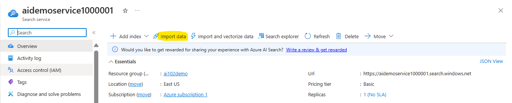
3. Establish connection to the **data source**. Data source will be the blob storage to search the documents and to create the Index.
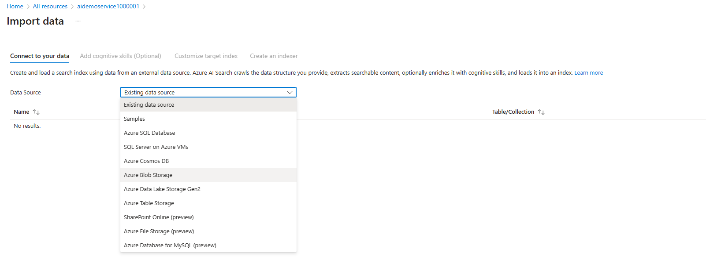
4. Select the Blob storage container name in the connection string
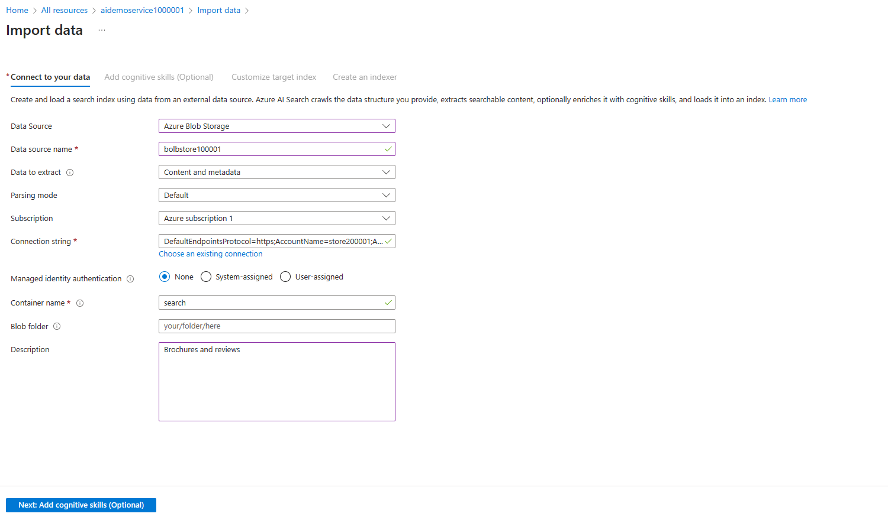
5. Select the cognitive service(AI multi service account) to add the skills to enrich the pipeline.
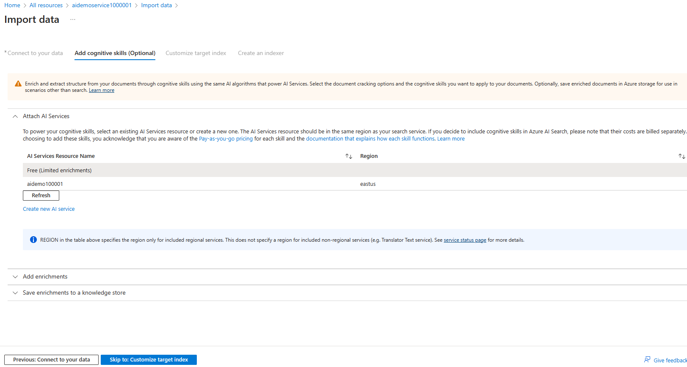
6. Enrich the pipeline by selecting the skills and mapping to the fields. 
- Enable OCR and merge all text into merged_content field.
- Source data field is set to merged_content.
- Leave the Enrichment granularity level as Source field, which is set the entire contents of the document being indexed; but note that you can change this to extract information at more granular levels, like pages or sentences.
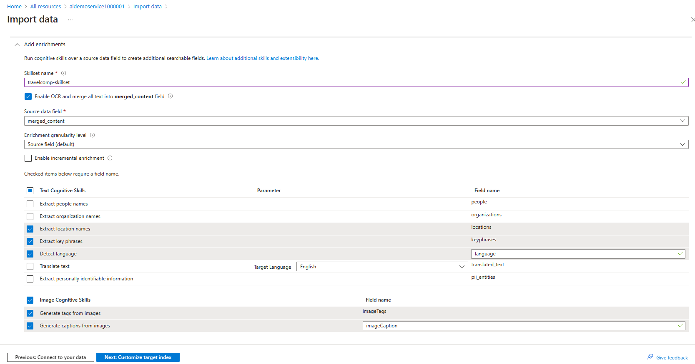
7. in the Index section, Key is set to metadata_storage_path and leave the Suggester name blank and Search mode at its default.
- Ensure that the correct Retrievable, Filterable, Sortable, Facetable, and Searchable options are selected for each field 
- The searchable result of the indexing process.
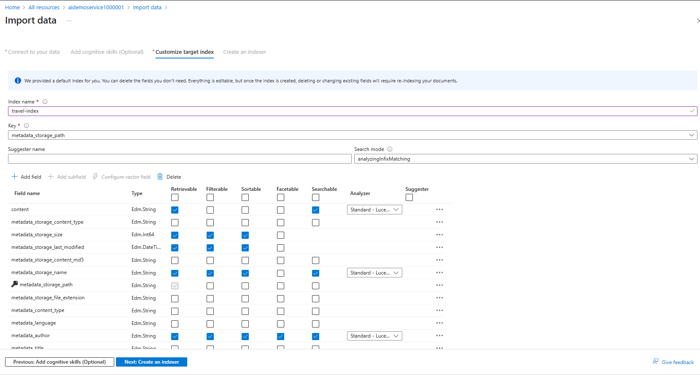
8. In the Indexer section, 
- Schedule set to Once.
- Advanced options, and ensure that the Base-64 encode keys option is selected
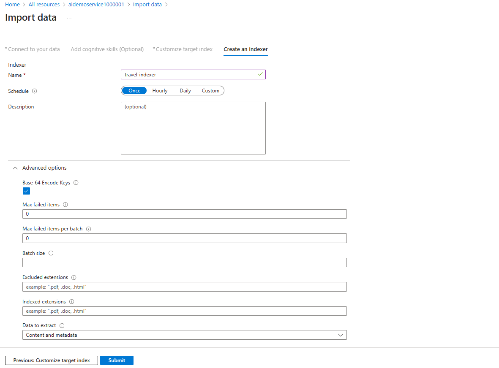
9. Selecting the Submit, will create the data source, skillset, index, and indexer. The indexer will run automatically and runs the indexing pipeline, which:
- Extracts the document metadata fields and content from the data source
- Runs the skillset of cognitive skills to generate additional enriched fields
- Maps the extracted fields to the index.
- The file name and author are in the metadata_storage_name and metadata_author fields, which were extracted from the source document. The locations field was generated by a cognitive skill.
10. At the top of  Azure AI Search resource, access Overview page and select select Search explorer.
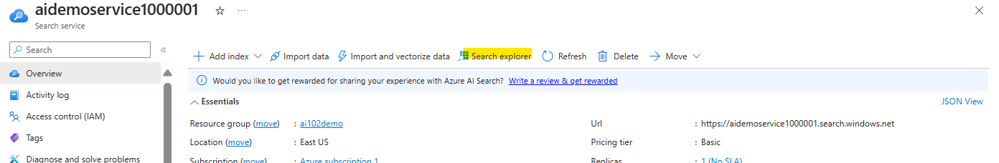
11. In the Search explorer, input * (a single asterisk) in the Query string box, then click Search. This query fetches all documents in the index in JSON format. Review the results, observing the fields for each document, which include content, metadata, and enriched data from the selected cognitive skills.
12. In the View menu, select JSON view and note that the JSON request for the search is shown
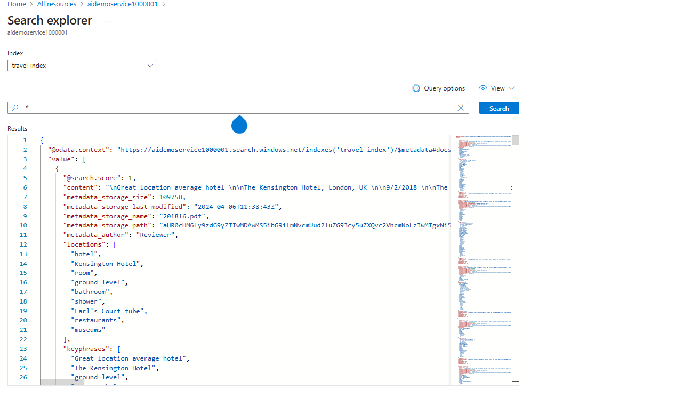
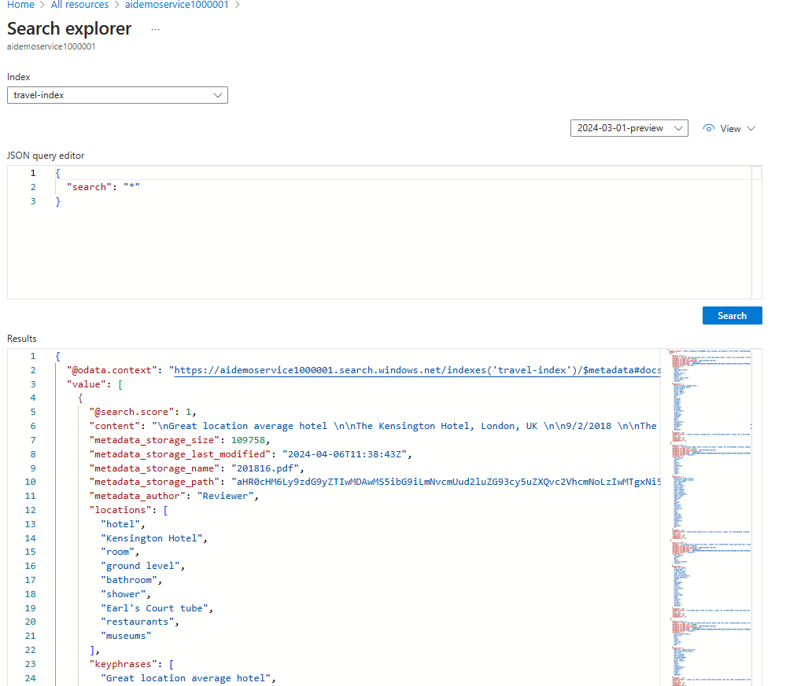
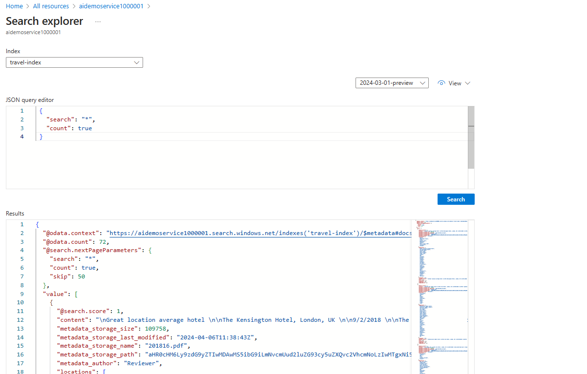
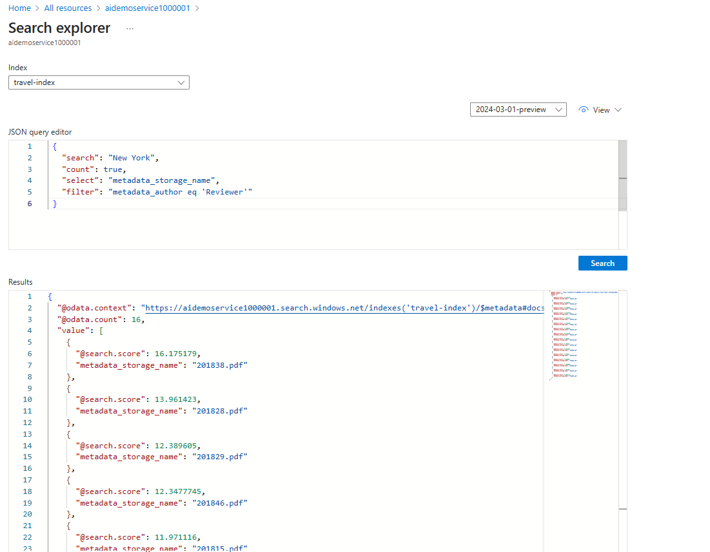
13. Modify the Skill, Index and Indexer to add enrichments to the fields
- **Skill**
```json
 {
     "@odata.type": "#Microsoft.Skills.Text.V3.SentimentSkill",
     "defaultLanguageCode": "en",
     "name": "get-sentiment",
     "description": "New skill to evaluate sentiment",
     "context": "/document",
     "inputs": [
         {
             "name": "text",
             "source": "/document/merged_content"
         },
         {
             "name": "languageCode",
             "source": "/document/language"
         }
     ],
     "outputs": [
         {
             "name": "sentiment",
             "targetName": "sentimentLabel"
         }
     ]
 }
```
    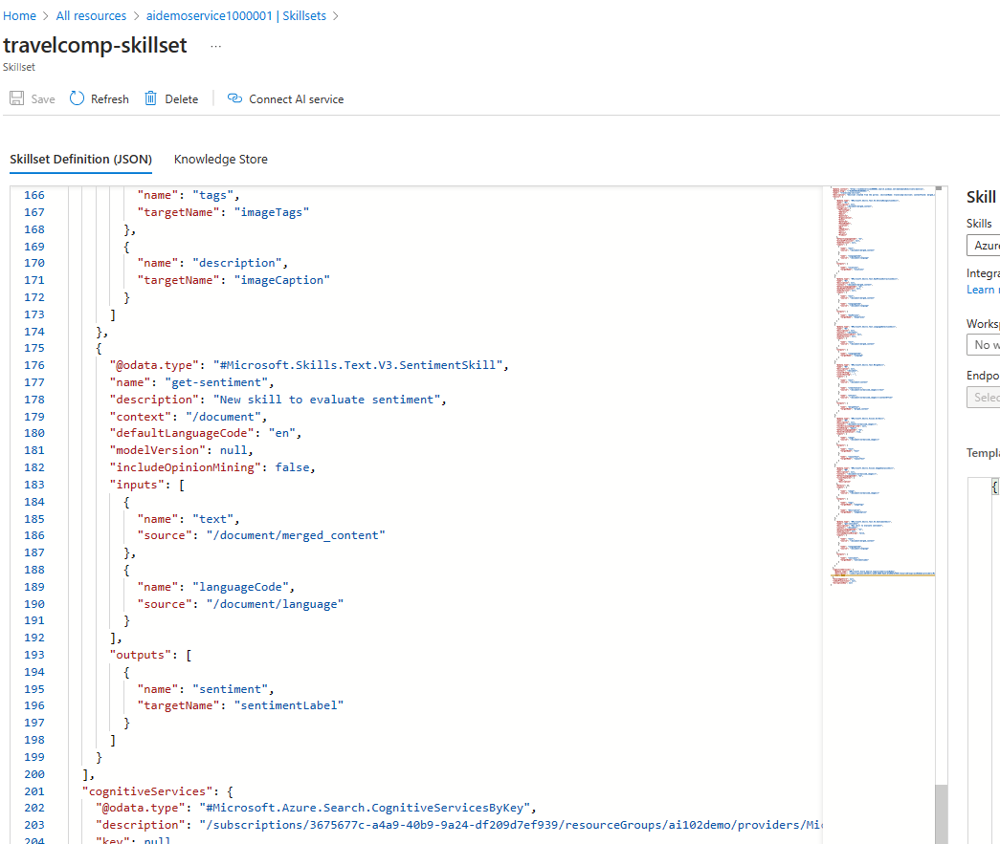
- **Index**
```json
 {
     "name": "sentiment",
     "type": "Edm.String",
     "facetable": false,
     "filterable": true,
     "retrievable": true,
     "sortable": true
 },
 {
     "name": "url",
     "type": "Edm.String",
     "facetable": false,
     "filterable": true,
     "retrievable": true,
     "searchable": false,
     "sortable": false
 }
```
    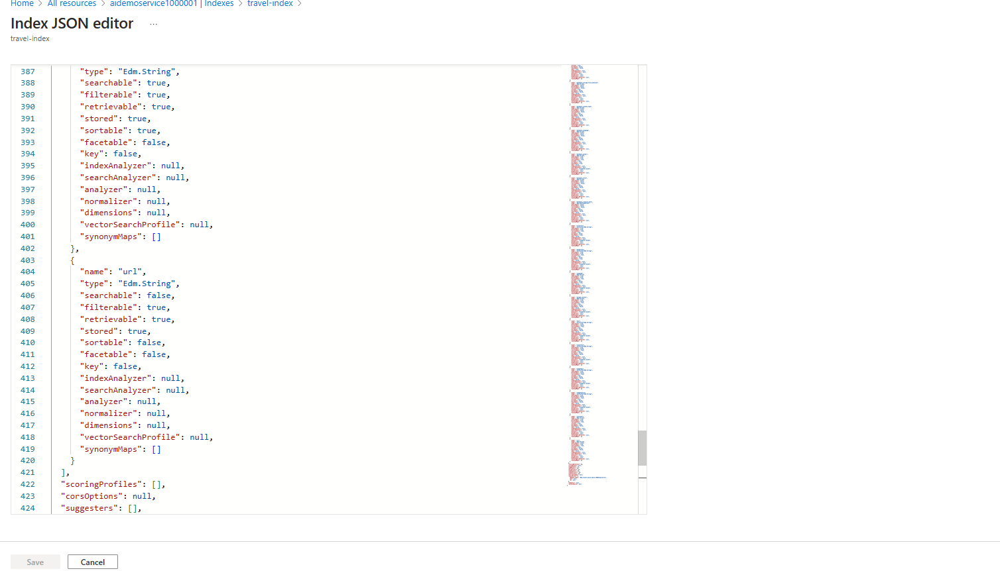
- **Indexer**
    * In the fieldMappings list, note the mapping for the metadata_storage_path value to the base-64 encoded key field. This was created when you assigned the metadata_storage_path as the key and selected the option to encode the key in the Azure portal. Additionally, a new mapping explicitly maps the same value to the url field
    ```json
     {
     "sourceFieldName" : "metadata_storage_path",
     "targetFieldName" : "url"
     } 
    ```    
    * Review the ouputFieldMappings section, which maps outputs from the skills in the skillset to index fields. Most of these reflect the choices you made in the user interface, but the following mapping has been added to map the sentimentLabel value extracted by your sentiment skill to the sentiment field 
     ```json
     {
     "sourceFieldName": "/document/sentimentLabel",
     "targetFieldName": "sentiment"
     }
     ```
    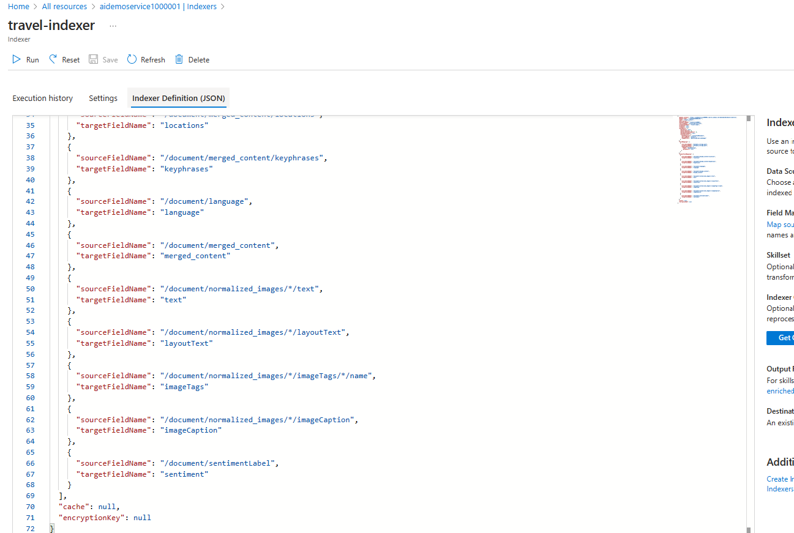

The new skill, called get-sentiment, examines the text in the merged_content field of each document being indexed, which includes both the original content and any text extracted from images. It analyzes the language of the document (defaulting to English) and assigns a sentiment label indicating whether the content is positive, negative, neutral, or mixed. This label is then saved as a new field called sentimentLabel.

14. Return to the Overview page for your Azure AI Search resource in the Azure portal and view the Index page. Select Index to "Reset" and "Run" to re-index the document for the modifications.
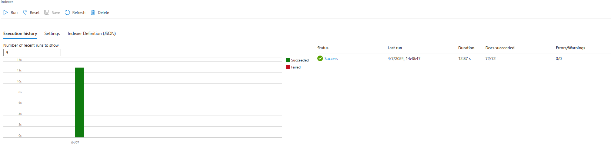

15. Azure AI Search resource, select Search explorer. In Search explorer, in the Query string box.
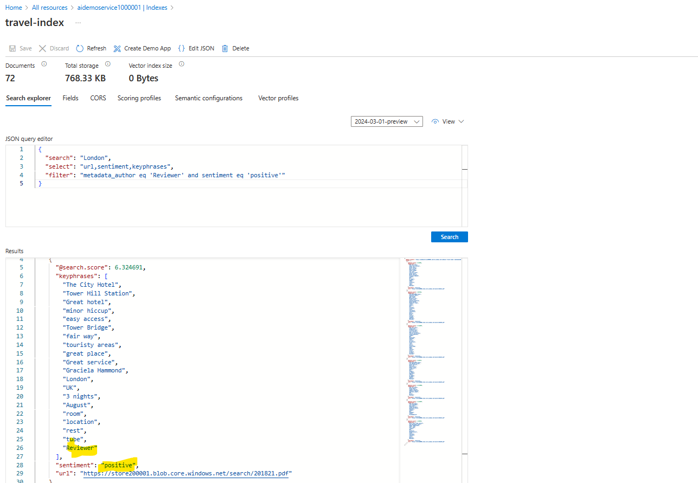

16. Add the code necessary to import the required SDK libraries(Azure.AI.TextAnalytics), establish an authenticated connection to your deployed project and submit text for classification. Update the configurations in the code base.
  - "AllowedHosts": "*",
  - "SearchServiceEndpoint": Endpoint of the Azure AI search Service,
  - "SearchServiceQueryApiKey": Primary Key of the Azure AI search Service in the section "Key"",
  - "SearchIndexName": Name of the Index created in the Azure AI search Service.
  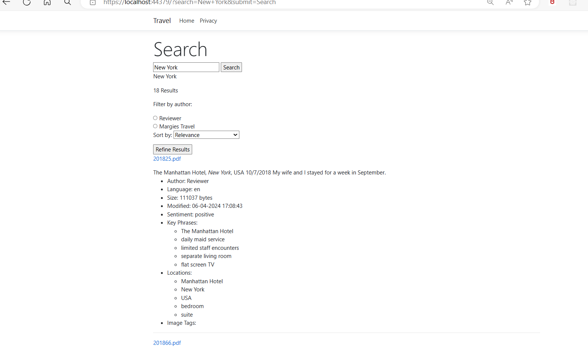