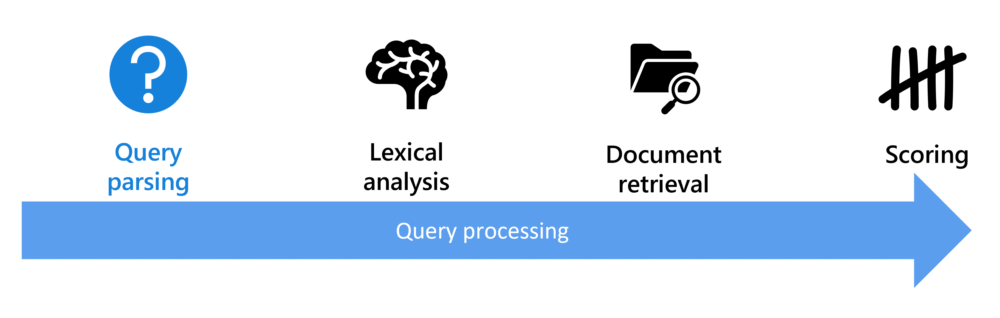
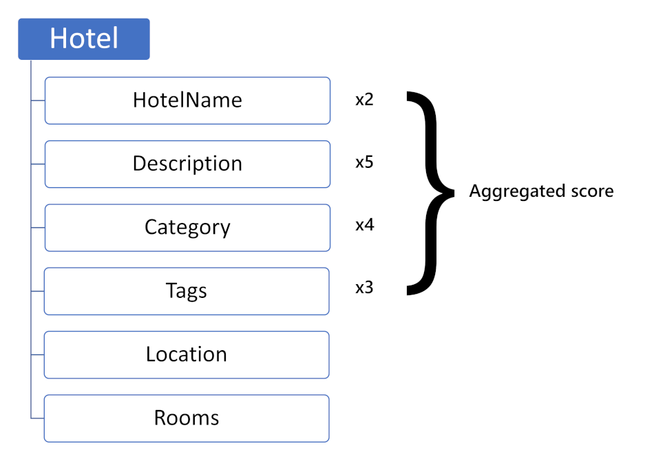
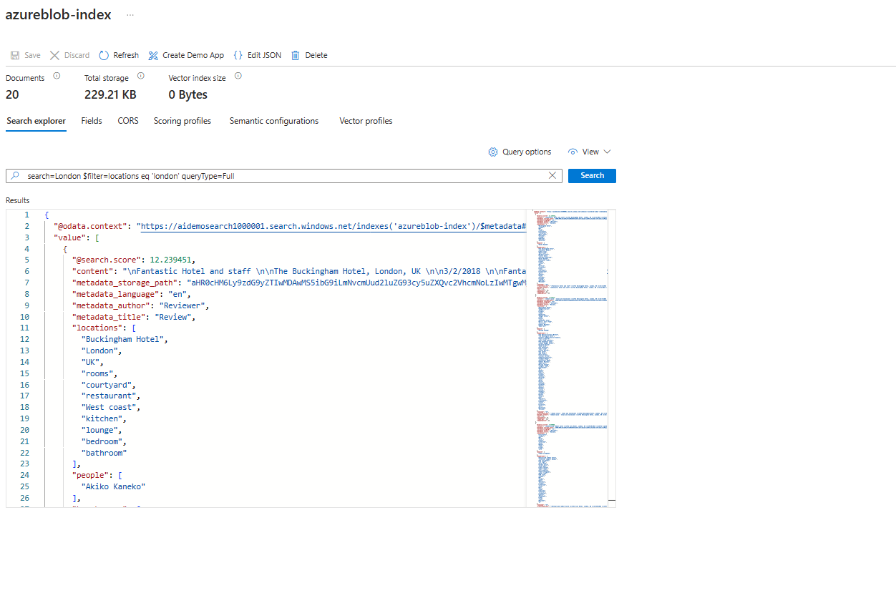
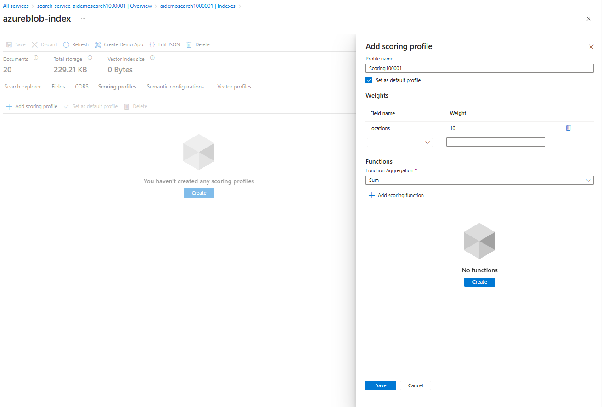
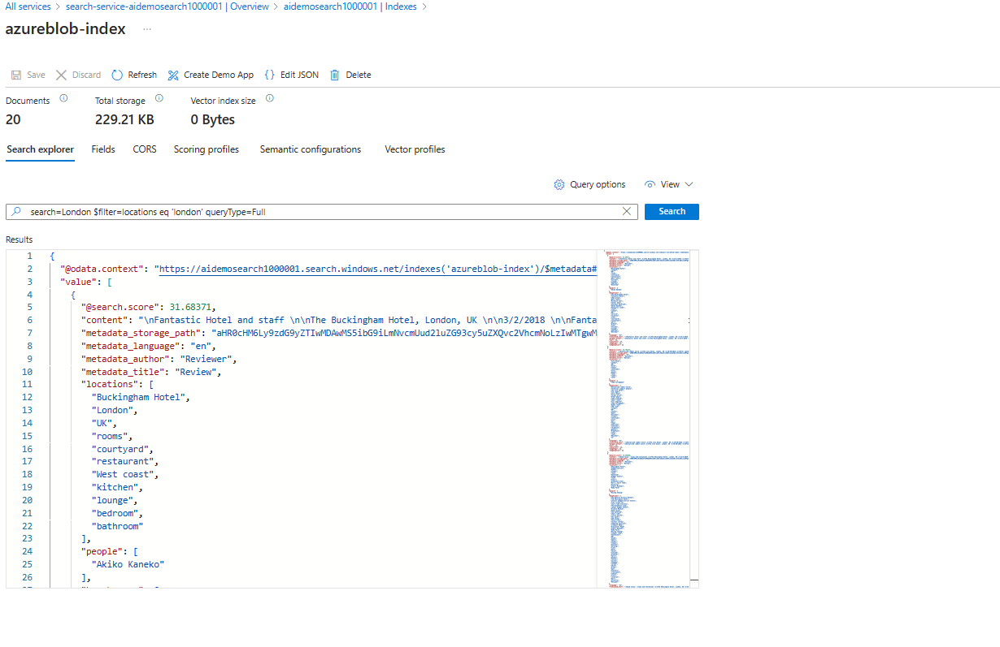
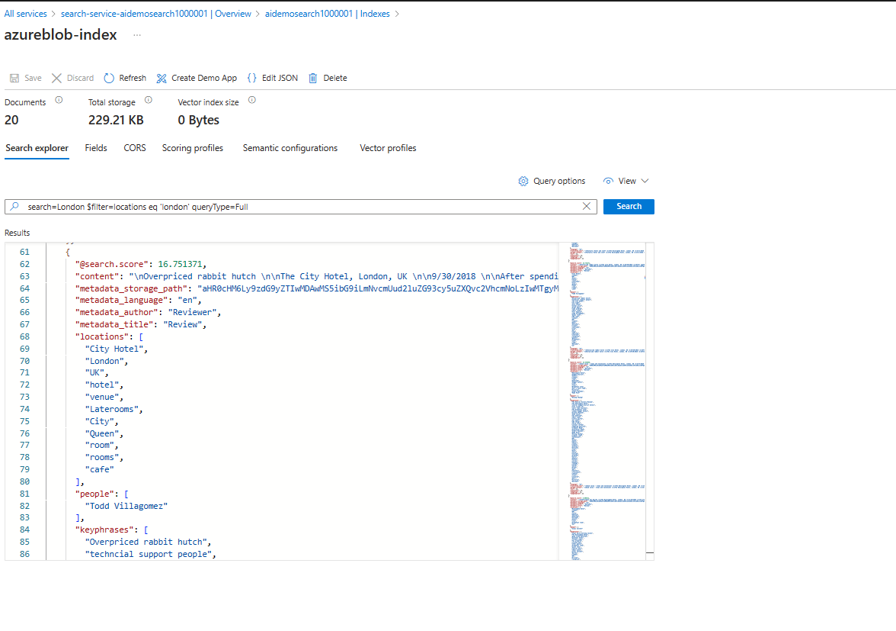

Search works best when the most relevant results are shown first. All search engines try to return the most relevant results to search queries. Azure AI Search implements an enhanced version of Apache Lucene for full text search.


The hotel sample data contains 50 hotels with descriptions, room details, and their locations. Imagine you run a hotel booking business and have an app that users can book hotels with. Users can search and the most relevant hotels must be shown first.

Simple query will look like "search=luxury&$select=HotelId, HotelName, Category, Tags, Description&$count=true"

We can tell the search explorer to use the Lucene Query parser by adding &queryType=full to the query string.

"search=luxury AND air con&$select=HotelId, HotelName, Category, Tags, Description&$count=true&queryType=full"

With the Lucene syntax, we can write more precise queries.

The parser should give a higher priority to hotels in the luxury category. We can also be more precise and look for air conditioning in the Tags field.

(Description:luxury OR Category:luxury^3) AND Tags:'air con'*

Azure AI Search uses the BM25 similarity ranking algorithm. The algorithm scores documents based on the search terms used.

Scoring is the last phase of processing a search query. The search engine assesses the documents from the initial three phases based on various factors, including the frequency of identified search terms in a document, the document's size, and the rarity of each term. By default, the search results are arranged in descending order of their search score, with the highest score listed first. In cases where two documents have the same search score, you can resolve the tie by incorporating an $orderby clause.

**Improve the score for more relevant documents**
The default scoring mechanism, based on term frequency and rarity, may not always yield the highest score for the most relevant document. Recognizing the uniqueness of each dataset, Azure AI Search enables users to adjust document scores using scoring profiles, allowing for better customization and relevance in search results.


A basic scoring profile adjusts the importance of different fields in an index. For instance, in a hotel index, the Description field might be given five times more weight than the Location or Rooms fields, and the Category field might be twice as important as the HotelName.

Scoring profiles can also use functions, like distance or freshness, for more precise control. For example, you can set how much newer documents get boosted before they're treated the same as older ones.

With scoring profiles, instead of boosting specific terms in a search, you can automatically boost fields for all queries in an index.

To add multiple languages to an index, first, identify all the fields that need a translation. Then duplicate those fields for each language you want to support.
```json
 {
  "name": "description_jp",
  "type": "Edm.String",
  "facetable": false,
  "filterable": false,
  "key": false,
  "retrievable": true,
  "searchable": true,
  "sortable": false,
  "analyzer": "ja.microsoft",
  "indexAnalyzer": null,
  "searchAnalyzer": null,
  "synonymMaps": [],
  "fields": []
},
{
  "name": "description_uk",
  "type": "Edm.String",
  "facetable": false,
  "filterable": false,
  "key": false,
  "retrievable": true,
  "searchable": true,
  "sortable": false,
  "analyzer": "uk.microsoft",
  "indexAnalyzer": null,
  "searchAnalyzer": null,
  "synonymMaps": [],
  "fields": []
}
```
A scoring profile sets criteria to enhance search scores based on user-defined parameters. For instance, one may prioritize matches in a 'tags' field over those in 'descriptions.' These criteria can include weighted fields, like the 'tags' example, or specific functions.

Scoring profiles are configured within a search index and applied to non-vector fields in query requests. Users can establish multiple profiles and adjust query logic to select the appropriate one.

```json
 "scoringProfiles": [
    {
      "name": "Scoring100001",
      "functionAggregation": "sum",
      "text": {
        "weights": {
          "locations": 10
        }
      },
      "functions": [
        {
          "fieldName": "keyphrases",
          "interpolation": "linear",
          "type": "tag",
          "boost": 20,
          "freshness": null,
          "magnitude": null,
          "distance": null,
          "tag": {
            "tagsParameter": "longue"
          }
        }
      ]
    }
  ]
```

**Scores are calculated** for full-text search queries, with matches rated by their relevance. The top-rated matches are then provided in the query result. Each document's total score is a summation of the individual scores for its fields, which are determined by the frequency of the search terms within each field (referred to as TF-IDF or term frequency-inverse document frequency).

**Scoring Logic** scoring profiles are essential when default ranking falls short of business goals. For instance, you might prioritize recently added items or boost results based on profit margin or revenue potential. They're pivotal for enhancing user experience by tailoring search relevance, akin to sorting options like price, date, or rating in traditional search result pages. In Azure AI Search, scoring profiles drive the definition of relevance, aligning with business aims and desired search experiences.

**Use functions** when simple relative weights are insufficient or don't apply, as is the case of distance and freshness, which are calculations over numeric data. You can specify multiple functions per scoring profile.
- **Freshness**:	Boosts by values in a datetime field (Edm.DateTimeOffset). This function has a "boostingDuration" attribute so that you can specify a value representing a timespan over which boosting occurs.
- **Magnitude**:	Boosts based on how high or low a numeric value is. Scenarios that call for this function include boosting by profit margin, highest price, lowest price, or a count of downloads. This function can only be used with Edm.Double and Edm.Int fields. For the magnitude function, you can reverse the range, high to low, if you want the inverse pattern (for example, to boost lower-priced items more than higher-priced items). Given a range of prices from $100 to $1, you would set "boostingRangeStart" at 100 and "boostingRangeEnd" at 1 to boost the lower-priced items.
- **Distance**:	Boosts by proximity or geographic location. This function can only be used with Edm.GeographyPoint fields.
- **Tag**:	Boosts by tags that are common to both search documents and query strings. Tags are provided in a "tagsParameter". This function can only be used with search fields of type Edm.String and Collection(Edm.String).

**Rules for using functions**
- Functions can only be applied to fields that are attributed as filterable.
- Function type ("freshness", "magnitude", "distance", "tag") must be lower case.
- Functions can't include null or empty values.

**Interpolations** allow you to set the shape of the slope used for scoring. Because scoring is high to low, the slope is always decreasing, but the interpolation determines the curve of the downward slope. 
- **Linear**:	For items that are within the max and min range, the boost applied to the item will be done in a constantly decreasing amount. Linear is the default interpolation for a scoring profile.
- **Constant**:	For items that are within the start and ending range, a constant boost will be applied to the rank results.
- **Quadratic**:	In comparison to a Linear interpolation that has a constantly decreasing boost, Quadratic will initially decrease at smaller pace and then as it approaches the end range, it decreases at a much higher interval. This interpolation option isn't allowed in tag scoring functions.
- **Logarithmic**:	In comparison to a Linear interpolation that has a constantly decreasing boost, Logarithmic will initially decrease at higher pace and then as it approaches the end range, it decreases at a much smaller interval. This interpolation option isn't allowed in tag scoring functions.

"**boostingDuration**" is an attribute of the freshness function. You use it to set an expiration period after which boosting will stop for a particular document. "**boostingDuration**" must be formatted as an XSD "dayTimeDuration" value (a restricted subset of an ISO 8601 duration value). The pattern for this is: "P[nD][T[nH][nM][nS]]".
"
- 1 day:	"**P1D**"
- 2 days and 12 hours:	"**P2DT12H**"
- 15 minutes:	"**PT15M**"
- 30 days, 5 hours, 10 minutes, and 6.334 seconds"	"**P30DT5H10M6.334S**"

- **Search results** before applying the scoring profile 
```json
{
  "search": "London",
  "filter": "locations eq 'london'",
}

or

search=London
$filter=locations eq 'london' 
&scoringParameter='longue'
```


After applying the scoring profile




- **Scoring Profile Function** query will be,
```json
{
  "search": "london",
  "scoringParameters": ["tparam--Museum"]
}

Sample : lake + view&$select=HotelName,Description,Category,Tags&$count=true
Description:  weight of 5
Category: weight of 3
Tags: Weight of 2

or

search=London 
&scoringParameter='longue'

```