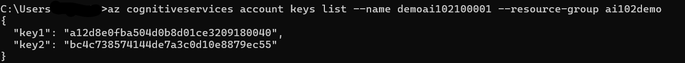
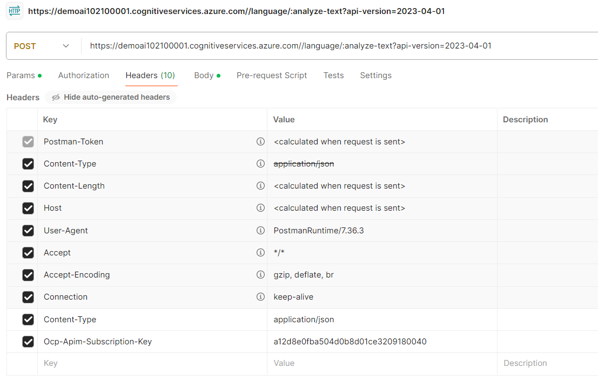
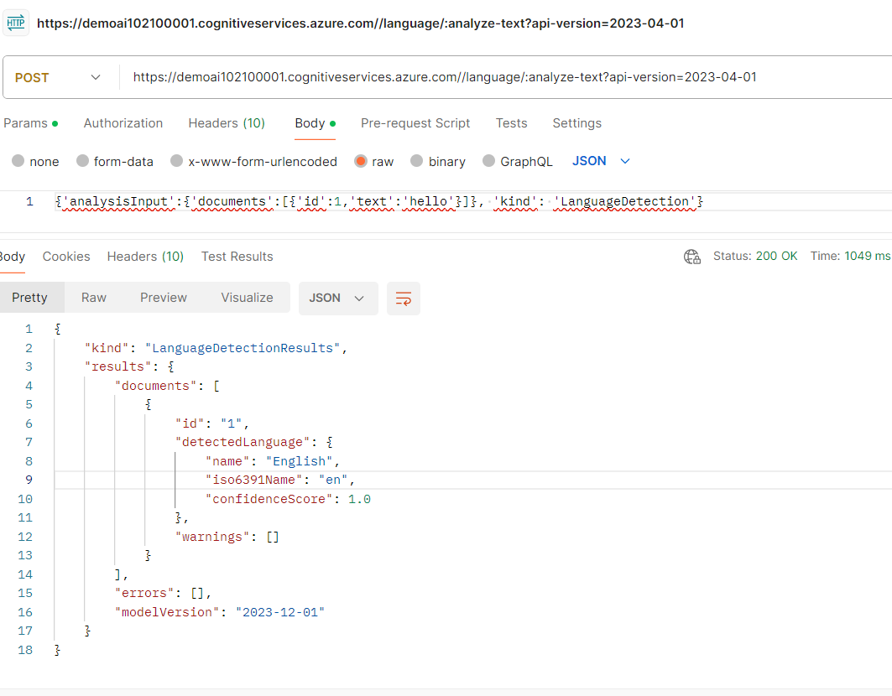

As a developer, it's essential to prioritize security in our applications. Make sure to limit access to resources like Azure AI services to only those who truly need it or they it should be accessed.

One should have an Azure Subscription in the Azure portal https://portal.azure.com

1. Open Azure Portal

2. Click on All Services in the left pane

3. Click on AI + Machine Learning in the Categories section of the right pane

4. Click Azure AI services multi-service account and create the service.

5. Go to the resource created and view the "Endpoint" and "Manage Keys" OR Visit "Keys and Endpoint" in the Resource Management section of the resource left pane.

6. When Azure AI services resource is created, two authentication keys are generated. We can manage these in the Azure portal or by using the Azure command line interface (CLI). 

7. The following command will list the Keys of the resource
	az cognitiveservices account keys list --name <resourceName> --resource-group <resourceGroup>
		

8. We can use PostMan or any other API testing tool to use  Analyze Text API, with the endpoint and key
	Append: to the endpoint"/language/:analyze-text?api-version=2023-04-01"
	Headers: "Content-Type: application/json" and "Ocp-Apim-Subscription-Key: 81468b6728294aab99c489664a818197"
To the Post request data to pass in the body "{'analysisInput':{'documents':[{'id':1,'text':'hello'}]}, 'kind': 'LanguageDetection'}"

.

9. If the key becomes compromised, or the developers who have it no longer require access, From the UI regenerate the Key1 in "Keys and Endpoint" of the AI resource or from the CLI using the command
 az cognitiveservices account keys regenerate --name <resourceName> --resource-group <resourceGroup> --key-name key1.

10. When Developing the application, store the key in Azure Key Vault, and provide access to the key through a managed identity (in other words, a user account used by the application itself).

11. Create an Azure Key Vault Store

12. When Deployment is completed, in the left navigation pane, select Secrets and Select + Generate/Import and add a new secret 
 	Upload options: Manual
	Name: AI-Services-Key (it’s important to match this exactly, because later you’ll run code that retrieves the secret based on this name)
	Value: Your key1 Azure AI services key

13. Select Create the new secret key

14. Create a service principal
	Login into Azure Portal and Click on "Microsoft Entra Id" and in the "Manage" section of Default Directory, Select App Registration and create a new App Registration
	Go To New App Registration Created and click "Certificates and Secrets" to create a new client secret. Cope the key to a text file. Once moved away from the screen, it is not possible to view the secret in text format and a new secret to be created again
	
15. In the created App Registration, Application(client) ID will be appid in the Overview, Password will be the one created in the "Certificates and Secrets", tenant will be Directory (tenant) ID in the Overview, spName will be "Display name" in the Overview.

16. Alternatively, CLI command can be executed skipping steps 14 and 15. Save the output in a text file
	 az ad sp create-for-rbac -n "api://<spName>" --role owner --scopes subscriptions/<subscriptionId>/resourceGroups/<resourceGroup>

17. CLI command "az ad sp show --id <appId>" used to fetch the Object ID or  In the created App Registration, copy the Object ID from the Overview section.

18. CLI command to set the Keyvault permission " az keyvault set-policy -n <keyVaultName> --object-id <objectId> --secret-permissions get list" or go to Keyvault create, click on Access Policy and select "Secret Management" from the "Configure from a template" dropdown. Click next, select the service principal created in the App Registration, and complete

19. Create a VS project and add the references 
	* Azure.AI.TextAnalytics Version="5.3.0"
	* Azure.Identity Version="1.11.0-beta.1"
	* Azure.Security.KeyVault.Secrets Version="4.6.0"
	* Microsoft.Extensions.Configuration Version="8.0.0"
	* Microsoft.Extensions.Configuration.Json Version="6.0.0"

20. In the project add appsettings.json file if missing.
	update with	
	```json
	{
    		"AIServicesEndpoint": "YOUR_AI_SERVICES_ENDPOINT",
    		"KeyVault": "YOUR_KEY_VAULT_NAME",
    		"TenantId": "YOUR_SERVICE_PRINCIPAL_TENANT_ID",
    		"AppId": "YOUR_SERVICE_PRINCIPAL_APP_ID",
    		"AppPassword": "YOUR_SERVICE_PRINCIPAL_PASSWORD"
	} 
	```

21. Run the program to detect the language of the text
	Enter some text ('quit' to stop)
		This is a AI-102
	
	Language: English

	Enter some text ('quit' to stop)
		C'est pour AI-102

	Language: French

	Enter some text ('quit' to stop)
		Isto é para AI-102
	
	Language: Portuguese
